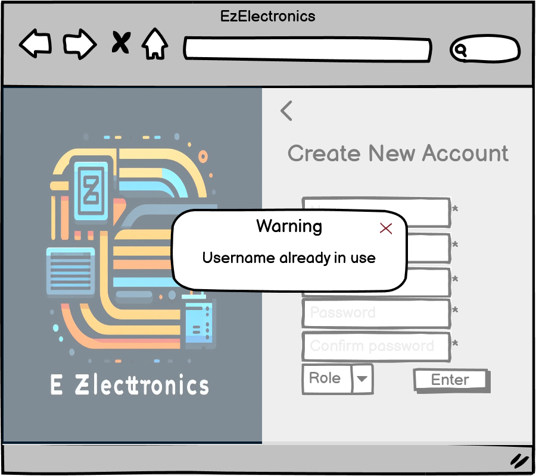
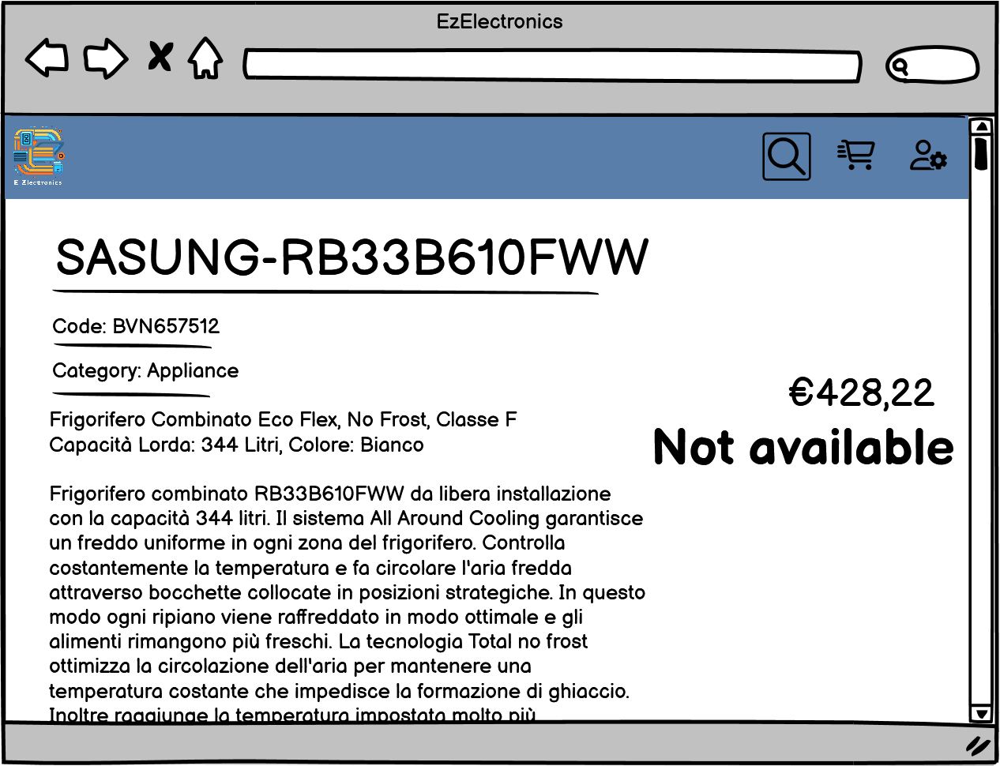
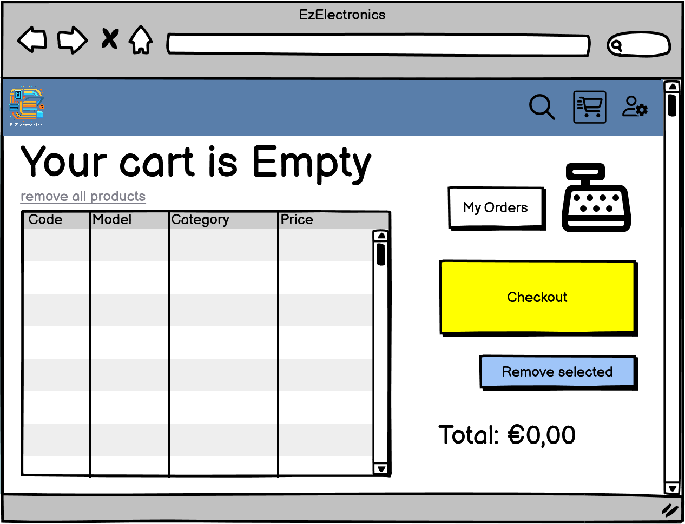

# Graphical User Interface Prototype - CURRENT

Authors: Alberto Cagnazzo, Diego Da Giau, Paola Verrone, Lorenzo Ricci

Date: 28/04/2024

Version: V1.1

# Login e creazione dell'account (UC1, UC2)

### Schermata di login da cui accedono sia gli utenti Customer che i Manager. E' necessario fare il login per procedere nell'applicazione

#### Nel caso di campi mancanti mostra un messaggio di errore

#### Nel caso di credenziali errate mostra un messaggio di errore

### Schermata di registrazione per la creazione di account (Customer e Manager)

#### Nel caso di campi mancanti mostra un messaggio di errore, così come nel caso di username già esistente

### Schermata standard visualizzata dopo il login:

#### Customer

#### Manager

# Visualizzazione informazioni account e logout (UC3)

### Menu utente sulla schermata principale con i due link per visualizzare le informazioni e effettuare il logout

### Finestra con le informazioni sull'account dell'utente loggato

### Finestra di conferma del logout. L'utente viene poi rimandato alla pagina di login

# Ricerca di prodotti nel catalogo (UC4)

### Visualizzazione di tutti i prodotti, sia per Customer che per Manager, con la possibilità di effettuare la ricerca per codice prodotto tramite la barra superiore (opzione ricerca per Code abilitata di default. Nel caso in cui il sistema non trovi nulla, vi è un messaggio di errore.)

#### Customer
.png)

#### Manager

.png)

#### Code not found

### Schermata di ricerca di un prodotto, dopo aver selezionato dal menu a tendina sulla barra superiore la ricerca per Modello. E' possibile quindi inserire il modello da cercare. E' possibile anche scegliere di visualizzare tutti i prodotti, solo quelli venduti e solo quelli non venduti. Nel caso in cui il sistema non trovi nulla, vi è un messaggio di errore.

#### Customer

.png)

#### Manager

.png)

#### Model not found

### Schermata di ricerca di un prodotto, dopo aver selezionato dal menu a tendina sulla barra superiore la ricerca per Categoria. E' possibile quindi scegliere la categoria desiderata dal menu a tendina. E' possibile anche scegliere di visualizzare tutti i prodotti, solo quelli venduti e solo quelli non venduti

.png)

# Visualizzazione delle informazioni di un prodotto, inserimento di prodotti nel carrello, prodotto venduto e eliminazione di un prodotto dal catalogo (UC5, UC6, UC7)

### Sia il customer che il manager possono, dalle pagine di ricerca del caso precedente, premere il tasto details per vedere le informazioni dettagliate di un prodotto.

#### Nel caso del Customer è possibile da questa schermata leggere le informazioni e aggiungere il prodotto al carrello.

#### E' mostrato anche il caso in cui il prodotto sia stato nel frattempo messo nel carrello da un altro cliente o il caso in cui sia già stato venduto.

#### Nel caso del Manager è possibile invece segnare il prodotto come venduto, nel caso in cui non sia ancora stato venduto, o rimuoverlo dal catalogo

#### Quando il manager segna il prodotto come venduto, inserisce la data di vendita, che deve essere valida. Se non si inserisce nulla viene settata di default la data odierna

# Gestione del carrello, checkout, consultazione dello storico (UC6, UC8)

### Il Customer può cliccare sull'icona del carrello nella barra in alto per vederne il contenuto e fare delle operazioni

#### Nel caso in cui il carrello sia vuoto il sistema stampa un messaggio

#### Il cliente può quindi vedere tutti gli articoli che ha messo precedentemente nel carrello e li può eliminare selezionandoli dalla tabella e cliccando il tasto apposito. Può anche svuotare interamente il carrello. 

#### Cliccando sul checkout il sistema chiede conferma dell'ordine e procede poi a svuotare il carrello

#### Tramite il tasto "My Orders" della slide del carrello potrà poi accedere alla schermata dello Storico degli acquisti, che mostra la lista degli ordini passati con le informazioni associate

#### Cliccando sui dettagli dell'ordine potrà vedere la lista di prodotti acquistati

# Gestione dei prodotti (UC7)

### Il Manager può, cliccando sull'icona dei prodotti nella barra superiore, accedere alla schermata di gestione dei prodotti. Da qui, data la lista dei prodotti, può selezionarne uno e vederne i dettagli

#### Cliccando sull'aggiunta di un prodotto, viene mostrata la schermata di creazione di un nuovo prodotto, con tutti i campi da inserire

#### Nel caso di errori dell'inserimento il sistema mostra un messaggio di errore

#### Cliccando sull'aggiunta di un set di prodotti, viene mostrata la schermata di creazione, con tutti i campi da inserire

#### Nel caso di errori dell'inserimento il sistema mostra un messaggio di errore

