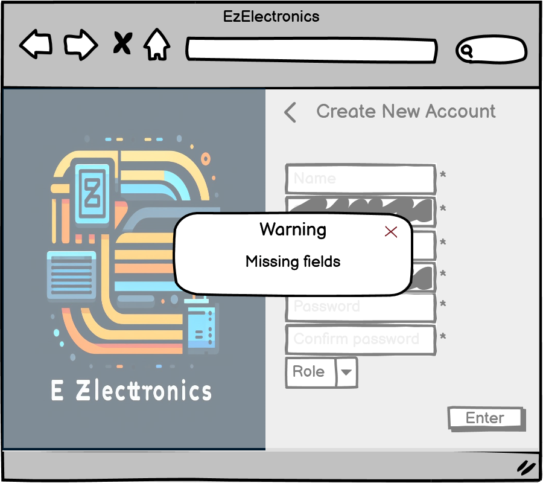
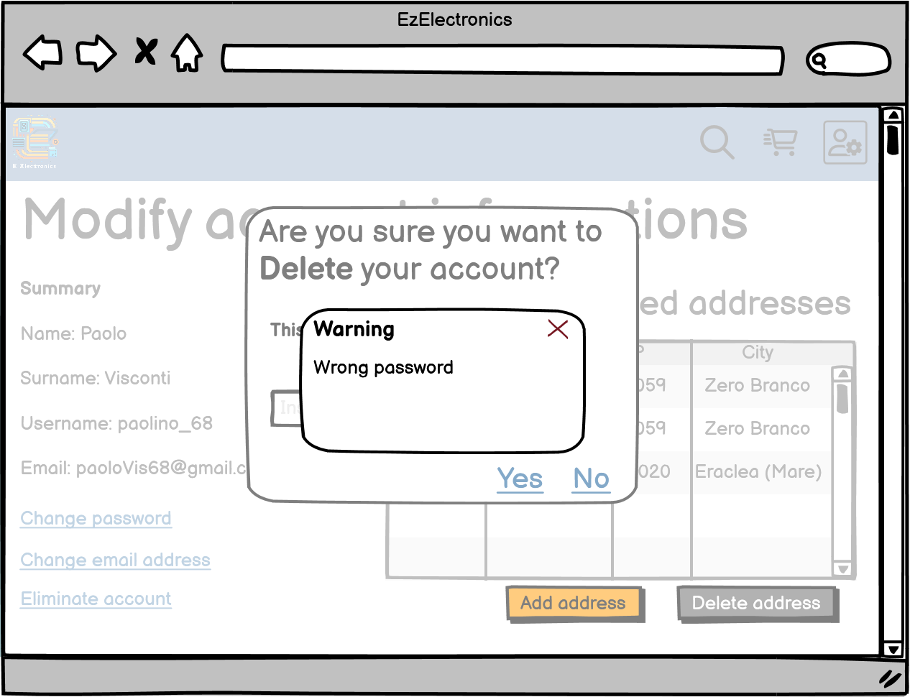
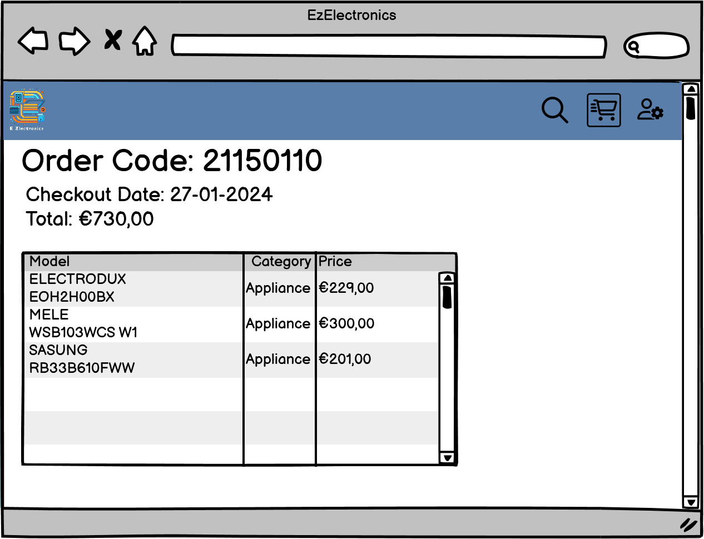
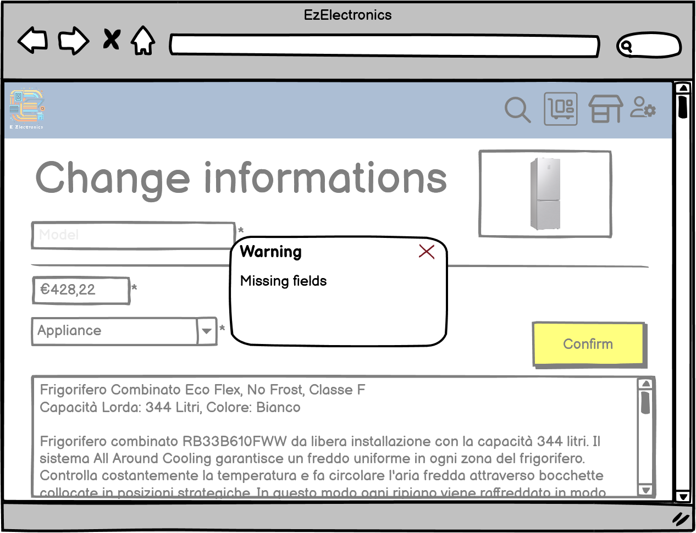
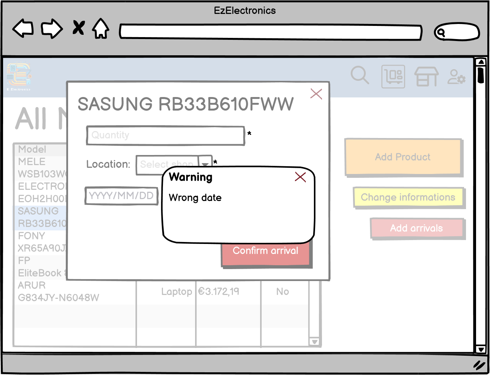

# Graphical User Interface Prototype - FUTURE

Authors: Alberto Cagnazzo, Diego Da Giau, Paola Verrone, Lorenzo Ricci

Date: 04/05/2024

Version: V1.2

# Login, password recovery (UC2)

### Dalla schermata di navigazione da utente non loggato è possibile cliccare sull'icona dell'account, per essere rimandati poi alla schermata di login.

#### Nel caso di campi mancanti o di credenziali errate, il sistema mostra un errore

### Cliccando sul link di recupero password è possibile cominciare la procedura. Si inserisce prima la mail associata all'account, con un errore nel caso di email errata

#### L'utente dovrà poi inserire il codice ricevuto per email

#### Infine si avrà la possibilità di scegliere una nuova password. E' necessario soddisfare determinati requisiti minimi di sicurezza, altrimenti il sistema mostra un errore

# Creazione di un account (UC1)

### Cliccando su "sign up" dalla schermata di login è possibile creare un account (sia Customer che Manager)

#### Nel caso di campi mancanti il sistema mostra un errore

#### Nel caso di username o email già in uso il sistema mostra un errore

# Gestione dell'account (UC3)

### Cliccando sull'icona dell'account nella barra superiore è possibile accedere alla schermata di modifica dell'account, che contiene un riepilogo di tutte le informazioni sul profilo, ed effettuare il logout

#### Il sistema chiede conferma per il logout

#### Dalla schermata di modifica dell'account, è possibile aggiungere o eliminare un indirizzo di spedizione, oltre alla modifica di email, password o cancellazione dell'account

#### Schermata di creazione di un nuovo indirizzo, con messaggio di errore nel caso di campi incompleti

#### Nella modifica della mail l'utente inserisce la nuova email e la passowrd. Il sistema verifica che l'email sia valida e che la password sia corretta e mostra un messaggio di errore nel caso negativo

#### Nella modifica della password l'utente inserisce la vecchia e la nuova password. Il sistema verifica che la vecchia password sia corretta e che la nuova sia valida, mostrando un messaggio di errore nel caso negativo

#### Nel caso di eliminazione dell'account, il sistema chiede conferma della password per completare l'operazione

# Ricerca di prodotti e visualizzazione dei dettagli di un prodotto (UC4, UC5)

### Dalla schermata standard per il cliente, che è possibile usare sia da utente loggato (Customer), che da utente non loggato, è possibile vedere la lista di tutti i prodotti (per modello) e ricercare per modello, applicando filtri sulla categoria e eventualmente decidendo di vedere solo i prodotti disponibili

#### Schermata da utente non loggato

#### Schermata da utente customer

.png)

#### Nel caso in cui il modello cercato non sia trovato, il sistema mostra un avviso

#### Cliccando sui dettagli di un modello è possibile vedere le informazioni associate e, per il Customer, aggiungere al carrello un prodotto del modello, se disponibile

#### Se invece l'utente non è loggato può solo vedere i dettagli

### Il manager può, nella schermata di ricerca, oltre a vedere la lista di tutti i prodotti, ricercare sia per modello che per codice e applicare dei filtri sulla categoria e sulla visualizzazione di prodotti venduti/non venduti

#### Ricerca tramite codice. La schermata di ricerca tramite modello è uguale a quella del cliente

.png)

#### Nel caso di codice non trovato

# Gestione carrello, visualizzazione dello storico e acquisto di prodotti (UC6, UC7, UC8)

### Dalla barra superiore il Customer può cliccare sull'icona del carrello per visualizzare il riepilogo. Da questa pagina è possibile poi eseguire una serie di operazioni, come l'acquisto del carrello attuale, la consultazione dello storico e la rimozione di prodotti dal carrello. 

#### E' possibile selezionare più prodotti alla volta e rimuoverli, oppure svuotare l'intero carrello

#### Nel caso di carrello vuoto, il sistema mostra un avviso

### Cliccando sul Checkout è possibile procedere con l'acquisto dei prodotti del carrello

#### Nel caso di carrello vuoto, il sistema mostra un messaggio di errore

#### Da questa schermata si può selezionare l'indirizzo di spedizione, il metodo di pagamento e vedere il riepilogo dell'ordine

#### Il cliente sceglie dalla lista di indirizzi che ha precedentemente inserito l'indirizzo di spedizione

#### Nel caso in cui non venga scelto nessun indirizzo il sistema mostra un messaggio di errore

#### Il cliente può anche visualizzare sulla mappa la posizione del negozio dove è situato il prodotto

#### Il cliente può quindi procedere all'acquisto cliccando sul tasto apposito: il sistema lo rimanderà al servizio di pagamento che ha scelto

### Cliccando sul tasto MyOrders il cliente può vedere la lista dei suoi ordini passati, con tutte le informazioni associate e vedere i dettagli di un ordine selezionandolo dalla tabella

#### Dettagli dell'ordine

# Gestione dei prodotti (UC15)

### Dalla schermata dei dettagli di un prodotto, dopo aver cercato e selezionato il prodotto desiderato, il manager può vedere le informazioni, segnare il prodotto come venduto oppure rimuoverlo dal catalogo

#### Cliccando il pulsante apposito, il manager inserirà poi la data di vendita. Nel caso in cui il campo sia lasciato vuoto, corrisponderà alla data odierna

#### Il sistema controlla che la data sia valida e mostra un errore

#### Nel caso in cui il prodotto fosse già venduto, tra le informazioni ci sarà anche la data di vendita e il manager potrà soltanto rimuoverlo dal catalogo

### Cliccando sul bottone dei prodotti nella barra superiore, il manager accede alla scheda di gestione dei prodotti, dalla quale può creare un nuovo modello (set di prodotti dello stesso tipo), modificare le informazioni di uno esistente o aggiungere dei nuovi arrivi ad uno dei modelli

#### Selezionando la creazione di un nuovo prodotto, il manager dovrà inserire tutti i campi necessari e confermare l'inserimento

#### Il sistema controlla la presenza di tutti i campi e eventualmente segnala con un errore la mancanza di quelli obbligatori. Nel caso in cui il campo della data non sia completo, il sistema la setta a quella odierna

### Selezionando la modifica delle informazioni di un modello, viene mostrata una schermata con tutte le informazioni che è possibile cambiare. 

#### Il sistema controlla la presenza di tutti i campi e eventualmente mostra un messaggio di errore

### Selezionando un modello e cliccando sull'aggiunta di nuovi arrivi, viene mostrata una schermata in cui è possibile selezionare il negozio di arrivo, la quantità e la data di arrivo

#### Il sistema verifica la data inserita e eventualmente mostra un messaggio di errore

#### Il sistema verifica anche la presenza di tutti i campi e eventualmente mostra un messaggio di errore

# Gestione dei negozi (UC9)

### Cliccando sul bottone del negozio nella barra superiore, il manager accede alla scheda di gestione dei negozi, dalla quale può vedere la lista di tutti i negozi, vedere le informazioni associate, crearne di nuovi e modificare le informazioni di quelli esistenti

#### Cliccando sul link della mappa il sistema rimanda alla posizione del negozio sul sistema esterno di localizzazione

#### Cliccando sulla creazione di un nuovo negozio si rimanda ad una schermata di creazione in cui il manager inserirà tutti i campi necessari

#### Nel caso in cui il nome inserito esista già, il sistema mostra un messaggio di errore

#### Il sistema controlla anche che tutti i campi siano presenti ed eventualmente mostra un messaggio di errore

### Cliccando sulla modifica delle informazioni di un negozio il sistema mostra una scheda con tutti i campi precompilati e che il manager può cambiare.

#### Anche in questo caso il sistema verifica l'unicità del nome e la presenza di tutti i campi

