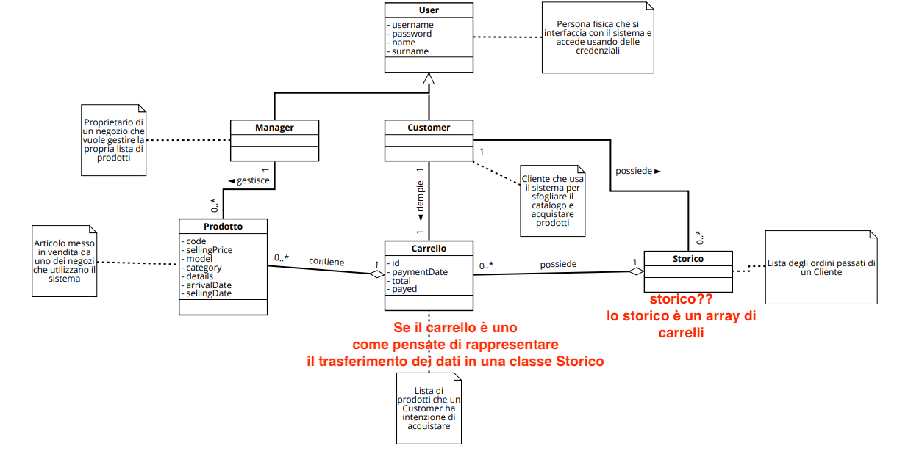
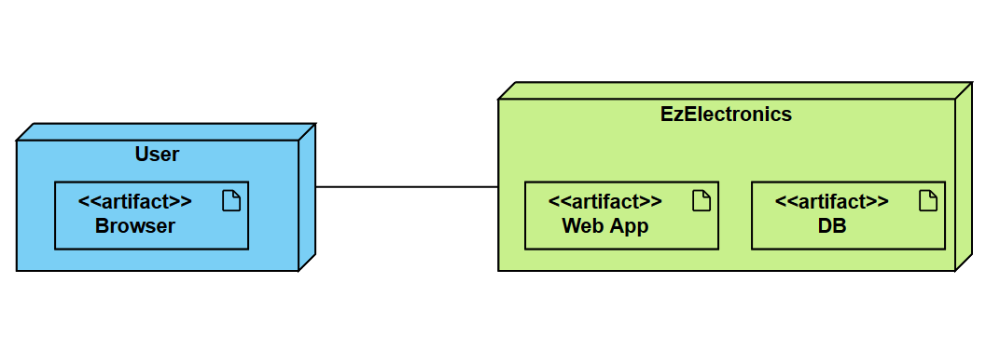

# Requirements Document - current EZElectronics

Date: 01/05/2024

Version: V1 - description of EZElectronics in CURRENT form (as received by teachers)

| Version number | Change |
| :------------: | :----: |
| 1.1               |    Stakeholders, Context Diagram, Interfaces    |
| 1.2               |    Functional Requirements, Non Functional Requirements    |
| 1.3               |    Stories and Personas, Glossary    |
| 1.4               |    Use Case    |
| 1.5               |    Deployment Diagram    |

# Contents

- [Requirements Document - current EZElectronics](#requirements-document---current-ezelectronics)
- [Contents](#contents)
- [Informal description](#informal-description)
- [Stakeholders](#stakeholders)
- [Context Diagram and interfaces](#context-diagram-and-interfaces)
  - [Context Diagram](#context-diagram)
  - [Interfaces](#interfaces)
- [Stories and personas](#stories-and-personas)
- [Functional and non functional requirements](#functional-and-non-functional-requirements)
  - [Functional Requirements](#functional-requirements)
  - [Access rights](#access-rights)
  - [Non Functional Requirements](#non-functional-requirements)
- [Use case diagram and use cases](#use-case-diagram-and-use-cases)
  - [Use case diagram](#use-case-diagram)
    - [Use case 1, UC1 Creazione dell'account](#use-case-1-uc1-creazione-dellaccount)
      - [Scenario 1.1](#scenario-11)
    - [Use case 2, UC2 Login](#use-case-2-uc2-login)
      - [Scenario 2.1](#scenario-21)
    - [Use case 3, UC3 Gestione dell'account](#use-case-3-uc3-gestione-dellaccount)
      - [Scenario 3.1](#scenario-31)
      - [Scenario 3.2](#scenario-32)
    - [Use case 4, UC4 Ricerca dei prodotti](#use-case-4-uc4-ricerca-dei-prodotti)
      - [Scenario 4.1](#scenario-41)
      - [Scenario 4.2](#scenario-42)
      - [Scenario 4.3](#scenario-43)
      - [Scenario 4.4](#scenario-44)
    - [Use case 5, UC5 Visualizzare le informazioni di un prodotto](#use-case-5-uc5-visualizzare-le-informazioni-di-un-prodotto)
      - [Scenario 5.1](#scenario-51)
    - [Use case 6, UC6 Gestione Carrello](#use-case-6-uc6-gestione-carrello)
      - [Scenario 6.1](#scenario-61)
      - [Scenario 6.2](#scenario-62)
      - [Scenario 6.3](#scenario-63)
      - [Scenario 6.4](#scenario-64)
      - [Scenario 6.5](#scenario-65)
    - [Use case 7, UC7 Gestione dei prodotti](#use-case-7-uc7-gestione-dei-prodotti)
      - [Scenario 7.1](#scenario-71)
      - [Scenario 7.2](#scenario-72)
      - [Scenario 7.3](#scenario-73)
      - [Scenario 7.4](#scenario-74)
    - [Use case 8, UC8 Consultazione dello storico](#use-case-8-uc8-consultazione-dello-storico)
      - [Scenario 8.1](#scenario-81)
- [Glossary](#glossary)
- [Deployment Diagram](#deployment-diagram)

# Informal description

EZElectronics (read EaSy Electronics) is a software application designed to help managers of electronics stores to manage their products and offer them to customers through a dedicated website. Managers can assess the available products, record new ones, and confirm purchases. Customers can see available products, add them to a cart and see the history of their past purchases.

# Stakeholders

| Stakeholder name | Description |
| :--------------: | :---------: |
| Customer         | L'utente che accede all'applicazione per comprare uno o più prodotti elettronici |
| Manager          | L'utente che utilizza l'applicazione per inserire e gestire i prodotti in vendita del proprio negozio di elettronica |

# Context Diagram and interfaces

## Context Diagram

## Interfaces

|   Actor   | Logical Interface | Physical Interface |
| :-------: | :---------------: | :----------------: |
| Customer  | GUI               | PC, Smartphone     |
| Manager   | GUI               | PC, Smartphone     |

# Stories and personas
Persona 1: \
Alex, studente di 18 anni. Studia in un liceo informatico e ha bisogno di comprare un nuovo computer e altri dispositivi tecnologi per lo studio.\
Story: Alex ha bisogno di un ampio catalogo di dispositivi cui poter scegliere quelli più adatti alle sue esigenze.

Persona 2: \
Steve, genitore cinquantenne, impiegato d'ufficio. Ha bisogno di un nuovo laptop per lavoro. \
Story: Steve cerca un'applicazione intuitiva e facile da usare per poter sfogliare i modelli e acquistare un laptop.

Persona 3: \
Laura, avvocato di 30 anni. Cerca un determinato modello di smarphone. \
Story: Laura ha bisogno di uno smartphone in particolare. Cerca un'applicazione efficace nella ricerca dei modelli di dispositivi e con schede techniche esaustive.

Persona 4: \
Giacomo, proprietario di un negozio di elettronica. Ha bisogno di dare più visibilità ai prodotti che vende. \
Story: Giacomo cerca un'applicazione online sulla quale può vendere in maniera rapida i propri prodotti.

Persona 5: \
Elisabetta, manager di un negozio di elettronica. Ha bisogno di gestire i prodotti che vengono venduti nel proprio negozio. \
Story: Elisabetta cerca un'applicazione online sulla quale può gestire le vendite all'interno del suo negozio.

# Functional and non functional requirements

## Functional Requirements

|  ID   | Description |
| :---: | :---------: |
| FR1 | Gestione degli utenti |
| FR1.1 | Creare un nuovo account utente (Customer o Manager) |
| FR1.2 | Fare il login di un utente già registrato |
| FR1.3 | Fare il logout dell'utente attuale |
| FR1.4 | Mostrare la lista delle informazioni dell'utente attuale |
| FR2 | Gestione dei prodotti |
| FR2.1 | Creare un nuovo prodotto |
| FR2.2 | Registrare l'arrivo di un set di prodotti dello stesso modello |
| FR2.3 | Segnare un prodotto come venduto |
| FR2.4 | Mostrare tutti i prodotti |
| FR2.5 | Mostrare un prodotto dato il codice |
| FR2.6 | Mostrare tutti i prodotti di una categoria |
| FR2.7 | Mostrare tutti i prodotti di un determinato modello |
| FR2.8 | Filtrare la ricerca per prodotti venduti/non venduti |
| FR2.9 | Eliminare un prodotto |
| FR3 | Gestione del carrello di un Customer |
| FR3.1 | Mostrare il carrello dell'utente loggato |
| FR3.2 | Aggiungere un prodotto al carrello dell'utente loggato |
| FR3.3 | Fare il checkout del carrello |
| FR3.4 | Mostrare lo storico dei carrelli precedenti (escluso quello attuale) |
| FR3.5 | Eliminare un prodotto dal carrello |
| FR3.6 | Svuotare il carrello |
| FR4  | Requisiti di sistema |
| FR4.1 | Il sistema calcola il codice dei prodotti durante la registrazione di un set |
| FR4.2 | Il sistema calcola il costo totale del carrello in base ai prodotti che contiene |
| FR4.3 | Il sistema imposta la data corrente quando il campo opzionale data viene omesso |

## Access rights

|  FR   | Customer | Manager|
| :---: | :---------: |:---------:|
|1.1 | x | x|
| 1.2 | x | x |
| 1.3 | x | x |
| 1.4 | x | x |
| 2.1 | | x |
|2.2 | | x |
| 2.3 | | x|
| 2.4 | x | x |
| 2.5 | x| x |
|2.6 | x | x|
|2.7 | x |x |
|2.8 | x | x |
|2.9| |x|
|3.1| x | |
|3.2| x||
|3.3 | x ||
|3.4| x||
|3.5| x||
|3.6| x||
|4.1|   | x |
|4.2| x |   |
|4.3|   | x |

## Non Functional Requirements

|   ID    | Type (efficiency, reliability, ..) | Description | Refers to |
| :-----: | :--------------------------------: | :---------: | :-------: |
|  NFR1   | Usabilità | Gli utenti non devono aver bisogno di training | 1, 2, 3 |
|  NFR2   | Efficienza | Tutte le funzionalità delle app devono completarsi in un tempo < 0.1 sec (escludendo la rete) | Tutti i FR |
|  NFR3   | Affidabilità | Ogni utente non deve segnalare più di quattro bug all’anno | Tutti i FR |
|  NFR4   | Portabilità | L’applicazione web deve essere disponibile per i seguenti browser: Firefox (da versione 109), Chrome (da versione 88), Edge (da versione 88), Opera (da versione 74), Safari (da versione 16), Firefox for Android (da versione 109), Safari on iOS (da versione 16) | Tutti i FR |
|  NFR5   | Portabilità | L'applicazione web deve mantenere la sua usabilità su dispositivi di diverso tipo e dimensione di schermo (es. tablet, smartphone) | 1, 2, 3 |
|  NFR6   | Scalabilità | L'applicazione web deve supportare 100.000 visite contemporanee senza perdere in performance | 1, 2, 3 |
|  NFR7   | Manutenibilità | Il tempo medio per ripristinare il sistema dopo un system failure non deve essere superire a 30 minuti | Tutti i FR |
|  NFR8   | Usabilità | L'utente dev'essere in grado di trovare il prodotto desiderato attraverso meno di 5 click | 2 |
|  NFR9   | Correttezza | L’applicazione deve fornire i giusti risultati minimo nel 95% delle richieste | Tutti i FR |

## Defect Table

|  Defect    | Description |
| :---: | :---------: |
|   aggiunta del prodotto al carrello       |     il cliente non può sapere se un determinato prodotto è già nel carrello di un altro se non dopo aver deciso di aggiungerlo al carrello        |
|   visualizzazione dei prodotti       |     il cliente visualizza la lista di prodotti singoli, potendo vedere anche quelli venduti    |
|   checkout       |    il checkout segna la data di vendita del singolo carrello, ma non segna la vendita dei singoli prodotti come venduti    |
|   creazione dei prodotti       |    l'aggiunta di un nuovo prodotto singolo richiede al manager di inserire manualmente il codice, mentre nell'aggiunta di un set di prodotti il sistema calcola automaticamente il codice. Il meccanismo è poco consistente    |

# Use case diagram and use cases

## Use case diagram

*Use case diagram ad alto livello*

*Use case diagram a basso livello*

### Use case 1, UC1 Creazione dell'account

| Actors Involved | Utente |
| :--------------: | :------------------------------------------------------------------: |
| Precondition | L'utente non è registrato. |
| Post condition | L'utente ha creato correttamente il proprio account. |
| Nominal Scenario | L'utente desidera creare un account, fornisce le informazioni richieste dal sistema. Il sistema crea l'account. |
| Variants |  |
| Exceptions | Username, nome, congnome, password o ruolo mancanti. Username già in uso. |

#### Scenario 1.1

|  Scenario 1.1  | Creazione dell'account |
| :------------: | :---------------------------: |
|  Precondition  | L'utente non è registrato |
| Post condition | L'utente ha creato correttamente il proprio account. |
|     Step#      | Description |
|       1        | Il sistema chiede username, nome, cognome, password e ruolo. |
|       2        | L'utente inserisce username, nome, cognome, password e ruolo. |
|       3        | L'utente conferma l'inserimento dei dati. |
|       4        | Il sistema controlla i dati inseriti. Dati completi. |
|       5        | Il sistema verifica l'univocità dello username. Username non in uso. |
|       6        | Il sistema crea l'account. |
|Exceptions | |
|       2a        | L'utente non inserisce uno o più dati. |
|       3a        | L'utente conferma di volersi registrare. |
|       4a        | Il sistema controlla i dati inseriti. Dati mancanti. |
|       5a        | Il sistema ritorna un messaggio di errore. |
|       6a        | Riprende dal punto 1. |
|       5b        | Il sistema verifica l'univocità dello username. Username già in uso. |
|       6b        | Il sistema restituisce un errore. |
|       7b        | Riprende da 1. |

### Use case 2, UC2 Login

| Actors Involved  | Utente |
| :--------------: | :------------------------------------------------------------------: |
|   Precondition   | L'utente ha creato l'account. |
|  Post condition  | L'utente ha effettuato correttamente il login e può usare i servizi del sistema. |
| Nominal Scenario | L'utente desidera utilizzare i servizi dell'applicazione, fornisce le proprie credenziali. Il sistema permette l'accesso. |
|     Variants     |  |
|    Exceptions    | Username o password errati. Username o password mancanti. |

#### Scenario 2.1

|  Scenario 2.1  | Login |
| :------------: | :------------------------------------------------------------------------: |
|  Precondition  | L'utente ha creato l'account. |
| Post condition | L'utente ha effettuato correttamente il login e può usare i servizi del sistema. |
|     Step#      |                                Description                                 |
|       1        | Il sistema chiede username e password. |
|       2        | L'utente inserisce username e password. |
|       3        | L'utente conferma l'inserimento. |
|       4        | Il sistema controlla i dati inseriti. Dati completi. |
|       5        | Il sistema verifica le credenziali. Credenziali corrette. |
|       6        | Il sistema concede l'accesso. |
|    Exceptions  |                                                                            |
|       2a       | L'utente non inserisce username e/o password. |
|       3a       | L'utente conferma di voler fare il login. |
|       4a       | Il sistema controlla le credenziali. Credenziali mancanti. |
|       5a       | Il sistema restituisce un errore. |
|       6a       | Riprende a 1. |
|       5b       | Il sistema verifica le credenziali. Credenziali errate. |
|       6b       | Il sistema restituisce un errore. |
|       7b       | Riprende a 1. |

### Use case 3, UC3 Gestione dell'account

| Actors Involved | Utente |
| :--------------: | :------------------------------------------------------------------: |
| Precondition | L'utente ha effettuato il login. |
| Post condition | L'utente ha svolto delle azioni sul proprio account (logout o visualizzazione delle infomazioni). |
| Nominal Scenario | L'utente desidera gestire il proprio account, chiede di fare logout o di visualizzare le proprie informazioni. Il sistema esegue la richiesta. |
| Variants |  |
| Exceptions |  |

#### Scenario 3.1

|  Scenario 3.1  | Visualizzazione delle informazioni dell'account |
| :------------: | :------------------------------------------------------------------------: |
|  Precondition  | L'utente ha effettuato il login. |
| Post condition | Il sistema mostra le informazioni dell'account dell'utente. |
|     Step#      |                                Description                                 |
|       1        | L'utente chiede di visualizzare le informazioni del proprio account. |
|       2        | Il sistema mostra le informazioni. |

#### Scenario 3.2

|  Scenario 3.2  |                    Logout                  |
| :------------: | :------------------------------------------------------------------------: |
|  Precondition  |  L'utente ha effettuato il login. |
| Post condition |  L'utente è uscito dall'account. |
|     Step#      |                                Description                                 |
|       1        | L'utente chiede di fare logout |
|       2        | L'utente conferma la richiesta. |
|       3        | Il sistema compie il logout dell'utente. |
|       4        | Il sistema chiede all'utente di effettuare il login. |

### Use case 4, UC4 Ricerca dei prodotti

| Actors Involved  | Utente |
| :--------------: | :------------------------------------------------------------------:               |
|   Precondition   | L'utente ha effettuato il login. |
|  Post condition  | L'utente vede una lista di prodotti e le informazioni associate. |
| Nominal Scenario | L'utente desidera vedere tutti i prodotti, chiede di vederli. Il sistema mostra tutti i prodotti all'utente. L'utente può anche vedere le informazioni di un prodotto in dettaglio. |
|     Variants     | L'utente ricerca i prodotti per categoria. L'utente ricerca i prodotti per modello. L'utente ricerca i prodotti per codice. |
|    Exceptions    | Il modello cercato non esiste. Il codice cercato non esiste. |

#### Scenario 4.1

|  Scenario 4.1  |                             Lista di tutti i prodotti                      |
| :------------: | :------------------------------------------------------------------------: |
|  Precondition  | L'utente ha effettuato il login. |
| Post condition | L'utente visualizza tutti i prodotti. |
|     Step#      |                                Description                                 |
|       1        | L'utente chiede di cercare i prodotti. |
|       2        | L'utente chiede di vedere tutti i prodotti. |
|       3        | L'utente chiede di filtrare i prodotti tra venduti, non venduti o tutti. |
|       4        | Il sistema mostra la lista dei prodotti disponibili in base al filtro richiesto. |

#### Scenario 4.2

|  Scenario 4.2  |                             Ricerca in base al modello                     |
| :------------: | :------------------------------------------------------------------------: |
|  Precondition  | L'utente ha effettuato il login. |
| Post condition | L'utente visualizza i prodotti di un determinato modello. |
|     Step#      |                                Description                                 |
|       1        | L'utente chiede di cercare i prodotti. |
|       2        | L'utente chiede di cerca per modello. |
|       3        | Il sistema chiede il modello. |
|       4        | L'utente inserisce il modello. |
|       5        | L'utente chiede di filtrare i prodotti tra venduti, non venduti o tutti. |
|       6        | Il sistema verifica che il modello esista. Il modello esiste. |
|       7        | Il sistema mostra la lista di tutti i prodotti di quel modello in base al filtro richiesto. |
|   Exceptions   |                                                                            |
|       6a       | Il sistema verifica che il modello esista. Il modello non esiste. |
|       7a       | Il sistema restituisce un errore. |
|       8a       | Riprende da 2. |

#### Scenario 4.3

|  Scenario 4.3  |                             Ricerca in base alla categoria                 |
| :------------: | :------------------------------------------------------------------------: |
|  Precondition  | L'utente ha effettuato il login. |
| Post condition | L'utente visualizza i un prodotti di una determinata categoria. |
|     Step#      |                                Description                                 |
|       1        | L'utente chiede di cercare i prodotti. |
|       2        | L'utente chiede di cercare per categoria. |
|       3        | L'utente seleziona la categoria tra quelle disponibili. |
|       4        | L'utente chiede di filtrare i prodotti tra venduti, non venduti o tutti. |
|       5        | Il sistema mostra la lista dei prodotti disponibili di quella categoria in base al filtro richiesto. |

#### Scenario 4.4

|  Scenario 4.4  |                             Ricerca in base al codice                 |
| :------------: | :------------------------------------------------------------------------: |
|  Precondition  | L'utente ha effettuato il login. |
| Post condition | L'utente visualizza il prodotto con uno specifico codice. |
|     Step#      |                                Description                                 |
|       1        | L'utente chiede di cercare i prodotti. |
|       2        | L'utente chiede di cercare per codice. |
|       3        | Il sistema chiede il codice. |
|       4        | L'utente insersce il codice. |
|       5        | Il sistema verifica che il codice esista. Il codice esiste. |
|       6        | Il sistema mostra il prodotto. |
|   Exceptions   |                                                                            |
|       5a       | Il sistema verifica che il codice esista. Il codice non esiste. |
|       6a       | Il sistema restituisce un errore. |
|       7a       | Riprende da 2. |

### Use case 5, UC5 Visualizzare le informazioni di un prodotto

| Actors Involved  | Utente |
| :--------------: | :------------------------------------------------------------------: |
|   Precondition   | L'utente ha effettuato il login. |
|  Post condition  | L'utente visualizza le informazioni di un prodotto. |
| Nominal Scenario | L'utente desidera visualizzare le informazioni dettagliate di un prodotto. Il sistema restituisce le informazioni. |
|     Variants     |  |
|    Exceptions    | Il prodotto non esiste. |

#### Scenario 5.1

|  Scenario 5.1  |           Visualizzare le informazioni di un prodotto                 |
| :------------: | :------------------------------------------------------------------------: |
|  Precondition  | L'utente ha effettuato il login. |
| Post condition | L'utente visualizza le informazioni di un prodotto. |
|     Step#      |                           Description                                 |
|       1        | L'utente chiede di visualizzare le informazioni dettagliate di uno specifico prodotto. |
|       2        | Il sistema verifica che il codice esista. Il codice esiste. |
|       3        | Il sistema restituisce le informazioni dettagliate del prodotto. |
|Exceptions   |               |
|       2a       | Il sistema verifica che il codice esista. Il codice non esiste. |
|       3a       | Il sistema restituisce un errore. |

### Use case 6, UC6 Gestione Carrello

| Actors Involved  | Customer |
| :--------------: | :------------------------------------------------------------------: |
|   Precondition   | Il customer ha effettuato il login. |
|  Post condition  | Il customer ha visualizzato il carrello. Il customer ha aggiunto o rimosso un prodotto dal carrello. Il customer ha svuotato il carrello. Il customer ha fatto il checkout del carrelli. |
| Nominal Scenario | Il customer desidera compiere delle azioni sul proprio carrello (aggiungere/togliere prodotti, svuotarlo, farne il checkout, visionarlo). Il sistema compie la richiesta. |
|     Variants     |  |
|    Exceptions    | Il prodotto non esiste. Il prodotto è presente in un altro carrello o è stato venduto. Il carrello è vuoto. Il prodotto non è presente nel carrello. |

#### Scenario 6.1

|  Scenario 6.1  | Visualizzare il carrello |
| :------------: | :---------------------------: |
|  Precondition  | Il customer ha effettuato il login. |
| Post condition | Il customer visualizza il carrello. |
|     Step#      |                                Description                                 |
|       1        | Il customer chiede di visualizzare il carrello. |
|       2        | Il sistema restituisce il carrello. |

#### Scenario 6.2

|  Scenario 6.2  | Checkout del carrello |
| :------------: | :---------------------------: |
|  Precondition  | Il customer ha effettuato il login. |
| Post condition | Il checkout termina con successo e il carrello viene aggiunto allo suo storico. |
|     Step#      |                                Description                                 |
|       1        | Il customer chiede di fare il checkout del carrello. |
|       2        | Il customer conferma la scelta. |
|       3        | Il sistema verifica che il carrello non sia vuoto. Il carrello non è vuoto. |
|       4        | Il sistema imposta il totale del carrello come la somma dei prezzi dei prodotti che lo compongono e imposta la data di pagamento alla data odierna. |
|       5        | Il sistema effettua il checkout. |
|       6        | Il sistema aggiunge il carrello allo storico. |
|   Exceptions   |  |
|       2a       | Il sistema verifica che il carrello non sia vuoto. Il carrello è vuoto. |  
|       3a       | Il sistema restituisce un errore. |

#### Scenario 6.3

|  Scenario 6.3  | Aggiunta di un prodotto al carrello |
| :------------: | :---------------------------: |
|  Precondition  | Il customer ha effettuato il login. |
| Post condition | Il customer ha aggiunto con successo un prodotto al carrello. |
|     Step#      |Description|
|       1        | Il customer chiede di aggiungere un prodotto al carrello. |
|       2        | Il sistema verifica che il codice esista. Il codice esiste. |
|       3        | Il sistema verifica che il prodotto non sia già presente in un altro carrello o sia già stato venduto. Il prodotto è disponibile. |
|       4        | Il sistema aggiunge il prodotto al carrello. |
|   Exceptions   |  |
|       2a       | Il sistema verifica che il codice esista. Il codice non esiste. |  
|       3a       | Il sistema restituisce un errore. |
|       3b       | Il sistema verifica che il prodotto non sia già presente in un altro carrello o sia già stato venduto. Il prodotto non è disponibile. |
|       4b       | Il sistema restituisce un errore. |

#### Scenario 6.4

|  Scenario 6.4  | Rimozione di un prodotto dal carrello |
| :------------: | :---------------------------: |
|  Precondition  | Il customer ha effettuato il login. |
| Post condition | Il customer ha rimosso il prodotto dal carrello. |
|     Step#      | Description |
|       1        | Il customer chiede di rimuovere un prodotto dal carrello. |
|       2        | Il sistema verifica che il codice esista. Il codice esiste. |
|       3        | Il sistema verifica che il prodotto sia nel carrello e che non sia già stato venduto. Il prodotto può essere rimosso. |
|       4        | Il sistema rimuove il prodotto dal carrello. |
|   Exceptions   |  |
|       2a       | Il sistema verifica che il codice esista. Il codice non esiste. |  
|       3a       | Il sistema restituisce un errore. |
|       3b       | Il sistema verifica che il prodotto sia nel carrello e che non sia già stato venduto. Il prodotto non può essere rimosso. |
|       4b       | Il sistema restituisce un errore. |

#### Scenario 6.5

|  Scenario 6.5  | Svuotare il carrello |
| :------------: | :---------------------------: |
|  Precondition  | Il customer ha effettuato il login. |
| Post condition | Il customer ha rimosso tutti i prodotti dal carrello. |
|     Step#      | Description |
|       1        | Il customer chiede di svuotare il carrello. |
|       2        | Il sistema verifica che il carrello non sia vuoto. Il carrello non è vuoto. |
|       3        | Il sistema svuota il carrello. |
|   Exceptions   |  |
|       2a       | Il sistema verifica che il carrello non sia vuoto. Il carrello è vuoto. |
|       3a       | Il sistema restituisce un errore. |

### Use case 7, UC7 Gestione dei prodotti

| Actors Involved  | Manager |
| :--------------: | :------------------------------------------------------------------: |
|   Precondition   | Il manager ha fatto login. |
|  Post condition  | Il manager registra un set di prodotti, aggiunge un prodotto, elimina un prodotto, marchia un prodotto come venduto. Il sistema completa la richiesta. |
|    Variants      |  |
|   Exceptions     | Il Manager inserisce un prodotto/i in con un campo mancante o un codice duplicato |

#### Scenario 7.1

|  Scenario 7.1  | Registrazione di un set di prodotti |
| :------------: | :---------------------------: |
|  Precondition  | Il manager ha effettuato il login. |
| Post condition | Il set di prodotti è correttamente inserito. |
|     Step#      | Description |
|       1        | Il manager chiede di registrare un set di prodotti. |
|       2        | Il sistema chiede di inserire modello, categoria, dettagli, quantità, data di arrivo, prezzo di vendita. |
|       3        | Il manager inserisce modello, categoria, dettagli, quantità, data di arrivo, prezzo di vendita. |
|       4        | Il manager conferma l'inserimento dei prodotti. |
|       5        | Il sistema controlla i campi inseriti. Campi obbligatori completi. |
|       6        | Il sistema controlla la validità della data. Data valida. |
|       7        | Il sistema aggiunge il set di prodotti. |
|       3a       | Il manager inserisce modello, categoria, dettagli, quantità, prezzo di vendita. |
|       4a       | Il manager conferma l'inserimento dei prodotti. |
|       5a       | Il sistema controlla i campi inseriti. Campi obbligatori completi. |
|       6a       | Il sistema imposta la data di arrivo alla data odierna. |
|       7a       | Riprende da 7. |
|   Exceptions   |  |
|       5(a).b   | Il sistema controlla i campi inseriti. Campi obbligatori non completi. |
|       6(a).b   | Il sistema restituisce un errore. |
|       7(a).b   | Riprende da 2. |
|       6.c      | Il sistema controllo la validità della data. Data non valida. |
|       7.c      | Il sistema restituisce un errore. |
|       8.c      | Riprende da 2. |

#### Scenario 7.2

|  Scenario 7.2  | Registrazione di un singolo prodotto |
| :------------: | :---------------------------: |
|  Precondition  | Il manager ha effettuato il login. |
| Post condition | Il prodotto è correttamente inserito all'interno del catalogo. |
|     Step#      | Description |
|       1        | Il manager chiede di registrare un prodotto. |
|       2        | Il sistema chiede di inserire modello, categoria, dettagli, codice, data di arrivo, prezzo di vendita. |
|       3        | Il manager inserisce modello, categoria, dettagli, codice, data di arrivo, prezzo di vendita. |
|       4        | Il manager conferma l'inserimento del prodotto. |
|       5        | Il sistema controlla i campi inseriti. Campi obbligatori completi. |
|       6        | Il sistema controlla l'univocità del codice. Codice univoco. |
|       7        | Il sistema controlla la validità della data. Data valida. |
|       8        | Il sistema aggiunge il prodotto. |
|       3a       | Il manager inserisce modello, categoria, dettagli, codice, prezzo di vendita. |
|       4a       | Il manager conferma l'inserimento del prodotto. |
|       5a       | Il sistema controlla i campi inseriti. Campi obbligatori completi. |
|       6a       | Il sistema controlla l'univocità del codice. Codice univoco. |
|       7a       | Il sistema imposta la data di arrivo alla data odierna. |
|       8a       | Riprende da 8. |
|   Exceptions   |  |
|       5(a).b   | Il sistema controlla i campi inseriti. Campi obbligatori non completi. |
|       6(a).b   | Il sistema restituisce un errore. |
|       7(a).b   | Riprende da 2. |
|       6(a).c   | Il sistema controlla l'univocità del codice. Codice non univoco. |
|       7(a).c   | Il sistema restituisce un errore. |
|       8(a).c   | Riprende da 2. |
|       7.d      | Il sistema controlla la validità della data. Data valida. |
|       8.d      | Il sistema restituisce un errore. |
|       9.d      | Riprende da 2. |

#### Scenario 7.3

|  Scenario 7.3  | Marchiare un prodotto come venduto |
| :------------: | :---------------------------: |
|  Precondition  | Il manager ha effettuato il login. |
| Post condition | Il prodotto è correttamente marchiato come venduto. |
|     Step#      | Description |
|       1        | Il manager chiede di marchiare il prodotto come venduto. |
|       2        | Il sistema chiede di inserire la data di vendita. |
|       3        | Il manager inserisce la data di vendita e conferma. |
|       4        | Il sistema verifica che il codice esista e che il prodotto non sia già stato venduto. Il codice esiste e il prodotto non è già stato venduto. |
|       5        | Il sistema verifica che la data sia valida, precedente alla data corrente e successiva alla data di arrivo del prodotto. La data è corretta. |
|       6        | Il sistema marchia il prodotto come venduto. |
|       3a       | Il manager non inserisce la data di vendita e conferma. |
|       4a       | Il sistema verifica che il codice esista e che il prodotto non sia già stato venduto. Il codice esiste e il prodotto non è già stato venduto. |
|       5a       | Il sistema imposta la data di vendita al giorno corrente. |
|       6a       | Riprende da 6. |
|   Exceptions   |  |
|       4(a).b   | Il sistema verifica che il codice esista e che il prodotto non sia già stato venduto. Il codice esiste o il prodotto è già stato venduto. |
|       5(a).b   | Il sistema restituisce un errore. |
|       5.c      | Il sistema verifica che la data sia valida, precedente alla data corrente e successiva alla data di arrivo del prodotto. La data non è corretta. |
|       6.c      | Il sistema restituisce un errore. |
|       7.c      | Riprende da 1. |

#### Scenario 7.4

| Scenario 7.4   | Eliminazione di un prodotto |
| :------: | :--------------------------------------------------------------------------------: |
| Precondition   | Il manager ha effettutato il login. |
| Postcondizione | Il prodotto selezionato è stato rimosso con successo. |
|     Step#      | Description |
|       1        | Il manager chiede di eliminare un prodotto. |
|       2        | Il sistema verifica che il codice corrisponda ad un prodotto. Il codice è corretto. |
|       3        | Il sistema rimuove il prodotto. |
|   Exceptions   |  |
|       2a       | Il sistema verifica che il codice corrisponda ad un prodotto. Il codice non è corretto. |
|       3a       | Il sistema restituisce un errore. |

### Use case 8, UC8 Consultazione dello storico

| Actors Involved  | Customer |
| :--------------: | :------------------------------------------------------------------: |
|   Precondition   | Il customer ha effettuato il login. |
|  Post condition  | Il customer consulta lo storico dei carrelli e i dettagli del singolo carrello. |
| Nominal Scenario | Il customer desidera visualizzare lo storico dei propri carrelli. Il sistema restituisce lo storico. Il customer desidera vedere i dettagli di un carrello pagato. Il sistema restituisce i dettagli del carrello. |
|    Variants      |  |
|   Exceptions     |  |

#### Scenario 8.1

|  Scenario 8.1  | Consultazione dello storico |
| :------------: | :---------------------------: |
|  Precondition  | Il customer ha effettuato il login. |
| Post condition | Il customer consulta lo storico dei carrelli. |
|     Step#      | Description |
|       1        | Il customer chiede di visualizzare lo storico dei propri carrelli. |
|       2        | Il sistema mostra lo storico dei carrelli. |
|       3a       | Il customer chiede di vedere i dettagli di un carrello. |
|       4a       | Il sistema restituisce i dettagli di un carrello. |

# Glossary

1. Prodotto: articolo messo in vendita da uno dei negozi che utilizzano il sistema.
2. Manager: gestore di un negozio che vuole controllare e vendere i propri prodotti.
3. Customer: cliente che usa il sistema per vedere i prodotti e acquistarli.
4. User: persona fisica che si interfaccia con il sistema e accede utilizzando delle credenziali
5. Carrello: lista di prodotti che un customer ha intenzione di acquistare.
6. Storico: lista degli ordini passati di un cliente.

# Deployment Diagram

