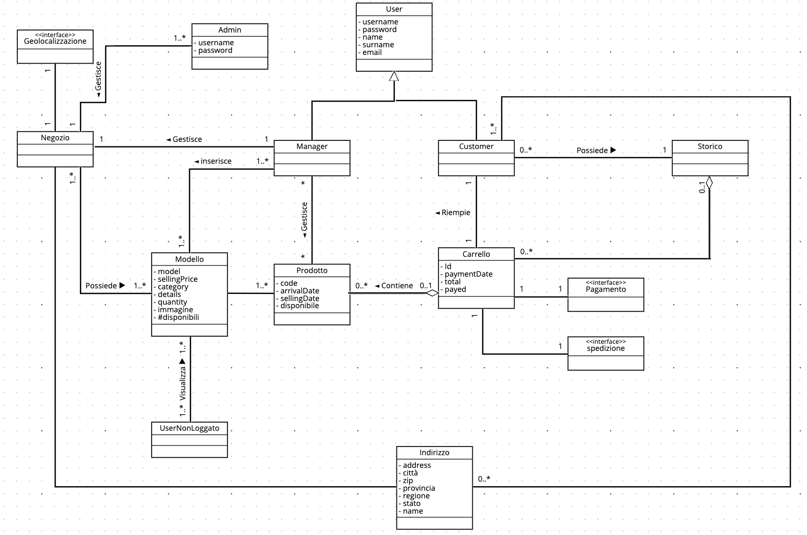
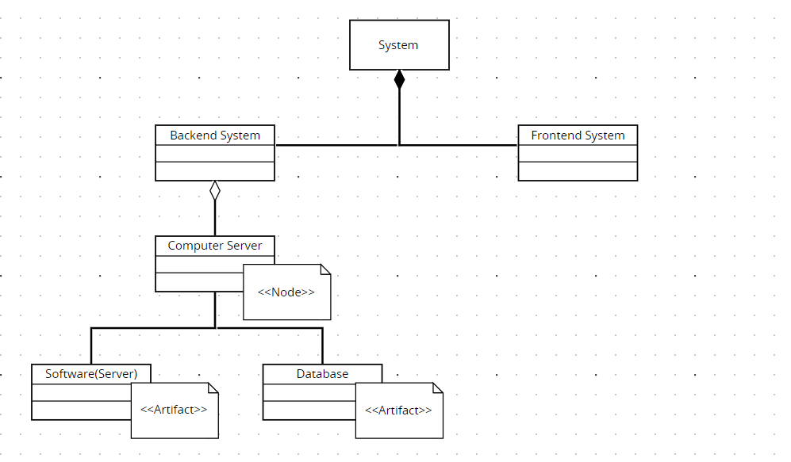
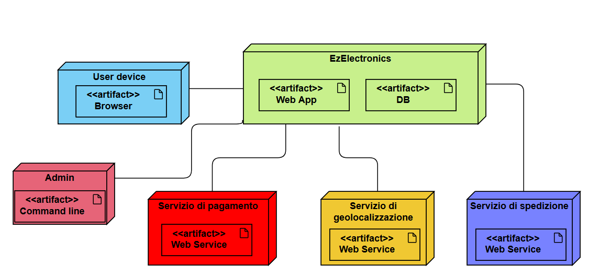

# Requirements Document - future EZElectronics

Date: 05/05/2024

Version: V1 - description of EZElectronics in FUTURE form (as proposed by the team)

| Version number | Change |
| :------------: | :----: |
|     1.1        |   Stakeholders, Interfacce     |
|     1.2        |   Deployment Diagram           |
|     1.3        |   Functional requirements      |
|     1.4        |   Use cases UC1-UC7                   |
|     1.5        |   Use cases UC8-UC15                  |
|     1.6        |   Glossary                  |

# Contents

- [Requirements Document - future EZElectronics](#requirements-document---future-ezelectronics)
- [Contents](#contents)
- [Informal description](#informal-description)
- [Stakeholders](#stakeholders)
- [Context Diagram and interfaces](#context-diagram-and-interfaces)
  - [Context Diagram](#context-diagram)
  - [Interfaces](#interfaces)
- [Stories and personas](#stories-and-personas)
- [Functional and non functional requirements](#functional-and-non-functional-requirements)
  - [Functional Requirements](#functional-requirements)
  - [Access rights](#access-rights)
  - [Non Functional Requirements](#non-functional-requirements)
- [Use case diagram and use cases](#use-case-diagram-and-use-cases)
  - [Use case diagram](#use-case-diagram)
    - [Use case 1, UC1 Creazione dell'account](#use-case-1-uc1-creazione-dellaccount)
      - [Scenario 1.1](#scenario-11)
    - [Use case 2, UC2 Login](#use-case-2-uc2-login)
      - [Scenario 2.1](#scenario-21)
      - [Scenario 2.2](#scenario-22)
    - [Use case 3, UC3 Gestione dell'account](#use-case-3-uc3-gestione-dellaccount)
      - [Scenario 3.1](#scenario-31)
      - [Scenario 3.2](#scenario-32)
      - [Scenario 3.3](#scenario-33)
      - [Scenario 3.4](#scenario-34)
      - [Scenario 3.5](#scenario-35)
      - [Scenario 3.6](#scenario-36)
      - [Scenario 3.7](#scenario-37)
    - [Use case 4, UC4 Ricerca dei prodotti](#use-case-4-uc4-ricerca)
      - [Scenario 4.1](#scenario-41)
      - [Scenario 4.2](#scenario-42)
      - [Scenario 4.3](#scenario-43)
      - [Scenario 4.4](#scenario-44)
      - [Scenario 4.1](#scenario-45)
      - [Scenario 4.2](#scenario-46)
      - [Scenario 4.3](#scenario-47)
    - [Use case 5, UC5 Visualizzare le informazioni di un prodotto](#use-case-5-uc5-visualizzare-le-informazioni-di-un-prodotto)
      - [Scenario 5.1](#scenario-51)
    - [Use case 6, UC6 Gestione Carrello](#use-case-6-uc6-gestione-carrello)
      - [Scenario 6.1](#scenario-61)
      - [Scenario 6.2](#scenario-62)
      - [Scenario 6.3](#scenario-63)
      - [Scenario 6.4](#scenario-64)
    - [Use case 7, UC7 Consultazione dello storico](#use-case-7-uc7-consultazione-dello-storico)
      - [Scenario 7.1](#scenario-71)
    - [Use case 8, UC8 Acquisto di prodotti](#use-case-8-uc8-acquisto-di-prodotti)
      - [Scenario 8.1](#scenario-81)
    - [Use case 9, UC9 Gestione Negozi](#use-case-9-uc9-gestione-negozi)
      - [Scenario 9.1](#scenario-91)
      - [Scenario 9.2](#scenario-92)
      - [Scenario 9.3](#scenario-93)
    - [Use case 10, UC10 Admin Login](#use-case-10-uc10-admin-login)
      - [Scenario 10.1](#scenario-101)
    - [Use case 11, UC11 Admin Logout](#use-case-11-uc11-admin-logout)
      - [Scenario 11.1](#scenario-111)
    - [Use case 12, UC12 Gestione admin dei prodotti](#use-case-12-uc12-gestione-admin-dei-prodotti)
      - [Scenario 12.1](#scenario-121)
      - [Scenario 12.2](#scenario-122)
      - [Scenario 12.3](#scenario-123)
      - [Scenario 12.4](#scenario-124)
      - [Scenario 12.5](#scenario-125)
      - [Scenario 12.6](#scenario-126)
      - [Scenario 12.7](#scenario-127)
    - [Use case 13, UC13 Gestione admin degli account](#use-case-13-uc13-gestione-admin-degli-account)
      - [Scenario 13.1](#scenario-131)
      - [Scenario 13.2](#scenario-132)
      - [Scenario 13.3](#scenario-133)
      - [Scenario 13.4](#scenario-134)
      - [Scenario 13.5](#scenario-135)
      - [Scenario 13.6](#scenario-136)
      - [Scenario 13.7](#scenario-137)
    - [Use case 14, UC14 Gestione admin dei negozi](#use-case-14-uc14-gestione-admin-dei-negozi)
      - [Scenario 14.1](#scenario-141)
      - [Scenario 14.2](#scenario-142)
      - [Scenario 14.3](#scenario-143)
    - [Use case 15, UC15 Gestione dei prodotti](#use-case-15-uc15-gestione-dei-prodotti)
      - [Scenario 15.1](#scenario-151)
      - [Scenario 15.2](#scenario-152)
      - [Scenario 15.3](#scenario-153)
      - [Scenario 15.4](#scenario-154)
- [Glossary](#glossary)
- [System Design Diagram](#system-design-diagram)
- [Deployment Diagram](#deployment-diagram)

# Informal description

EZElectronics (read EaSy Electronics) is a software application designed to help managers of electronics stores to manage their products and offer them to customers through a dedicated website. Managers can assess the available products, record new ones, and confirm purchases. Customers can see available products, add them to a cart and see the history of their past purchases.

# Stakeholders

| Stakeholder name | Description |
| :--------------: | :---------: |
| Customer         | L'utente che accede all'applicazione per comprare uno o più prodotti elettronici |
| Utente non loggato         | L'utente che usa l'applicazione per visualizzare i prodotti disponibili |
| Manager          | L'utente che utilizza l'applicazione per inserire e gestire i prodotti in vendita del proprio negozio di elettronica |
| Admin            | Tecnico che gestisce l'applicazione e eventuali malfunzionamenti |
| Servizio di Pagamento | Sistema esterno che gestisce il pagamento online |
| Servizio di Localizzazione | Sistema esterno che permette la visualizzazione su mappa di indirizzi |
| Servizio di spedizione | Sistema esterno che gestisce la spedizione dei prodotti acquistati |

# Context Diagram and interfaces

## Context Diagram

## Interfaces

|   Actor   | Logical Interface | Physical Interface |
| :-------: | :---------------: | :----------------: |
| Customer  | GUI               | PC, Smartphone     |
| Utente non loggato  | GUI               | PC, Smartphone     |
| Manager   | GUI               | PC, Smartphone     |
| Admin     | CLI(Command Line Interface) | PC       |
| Servizio di pagamento | <https://paypal.com>, <https://nexi.it>, <https://satispay.com> | Internet |
| Servizio di localizzazione | <https://maps.google.com> | Internet |
| Servizio di spedizione | Shipping company | Internet |

# Stories and personas

Persona 1: \
Alex, studente di 18 anni. Studia in un liceo informatico e ha bisogno di comprare un nuovo compouter e altri dispositivi tecnologi per lo studio.\
Story: Alex ha bisogno di un ampio catalogo di dispositivi cui poter scegliere quelli più adatti alle sue esigenze.

Persona 2: \
Steve, genitore cinquantenne, impiegato d'ufficio. Ha bisogno di un nuovo laptop per lavoro. \
Story: Steve cerca un'applicazione intuitiva e facile da usare per poter sfogliare i modelli e acquistare il laptop.

Persona 3: \
Laura, avvocato di 30 anni. Cerca un determinato modello di smarphone. \
Story: Laura ha bisogno di uno smartphone in particolare. Cerca un'applicazione efficace nella ricerca dei modelli di dispositivi e con schede techniche esaustive.

Persona 4: \
Giacomo, proprietario di un negozio di elettronica. Ha bisogno di dare più visibilità ai prodotti che vende. \
Story: Giacomo cerca un'applicazione online sulla quale può vendere in maniera rapida i propri prodotti.

Persona 5: \
Elisabetta, manager di un negozio di elettronica. Ha bisogno di gestire i prodotti che vengono venduti nel proprio negozio. \
Story: Elisabetta cerca un'applicazione online sulla quale può gestire gestire le vendite all'interno del suo negozio.

Persona 6: \
Anna, manager di più negozi di elettronica.
Story: Anna vuole estendere la sua clientela e necessita di un'applicazione che le permetta di unire in un posto solo i prodotti di tutti i suoi negozi.

Persona 7: \
Gianluca, ragazzo di 24 anni. Cerca un'applicazione che gli permetta di acquistare online con i metodi di pagamento più comodi del momento.
Story: Gianluca usa molto spesso PayPal e Satispay per pagare online e cerca un'applicazione che gli permetta di usare questi metodi di pagamento.

# Functional and non functional requirements

## Functional Requirements

|  ID   | Description |
| :---: | :---------: |
| FR1 | Gestione degli utenti |
| FR1.1 | Creare un nuovo account utente (Customer o Manager) |
| FR1.2 | Fare il login di un utente già registrato |
| FR1.3 | Fare il logout dell'utente attuale |
| FR1.4 | Mostrare la lista delle informazioni dell'utente attuale |
| FR1.5 | Modificare email e password del proprio account |
| FR1.6 | Eliminare il proprio account |
| FR1.7 | Recuperare la propria password |
| FR1.8 | Aggiungere un indirizzo di spedizione |
| FR1.9 | Rimuovere un indirizzo di spedizione |
| FR2 | Gestione dei prodotti |
| FR2.1 | Registrare l'arrivo di un set di prodotti dello stesso modello |
| FR2.2 | Mostrare tutti i prodotti |
| FR2.3 | Mostrare un prodotto dato il codice |
| FR2.4 | Mostrare tutti i prodotti di una categoria |
| FR2.5 | Mostrare tutti i prodotti di un determinato modello |
| FR2.6 | Mostrare i prodotti in base a diversi filtri |
| FR2.7 | Eliminare un prodotto |
| FR2.8 | Modificare le informazioni di un prodotto |
| FR3 | Gestione del carrello di un Customer |
| FR3.1 | Mostrare il carrello dell'utente loggato |
| FR3.2 | Aggiungere un prodotto al carrello dell'utente loggato |
| FR3.3 | Pagare il carrello |
| FR3.4 | Mostrare lo storico dei carrelli precedenti (escluso quello attuale) |
| FR3.5 | Eliminare uno o più prodotti dal carrello |
| FR3.6 | Svuotare il carrello |
| FR4 | Gestione negozio |
| FR4.1 | Creare un nuovo negozio |
| FR4.2 | Mostrare le informazioni del negozio |
| FR4.3 | Modificare le informazioni di un negozio |
| FR4.4 | Vedere la lista di tutti i negozi |
| FR4.5 | Eliminare un negozio |
| FR6 | Gestione applicazione |
| FR6.1 | Fare il login dell'admin |
| FR6.2 | Fare il logout dell'admin |
| FR6.3 | Mostrare all'admin tutti i prodotti |
| FR6.4 | Far eliminare all'admin un prodotto |
| FR6.5 | Far eliminare all'admin tutti i prodotti |
| FR6.6 | Far eliminare all'admin tutti i prodotti di un negozio o di un modello |
| FR6.7 | Mostarare all'admin tutti i prodotti di un negozio o di un modello |
| FR6.8 | Far eliminare all'admin un account |
| FR6.9 | Mostrare all'admin tutti gli account |
| FR6.10 | Mostrare all'admin tutti gli account manager o customer |
| FR6.11 | Far eliminare all'admin tutti gli account |
| FR6.12 | Far eliminare all'admin tutti gli account Customer o Manager |
| FR6.13 | Far eliminare all'admin uno o tutti i negozi |
| FR6.14 | Mostrare all'admin tutti i negozi |
| FR7  | Requisiti di sistema |
| FR7.1 | Il sistema calcola il codice numerico dei prodotti |
| FR7.2 | Il sistema calcola il costo totale del carrello in base ai prodotti che contiene |
| FR7.3 | Il sistema imposta la data corrente quando il campo opzionale data viene omesso |
| FR7.4 | Il sistema valida la password in base alle regole definite |
| FR7.5 | Il sistema calcola il negozio da cui proviene il prodotto comprato in base alla disponibilità e alla distanza con l'indirizzo di spedizione |
| FR7.6 | Il sistema valida la data in base al formato prestabilito in fase di sviluppo. |

## Access rights

|  FR   | Customer | Manager| Admin |
| :---: | :---------: |:---------:|:---------:|
|1.1 |x|x||
|1.2 |x|x||
|1.3| x|x||
|1.4| x|x||
|1.5|x|x||
|1.6|x|x||
|1.7|x|x||
|1.8|x|||
|1.9|x|||
|2.1||x||
|2.2|x|x||
|2.3|x|x||
|2.4|x|x||
|2.5|x|x||
|2.6|x|x||
|2.7||x||
|2.8||x||
|3.1|x|||
|3.2|x|||
|3.3|x|||
|3.4|x|||
|3.5|x|||
|3.6|x|||
|4.1||x||
|4.2||x||
|4.3||x||
|4.4||x||
|4.5||x||
|5.1|x|||
|5.2|x|||
|5.3|x|||
|5.4|x|||
|5.5|x|||
|6.1|||x|
|6.2|||x|
|6.3|||x|
|6.4|||x|
|6.5|||x|
|6.6|||x|
|6.7|||x|
|6.8|||x|
|6.9|||x|
|6.10|||x|
|6.11|||x|
|6.12|||x|
|6.13|||x|
|6.14|||x|
|7.1|   | x |   |
|7.2| x |   |   |
|7.3|   | x |   |
|7.4| x | x |   |
|7.5| x |   |   |
|7.6|   | x |   |

## Non Functional Requirements

|   ID    | Type (efficiency, reliability, ..) | Description | Refers to |
| :-----: | :--------------------------------: | :---------: | :-------: |
|  NFR1   | Usabilità | Gli utenti non devono aver bisogno di training | 1, 2, 3 |
|  NFR2   | Efficienza | Tutte le funzionalità delle app devono completarsi in un tempo < 0.1 sec (escludendo la rete) | Tutti i FR |
|  NFR3   | Affidabilità | Ogni utente non deve segnalare più di quattro bug all’anno | Tutti i FR |
|  NFR4   | Portabilità | L’applicazione web deve essere disponibile per i seguenti browser: Firefox (da versione 109), Chrome (da versione 88), Edge (da versione 88), Opera (da versione 74), Safari (da versione 16), Firefox for Android (da versione 109), Safari on iOS (da versione 16) | Tutti i FR |
|  NFR5   | Portabilità | L'applicazione web deve mantenere la sua usabilità su dispositivi di diverso tipo e dimensione di schermo (es. tablet, smartphone) | 1, 2, 3 |
|  NFR6   | Scalabilità | L'applicazione web deve supportare 100.000 visite contemporanee senza perdere in performance | 1, 2, 3 |
|  NFR7   | Manutenibilità | Il tempo medio per ripristinare il sistema dopo un system failure non deve essere superire a 30 minuti | Tutti i FR |
|  NFR8   | Usabilità | L'utente dev'essere in grado di trovare il prodotto desiderato attraverso meno di 5 click | 2 |
|  NFR9   | Correttezza | L’applicazione deve fornire i giusti risultati minimo nel 95% delle richieste | Tutti i FR |
|  NFR10  | Compatibilità | L'applicazione deve essere compatibile per i seguenti metodi di pagamento: Satispay, Paypal, Nexi | 3 |
|  NFR11  | Sicurezza | L'applicazione deve essere protetta da accessi non autorizzati | Tutti i FR |
|  NFR12  | Dominio | L'applicazione viene rilasciata in Europa | Tutti i FR |

# Use case diagram and use cases

## Use case diagram

*Use case diagram ad alto livello*

*Use case diagram a basso livello*

### Use case 1, UC1 Creazione dell'account

| Actors Involved | Utente |
| :--------------: | :------------------------------------------------------------------: |
| Precondition | L'utente non è registrato. |
| Post condition | L'utente ha creato correttamente il proprio account. |
| Nominal Scenario | L'utente desidera creare un account, fornisce le informazioni richieste dal sistema. Il sistema crea l'account. |
| Variants |  |
| Exceptions | Username, nome, congnome, email, password o ruolo mancanti. Username già in uso. Email già in uso. |

#### Scenario 1.1

|  Scenario 1.1  | Creazione dell'account |
| :------------: | :---------------------------: |
|  Precondition  | L'utente non è registrato |
| Post condition | L'utente ha creato correttamente il proprio account. |
|     Step#      | Description |
|       1        | Il sistema chiede username, nome, cognome, email, password e ruolo. |
|       2        | L'utente inserisce username, nome, cognome, email, password e ruolo. |
|       3        | L'utente conferma l'inserimento dei dati. |
|       4        | Il sistema controlla i dati inseriti. Dati completi. |
|       5        | Il sistema verifica l'univocità dello username. Username non in uso. |
|       6        | Il sistema verifica l'univocità dell'email. Email non in uso. |
|       7        | Il sistema crea l'account. |
|Exceptions | |
|       2a        | L'utente non inserisce uno o più dati. |
|       3a        | L'utente conferma di volersi registrare. |
|       4a        | Il sistema controlla i dati inseriti. Dati mancanti. |
|       5a        | Il sistema ritorna un messaggio di errore. |
|       6a        | Riprende da 1. |
|       5b        | Il sistema verifica l'univocità dello username. Username già in uso. |
|       6b        | Il sistema restituisce un errore. |
|       7b        | Riprende da 1. |
|       6c        | Il sistema verifica l'univocità dell'email. Email già in uso. |
|       7c        | Il sistema restituisce un errore. |
|       8c        | Riprende da 1. |

### Use case 2, UC2 Login

| Actors Involved  | Utente |
| :--------------: | :------------------------------------------------------------------: |
|   Precondition   | L'utente ha creato l'account. |
|  Post condition  | L'utente ha effettuato correttamente il login e può usare i servizi del sistema. |
| Nominal Scenario | L'utente desidera utilizzare i servizi dell'applicazione, fornisce le proprie credenziali. Il sistema permette l'accesso. |
|     Variants     |  |
|    Exceptions    | Username/email o password errati. Username/email o password mancanti. Codice errato. Password non valida. |

#### Scenario 2.1

|  Scenario 2.1  | Login |
| :------------: | :------------------------------------------------------------------------: |
|  Precondition  | L'utente ha creato l'account. |
| Post condition | L'utente ha effettuato correttamente il login e può usare i servizi del sistema. |
|     Step#      |                                Description                                 |
|       1        | Il sistema chiede username,email e password. |
|       2        | L'utente inserisce username,email e password. |
|       3        | L'utente conferma l'inserimento. |
|       4        | Il sistema controlla i dati inseriti. Dati completi. |
|       5        | Il sistema verifica le credenziali. Credenziali corrette. |
|       6        | Il sistema concede l'accesso. |
|    Exceptions  |  |
|       2a       | L'utente non inserisce username/email e/o password. |
|       3a       | L'utente conferma di voler fare il login. |
|       4a       | Il sistema controlla le credenziali. Credenziali mancanti. |
|       5a       | Il sistema restituisce un errore. |
|       6a       | Riprende a 1. |
|       5b       | Il sistema verifica le credenziali. Credenziali errate. |
|       6b       | Il sistema restituisce un errore. |
|       7b       | Riprende a 1. |

### Scenario 2.2

|  Scenario 2.2  | Recupero password |
| :------------: | :------------------------------------------------------------------------: |
|  Precondition  | L'utente ha creato l'account. |
| Post condition | L'utente ha modificato correttamente la password e può riprovare ad accedere. |
|     Step#      |                                Description                                 |
|       1        | L'utente chiede di recuperare la password. |
|       2        | Il sistema chiede l'email collegata all'account. |
|       3        | L'utente inserice l'email e conferma. |
|       4        | Il sistema verifica che l'email sia corretta. Email corretta. |
|       5        | Il sistema invia un codice di verifica all'email inserita. |
|       6        | Il sistema chiede di inserire il codice. |
|       7        | L'utente inserisce il codice e conferma. |
|       8        | Il sistema verifica il codice inserito. Codice corretto. |
|       9        | Il sistema chiede di inserire una nuova password. |
|       10       | L'utente inserisce la password. |
|       11       | Il sistema controlla la password. Password valida. |
|       12       | Il sistema modifica la password dell'utente. |
|    Exceptions  |                                                                            |
|       5a       | Il sistema verifica che l'email sia corretta. Email non corretta. |
|       6a       | Il sistema restituisce un errore. |
|       7a       | Riprende a 2. |
|       8b       | Il sistema verifica il codice inserito. Codice non corretto. |
|       9b       | Il sistema restituisce un errore. |
|       10b      | Riprende a 7. |
|       11c      | Il sistema controlla la password. Password non valida. |
|       12c      | Il sistema restituisce un errore. |
|       13c      | Riprende a 10. |

### Use case 3, UC3 Gestione dell'account

| Actors Involved | Utente |
| :--------------: | :------------------------------------------------------------------: |
| Precondition | L'utente ha effettuato il login. |
| Post condition | L'utente ha svolto delle azioni sul proprio account (logout, visualizzazione delle infomazioni, modifica delle informazioni, aggiunta di un indirizzo di spedizione, eliminazione dell'account). |
| Nominal Scenario | L'utente desidera gestire il proprio account, chiede di fare logout, di visualizzare o modificare le proprie informazioni, di eliminare il proprio account. Il sistema esegue la richiesta. |
| Variants |  |
| Exceptions | Password errata. Email non valida. Password non valida. Nome dell'indirizzo, indirizzo, CAP e città mancanti. |

#### Scenario 3.1

|  Scenario 3.1  | Visualizzazione delle informazioni dell'account |
| :------------: | :------------------------------------------------------------------------: |
|  Precondition  | L'utente ha effettuato il login. |
| Post condition | Il sistema mostra le informazioni dell'account dell'utente. |
|     Step#      |                                Description                                 |
|       1        | L'utente chiede di visualizzare le informazioni del proprio account. |
|       2        | Il sistema mostra le informazioni. |

#### Scenario 3.2

|  Scenario 3.2  |                    Modifica dell'email                  |
| :------------: | :------------------------------------------------------------------------: |
|  Precondition  |  L'utente ha effettuato il login. |
| Post condition |  L'utente ha modificato la propria email. |
|     Step#      |                                Description                                 |
|       1        | L'utente chiede di modificare l'email associata all'account. |
|       2        | Il sistema chiede di inserire la nuova email e la password. |
|       3        | L'utente inserisce la nuova email e la password. |
|       4        | Il sistema verifica che la password sia corretta. Password corretta. |
|       5        | Il sistema verifica che l'email sia valida. Email valida. |
|       6        | Il sistema modifica l'email associata all'account. |
|   Exceptions   |                                                                            |
|       4a       | Il sistema verifica che la password sia corretta. Password non corretta. |
|       5a       | Il sistema restituisce un errore. |
|       6a       | Riprende da 2. |
|       5b       | Il sistema verifica che l'email sia valida. Email non valida. |
|       6b       | Il sistema restituisce un errore. |
|       7b       | Riprende da 2. |

#### Scenario 3.3

|  Scenario 3.3  |                    Modifica della password                  |
| :------------: | :------------------------------------------------------------------------: |
|  Precondition  |  L'utente ha effettuato il login. |
| Post condition |  L'utente ha modificato la propria password. |
|     Step#      |                                Description                                 |
|       1        | L'utente chiede di modificare la password. |
|       2        | Il sistema chiede di inserire la vecchia e la nuova password. |
|       3        | L'utente inserisce la vecchia e la nuova password. |
|       4        | Il sistema verifica che la vecchia password sia corretta. Password corretta. |
|       5        | Il sistema verifica che la nuova password sia valida. Password valida. |
|       6        | Il sistema modifica la password dell'account. |
|   Exceptions   |                                                                            |
|       4a       | Il sistema verifica che la vecchia password sia corretta. Password non corretta. |
|       5a       | Il sistema restituisce un errore. |
|       6a       | Riprende da 2. |
|       4a       | Il sistema verifica che la nuova password sia valida. Password non valida. |
|       5a       | Il sistema restituisce un errore. |
|       6a       | Riprende da 2. |

#### Scenario 3.4

|  Scenario 3.4  |                    Eliminazione account                 |
| :------------: | :------------------------------------------------------------------------: |
|  Precondition  |  L'utente ha effettuato il login. |
| Post condition |  L'utente ha eliminato il proprio account. |
|     Step#      |                                Description                                 |
|       1        | L'utente chiede di eliminare l'account. |
|       2        | Il sistema chiede di inserire la password. |
|       3        | L'utente inserisce la password. |
|       4        | Il sistema verifica che la password sia corretta. Password corretta. |
|       5        | Il sistema elimina l'account. |
|   Exceptions   |                                                                            |
|       4a       | Il sistema verifica che la password sia corretta. Password non corretta. |
|       5a       | Il sistema restituisce un errore. |
|       6a       | Riprende da 2. |

#### Scenario 3.5

|  Scenario 3.5  |                    Aggiungere indirizzo di spedizione                  |
| :------------: | :------------------------------------------------------------------------: |
|  Precondition  |  L'utente ha effettuato il login ed è un customer. |
| Post condition |  Il customer ha aggiunto un indirizzo di spedizione. |
|     Step#      |                                Description                                 |
|       1        | Il customer chiede di aggiungere un indirizzo di spedizione. |
|       2        | Il sistema chiede di inserire nome dell'indirizzo, indirizzo, CAP, provincia, città e stato. |
|       3        | Il customer inserisce nome dell'indirizzo, indirizzo, CAP, provincia, città e stato. |
|       4        | Il sistema verifica i dati immessi. Dati completi. |
|       5        | Il sistema verifica l'univocità del nome. Nome univoco. |
|       6        | Il sistema aggiunge il nuovo indirizzo all'account. |
|   Exceptions   |                                                                            |
|       4a       | Il sistema verifica i dati immessi. Dati non completi. |
|       5a       | Il sistema restituisce un errore. |
|       6a       | Riprende da 2. |
|       5b       | Il sistema verifica l'univocità del nome. Nome non univoco. |
|       6b       | Il sistema restituisce un errore. |
|       7b       | Riprende da 2. |

#### Scenario 3.6

|  Scenario 3.6  |                    Rimuovere indirizzo di spedizione                  |
| :------------: | :------------------------------------------------------------------------: |
|  Precondition  |  L'utente ha effettuato il login ed è un customer. |
| Post condition |  Il customer ha rimosso un indirizzo di spedizione. |
|     Step#      |                                Description                                 |
|       1        | Il customer chiede di rimuovere un indirizzo di spedizione. |
|       2        | Il sistema rimuove l'indirizzo. |

#### Scenario 3.7

|  Scenario 3.7  |                    Logout                  |
| :------------: | :------------------------------------------------------------------------: |
|  Precondition  |  L'utente ha effettuato il login. |
| Post condition |  L'utente è uscito dall'account. |
|     Step#      |                                Description                                 |
|       1        | L'utente chiede di fare logout |
|       2        | L'utente conferma la richiesta. |
|       3        | Il sistema compie il logout dell'utente. |
|       4        | Il sistema chiede all'utente di effettuare il login. |

### Use case 4, UC4 Ricerca

| Actors Involved  | Utente loggato, utente non loggato |
| :--------------: | :------------------------------------------------------------------:               |
|   Precondition   | L'utente ha effettuato il login. |
|  Post condition  | L'utente vede una lista di modelli o prodotti e le informazioni associate. |
| Nominal Scenario | L'utente non loggato (o il customer) desidera vedere tutti i modelli. |
|     Variants     | L'utente ricerca un particolare modello. L'utente ricerca i modelli per categoria. Il manager ricerca i prodotti per codice. Il manager vede tutti i prodotti. Il manager ricerca i prodotti per modello. Il manager ricerca i prodotti per categoria. |
|    Exceptions    | Il modello cercato non esiste. Il codice cercato non esiste. |

#### Scenario 4.1

|  Scenario 4.1  |                             Lista di tutti i modelli                      |
| :------------: | :------------------------------------------------------------------------: |
|  Precondition  | L'utente non è loggato o è un customer. |
| Post condition | L'utente visualizza tutti i prodotti. |
|     Step#      |                                Description                                 |
|       1        | L'utente chiede di cercare. |
|       2        | L'utente chiede di vedere tutti i modelli scegliendo se filtrare solo per quelli disponibili o no. |
|       3        | Il sistema mostra la lista dei modelli in base al filtro richiesto. |

#### Scenario 4.2

|  Scenario 4.2  |                             Ricerca singolo modello                     |
| :------------: | :------------------------------------------------------------------------: |
|  Precondition  | L'utente non è loggato o è un customer. |
| Post condition | L'utente visualizza un determinato modello. |
|     Step#      |                                Description                                 |
|       1        | L'utente chiede di cercare. |
|       2        | Il sistema chiede il modello. |
|       3        | L'utente inserisce il modello. |
|       4        | L'utente chiede di filtrare i prodotti tra disponibili o tutti. |
|       5        | Il sistema verifica che il modello esista. Il modello esiste. |
|       6        | Il sistema mostra il modello in base al filtro richiesto. |
|   Exceptions   |                                                                            |
|       5a       | Il sistema verifica che il modello esista. Il modello non esiste. |
|       6a       | Il sistema restituisce un errore. |
|       7a       | Riprende da 2. |

#### Scenario 4.3

|  Scenario 4.3  |                             Ricerca modelli in base alla categoria                 |
| :------------: | :------------------------------------------------------------------------: |
|  Precondition  | L'utente non è loggato o è un customer. |
| Post condition | L'utente visualizza i modelli di una determinata categoria. |
|     Step#      |                                Description                                 |
|       1        | L'utente chiede di cercare. |
|       2        | L'utente chiede di cercare per categoria. |
|       3        | L'utente seleziona la categoria tra quelle disponibili. |
|       4        | L'utente chiede di filtrare i prodotti tra disponibili o tutti. |
|       5        | Il sistema mostra la lista dei modelli di quella categoria in base al filtro richiesto. |

#### Scenario 4.4

|  Scenario 4.4  |                             Lista di tutti i prodotti                      |
| :------------: | :------------------------------------------------------------------------: |
|  Precondition  | L'utente ha effettuato il login ed è un manager. |
| Post condition | L'utente visualizza tutti i prodotti. |
|     Step#      |                                Description                                 |
|       1        | L'utente chiede di cercare. |
|       2        | L'utente chiede di vedere tutti i prodotti. |
|       3        | L'utente chiede di filtrare i prodotti tra venduti, non venduti o tutti. |
|       4        | Il sistema mostra la lista dei prodotti in base al filtro richiesto. |

#### Scenario 4.5

|  Scenario 4.5  |                             Ricerca prodotti in base al codice                 |
| :------------: | :------------------------------------------------------------------------: |
|  Precondition  | L'utente ha effettuato il login ed è un manager. |
| Post condition | L'utente visualizza il prodotto con uno specifico codice. |
|     Step#      |                                Description                                 |
|       1        | L'utente chiede di cercare i prodotti. |
|       2        | L'utente chiede di cerca per codice. |
|       3        | Il sistema chiede il codice. |
|       4        | L'utente insersce il codice. |
|       5        | Il sistema verifica che il codice esista. Il codice esiste. |
|       6        | Il sistema mostra il prodotto. |
|   Exceptions   |                                                                            |
|       5a       | Il sistema verifica che il codice esista. Il codice non esiste. |
|       6a       | Il sistema restituisce un errore. |
|       7a       | Riprende da 2. |

#### Scenario 4.6

|  Scenario 4.6  |                             Ricerca prodotti in base al modello                     |
| :------------: | :------------------------------------------------------------------------: |
|  Precondition  | L'utente ha effettuato il login ed è un manager. |
| Post condition | L'utente visualizza i prodotti di un determinato modello. |
|     Step#      |                                Description                                 |
|       1        | L'utente chiede di cercare i prodotti. |
|       2        | L'utente chiede di cercare per modello. |
|       3        | Il sistema chiede il modello. |
|       4        | L'utente inserisce il modello. |
|       5        | L'utente chiede di filtrare i prodotti tra venduti, non venduti o tutti. |
|       6        | Il sistema verifica che il modello esista. Il modello esiste. |
|       7        | Il sistema mostra la lista di tutti i prodotti di quel modello in base al filtro richiesto. |
|   Exceptions   |                                                                            |
|       6a       | Il sistema verifica che il modello esista. Il modello non esiste. |
|       7a       | Il sistema restituisce un errore. |
|       8a       | Riprende da 2. |

#### Scenario 4.7

|  Scenario 4.7  |                             Ricerca prodotti in base alla categoria                 |
| :------------: | :------------------------------------------------------------------------: |
|  Precondition  | L'utente ha effettuato il login ed è un manager. |
| Post condition | L'utente visualizza i un prodotti di una determinata categoria. |
|     Step#      |                                Description                                 |
|       1        | L'utente chiede di cercare i prodotti. |
|       2        | L'utente chiede di cercare per categoria. |
|       3        | L'utente seleziona la categoria tra quelle disponibili. |
|       4        | L'utente chiede di filtrare i prodotti tra venduti, non venduti o tutti. |
|       5        | Il sistema mostra la lista dei prodotti di quella categoria in base al filtro richiesto. |

### Use case 5, UC5 Visualizzare le informazioni di un prodotto

| Actors Involved  | Utente |
| :--------------: | :------------------------------------------------------------------: |
|   Precondition   | L'utente ha effettuato il login. |
|  Post condition  | L'utente visualizza le informazioni di un prodotto. |
| Nominal Scenario | L'utente desidera visualizzare le informazioni dettagliate di un prodotto. Il sistema restituisce le informazioni. |
|     Variants     |  |
|    Exceptions    | Il prodotto non esiste. |

#### Scenario 5.1

|  Scenario 5.1  |           Visualizzare le informazioni di un prodotto                 |
| :------------: | :------------------------------------------------------------------------: |
|  Precondition  | L'utente ha effettuato il login. |
| Post condition | L'utente visualizza le informazioni di un prodotto. |
|     Step#      |                           Description                                 |
|       1        | L'utente chiede di visualizzare le informazioni dettagliate di uno specifico prodotto. |
|       2        | Il sistema verifica che il codice esista. Il codice esiste. |
|       3        | Il sistema restituisce le informazioni dettagliate del prodotto. |
|Exceptions   |               |
|       2a       | Il sistema verifica che il codice esista. Il codice non esiste. |
|       3a       | Il sistema restituisce un errore. |

### Use case 6, UC6 Gestione Carrello

| Actors Involved  | Customer |
| :--------------: | :------------------------------------------------------------------: |
|   Precondition   | Il customer ha effettuato il login. |
|  Post condition  | Il customer ha visualizzato il carrello. Il customer ha aggiunto o rimosso prodotti dal carrello. Il customer ha svuotato il carrello. |
| Nominal Scenario | Il customer desidera compiere delle azioni sul proprio carrello (aggiungere/togliere prodotti, svuotarlo, visionarlo). Il sistema compie la richiesta. |
|     Variants     |  |
|    Exceptions    | Il prodotto non esiste. Il prodotto è presente in un altro carrello o è stato venduto. Il carrello è vuoto. Il prodotto non è presente nel carrello. Il carrello non appartiene al customer. |

#### Scenario 6.1

|  Scenario 6.1  | Visualizzare il carrello |
| :------------: | :---------------------------: |
|  Precondition  | Il customer ha effettuato il login. |
| Post condition | Il customer visualizza il carrello. |
|     Step#      |                                Description                                 |
|       1        | Il customer chiede di visualizzare il carrello. |
|       2        | Il sistema restituisce il carrello. |

#### Scenario 6.2

|  Scenario 6.2  | Aggiunta di un prodotto al carrello |
| :------------: | :---------------------------: |
|  Precondition  | Il customer ha effettuato il login. |
| Post condition | Il customer ha aggiunto con successo un prodotto al carrello. |
|     Step#      |Description|
|       1        | Il customer chiede di aggiungere un prodotto di un modello al carrello. |
|       2        | Il sistema verifica che il modello abbia prodotti disponibili per essere inseriti in un carrello. Ci sono prodotti disponibili. |
|       3        | Il sistema aggiunge un prodotto disponibile al carrello, diminuisce il numero di prodotti disponibili per quel modello e imposta il prodotto come non disponibile. |
|   Exceptions   |  |
|       2b       | Il sistema verifica che il modello abbia prodotti disponibili per essere inseriti in un carrello. Non ci sono prodotti disponibili. |
|       3b       | Il sistema restituisce un errore. |

#### Scenario 6.3

|  Scenario 6.3  | Rimozione di più prodotti dal carrello |
| :------------: | :---------------------------: |
|  Precondition  | Il customer ha effettuato il login. |
| Post condition | Il customer ha rimosso i prodotti selezionati dal carrello. |
|     Step#      | Description |
|       1        | Il customer indica i prodotti che vuole rimuovere. |
|       2        | Il customer chiede di rimuovere i prodotti dal carrello. |
|       3        | Il sistema verifica che i codici esistano. I codici esistono. |
|       4        | Il sistema verifica che i prodotti siano nel carrello e che non siano già stati venduti. I prodotti possono essere rimossi. |
|       5        | Il sistema rimuove i prodotti dal carrello, aumenta il numero di prodotti disponibili per quel modello e imposta il prodotto come disponibile. |
|   Exceptions   |  |
|       2a       | Il sistema verifica che i codici esistono. Uno o più codici non esistono. |  
|       3a       | Il sistema restituisce un errore. |
|       3b       | Il sistema verifica che i prodotti siano nel carrello e che uno o più non siano già stati stati venduti. I prodotti non possono essere rimossi. |
|       4b       | Il sistema restituisce un errore. |

#### Scenario 6.4

|  Scenario 6.4  | Svuotare il carrello |
| :------------: | :---------------------------: |
|  Precondition  | Il customer ha effettuato il login. |
| Post condition | Il customer ha rimosso tutti i prodotti dal carrello. |
|     Step#      | Description |
|       1        | Il customer chiede di svuotare il carrello. |
|       2        | Il sistema verifica che il carrello appartenga al customer. Il carrello appartiene al customer. |
|       3        | Il sistema verifica che il carrello non sia vuoto. Il carrello non è vuoto. |
|       4        | Il sistema svuota il carrello, aumenta il numero di prodotti disponibili per ogni modello di ciascun prodotto nel carrello e imposta i prodotti tolti come disponibili. |
|   Exceptions   |  |
|       2a       | Il sistema verifica che il carrello appartenga al customer. Il carrello appartiene al customer. |
|       3a       | Il sistema restituisce un errore. |
|       3b       | Il sistema verifica che il carrello non sia vuoto. Il carrello è vuoto. |
|       4b       | Il sistema restituisce un errore. |

### Use case 7, UC7 Consultazione dello storico

| Actors Involved  | Customer |
| :--------------: | :------------------------------------------------------------------: |
|   Precondition   | Il customer ha effettuato il login. |
|  Post condition  | Il customer consulta lo storico dei carrelli e i dettagli del singolo carrello. |
| Nominal Scenario | Il customer desidera visualizzare lo storico dei propri carrelli. Il sistema restituisce lo storico. Il customer desidera vedere i dettagli di un carrello pagato. Il sistema restituisce i dettagli del carrello. |
|    Variants      |  |
|   Exceptions     |  |

#### Scenario 7.1

|  Scenario 7.1  | Consultazione dello storico |
| :------------: | :---------------------------: |
|  Precondition  | Il customer ha effettuato il login. |
| Post condition | Il customer consulta lo storico dei carrelli. |
|     Step#      | Description |
|       1        | Il customer chiede di visualizzare lo storico dei propri carrelli. |
|       2        | Il sistema mostra lo storico dei carrelli. |
|       3a       | Il customer chiede di vedere i dettagli di un carrello. |
|       4a       | Il sistema restituisce i dettagli di un carrello. |

### Use case 8, UC8 Acquisto di prodotti

| Actors Involved  | Customer, servizio di pagamento, servizio di spedizione, servizio di localizzazione |
| :--------------: | :------------------------------------------------------------------: |
|   Precondition   | Il customer ha effettuato il login. |
|  Post condition  | Il customer ha pagato i prodotti nel carrello. I prodotti vengono spediti. |
| Nominal Scenario | Il customer desidera acquistare i prodotti nel proprio carrello. Il sistema gli permette di farlo. Il sistema si interfaccia con il servizio di localizzazione. Il sistema si interfaccia con il metodo di pagamento richiesto. Il sistema si interfaccia con la compagnia di spedizioni. Il sistema termina l'acquisto. |
|    Variants      |  |
|   Exceptions     | Il carrello è vuoto. L'indirizzo di spedizione non è stato indicato. |

#### Scenario 8.1

|  Scenario 8.1  | Acquisto di prodotti |
| :------------: | :---------------------------: |
|  Precondition  | Il customer ha effettuato il login. |
| Post condition | Il customer ha pagato i prodotti nel carrello. I prodotti vengono spediti. |
|     Step#      | Description |
|       1        | Il customer chiede di fare il checkout del carrello e pagare i prodotti al suo interno. |
|       2        | Il sistema verifica che il carrello non sia vuoto e che appartenga al customer. Il carrello non è vuoto e appartiene al customer. |
|       3        | Il sistema mostra le informazioni di checkout. |
|       4        | Il customer chiede di indicare un indirizzo di spedizione. |
|       5        | Il sistema controlla che ci siano indirizzi di spedizione salvati. Indirizzi presenti. |
|       6        | Il customer seleziona l'indirizzo di spedizione. |
|       7        | Il customer seleziona un metodo di pagamento. |
|       8        | Il customer conferma l'ordine. |
|       9        | Il sistema rimanda al circuito di pagamento selezionato. |
|       10       | Il sistema conferma il pagamento, inserisce l'ordine nello storico, imposta la data di pagamento del carrello e di ogni singolo prodotto in esso alla data odierna e si interfaccia con il servizio di spedizione. |
|       4a       | Il customer chiede di vedere sulla mappa il negozio. |
|       5a       | il sistema reindirizza il customer al servizio di localizzazione. |
|   Exceptions     | |
|       2b       | Il sistema verifica che il carrello non sia vuoto e che appartenga al customer. Il carrello è vuoto o non appartiene al customer. |
|       3b       | Il sistema restituisce un messaggio di errore. |
|       5c       | Il sistema controlla che ci siano indirizzi di spedizione salvati. Indirizzi non presenti. |
|       6c       | Il sistema restituisce un messaggio di errore. |

### Use case 9, UC9 Gestione Negozi

| Actors Involved  | Manager, servizio di localizzazione |
| :--------------: | :------------------------------------------------------------------: |
|   Precondition   | Il manager ha effettuato il login. |
|  Post condition  | Il sistema registra le nuovi informazioni riguardo un negozio aggiunto o modificato. |
| Nominal Scenario | Il manager crea un negozio, modifica le informazioni di uno già esistente, visualizza la lista dei negozi e le informazioni di ciascun negozio. |
|    Variants      |  |
|   Exceptions     | Campi mancanti, campi non validi |

#### Scenario 9.1

|  Scenario 9.1  | Creazione di un negozio |
| :------------: | :---------------------------: |
|  Precondition  | Il manager ha effettuato il login. |
| Post condition | Il manager ha creato un nuovo negozio |
|     Step#      | Description |
|       1        | Il manager chiede di creare un nuovo negozio. |
|       2        | Il sistema chiede nome, indirizzo, città, provincia, CAP, stato e posizione. |
|       3        | Il manager inserisce nome, indirizzo, città, provincia, CAP e stato. |
|       4        | Il manager attraverso il servizio geolocalizzazione seleziona una posizione sulla mappa e conferma la scelta. |
|       5        | Il manager conferma la creazione. |
|       6        | Il sistema verifica i campi inseriti. Campi completi. |
|       7        | Il sistema verifica l'univocità del nome. Nome disponibile. |
|       8        | Il sistema inserisce il nuovo negozio. |
|   Exceptions   |  |
|       6a       | Il sistema verifica i campi inseriti. Campi completi. |
|       7a       | Il sistema restituisce un errore. |
|       8a       | Riprende da 2. |
|       7b       | Il sistema verifica l'univocità del nome. Nome non disponibile. |
|       8b       | Il sistema restituisce un errore. |
|       9b       | Riprende da 2. |

#### Scenario 9.2

|  Scenario 9.2  | Modifica delle informazioni di un negozio |
| :------------: | :---------------------------: |
|  Precondition  | Il manager ha effettuato il login. |
| Post condition | Il manager ha modificato le informazioni di un negozio. |
|     Step#      | Description |
|       1        | Il manager chiede di modificare le informazioni di un negozio. |
|       2        | Il sistema chiede nome, indirizzo, città, provincia, CAP, stato e posizione. |
|       3        | Il manager modifica i campi desiderati tra nome, indirizzo, città, provincia, CAP, stato. La posizione viene modificata attraverso il servizio di localizzazione. |
|       4        | Il manager conferma la modifica. |
|       5        | Il sistema verifica i campi inseriti. Campi completi. |
|       6        | Il sistema verifica l'univocità del nome. Nome disponibile. |
|       7        | Il sistema modifica le informazioni del negozio. |
|   Exceptions   |  |
|       5a       | Il sistema verifica i campi inseriti. Campi non completi. |
|       6a       | Il sistema restituisce un errore. |
|       7a       | Riprende da 2. |
|       6b       | Il sistema verifica l'univocità del nome. Nome disponibile. |
|       7b       | Il sistema restituisce un errore. |
|       8b       | Riprende da 2. |

#### Scenario 9.3

|  Scenario 9.3  | Visualizzazione della lista dei negozi. |
| :------------: | :---------------------------: |
|  Precondition  | Il manager ha effettuato il login. |
| Post condition | Il manager visualizza le informazioni dei negozi |
|     Step#      | Description |
|       1        | Il manager chiede di vedere i negozi. |
|       2        | Il sistema mostra la lista dei negozi esistenti con le informazioni associate. |
|       3a       | Il manager chiede di vedere la posizione sulla mappa. |
|       4a       | Il sistema rimanda al servizio esterno di localizzazione che mostra la posizione sulla mappa. |

### Use case 10, UC10 Admin login

| Actors Involved | Admin |
| :--------------: | :------------------------------------------------------------------: |
| Precondition |  |
| Post condition | L'admin accede al sistema e può utilizzare i comandi. |
| Nominal Scenario | L'admin desidera amministrare l'applicazione, fornisce le proprie credenziali. Il sistema permette l'accesso. |
| Variants | L'admin effettua il logout. |
| Exceptions | Username, password errati. |

#### Scenario 10.1

|  Scenario 10.1  | Login |
| :------------: | :---------------------------: |
|  Precondition  | ... |
| Post condition | L'admin accede al sistema e può utilizzare i comandi |
|     Step#      | Description |
|       1        | Il sistema chiede username e password. |
|       2        | L'admin inserisce lo username. |
|       3        | L'admin inserisce la password. |
|       4        | Il sistema controlla i dati inseriti. Dati corretti. |
|       5        | Il sistema effettua il logine mostra la lista dei comandi da amministratore. |
|Exceptions | |
|       4a        | Il sistema controlla i dati inseriti. Dati non corretti. |
|       5a        | Il sistema restituisce un errore. |
|       6a        | Riprende da 1. |

### Use case 11, UC11 Admin logout

#### Scenario 11.1

|  Scenario 11.1  | Logout |
| :------------: | :---------------------------: |
|  Precondition  | L'admin ha effettuato il login. |
| Post condition | L'admin è uscito dal proprio account. |
|     Step#      | Description |
|       1        | L'admin inserisce il comando di logout. |
|       2        | Il sistema esce dall'account. |

### Use case 12, UC12 Gestione admin dei prodotti

| Actors Involved | Admin |
| :--------------: | :------------------------------------------------------------------: |
| Precondition | L'admin ha effettuato l'accesso. |
| Post condition | L'admin ha compiuto azioni sui prodotti. |
| Nominal Scenario | L'admin visualizza la lista di tutti i prodotti. L'admin elimina uno o tutti i prodotti. L'admin elimina tutti i prodotti di un modello. L'admin elimina tutti i prodotti di un negozio. L'admin vede tutti i prodotti di un modello. L'admin vede tutti i prodotti di un negozio. |
| Variants |  |
| Exceptions | Codice prodotto errato. Nome negozio errato. Modello errato. |

#### Scenario 12.1

|  Scenario 12.1  | Lista di tutti i prodotti |
| :------------: | :---------------------------: |
|  Precondition  | L'admin ha effettuato l'accesso. |
| Post condition | L'admin visualizza la lista di tutti i prodotti con le informazioni associate. |
|     Step#      | Description |
|       1        | L'admin inserisce il comando per la visualizzazione dei prodotti. |
|       2        | Il sistema mostra tutti i prodotti con le informazioni associate. |

#### Scenario 12.2

|  Scenario 12.2  | Eliminazione di un prodotto |
| :------------: | :---------------------------: |
|  Precondition  | L'admin ha effettuato l'accesso. |
| Post condition | L'admin elimina un determinato prodotto. |
|     Step#      | Description |
|       1        | L'admin inserisce il comando di eliminazione di un prodotto. |
|       2        | Il sistema chiede il codice. |
|       3        | L'admin inserisce il codice del prodotto da eliminare. |
|       4        | Il sistema verifica il codice. Codice esistente. |
|       5        | Il sistema elimina il prodotto e, se il prodotto era disponibile, anche il numero di prodotti disponibili per quel modello. |
|       6        | Il sistema mostra un messaggio di conferma. |
|Exceptions | |
|       4a       | Il sistema verifica il codice. Codice non esistente. |
|       5a       | Il sistema mostra un messaggio di errore. |

#### Scenario 12.3

|  Scenario 12.3  | Eliminazione di tutti i prodotti |
| :------------: | :---------------------------: |
|  Precondition  | L'admin ha effettuato l'accesso. |
| Post condition | L'admin elimina tutti i prodotti. |
|     Step#      | Description |
|       1        | L'admin inserisce il comando di eliminazione di tutti i prodotti. |
|       2        | Il sistema chiede conferma della scelta. |
|       3        | Il sistema elimina tutti i prodotti. |
|       7        | Il sistema mostra un messaggio di conferma. |

#### Scenario 12.4

|  Scenario 12.4  | Eliminazione di tutti i prodotti di un negozio |
| :------------: | :---------------------------: |
|  Precondition  | L'admin ha effettuato l'accesso. |
| Post condition | L'admin elimina tutti i prodotti di un negozio. |
|     Step#      | Description |
|       1        | L'admin inserisce il comando di eliminazione di tutti i prodotti per negozio. |
|       2        | Il sistema chiede il nome del negozio. |
|       3        | L'admin inserisce il nome del negozio. |
|       4        | Il sistema chiede conferma della scelta. |
|       5        | Il sistema verifica il nome del negozio. Nome corretto. |
|       6        | Il sistema elimina tutti i prodotti del negozio scelto e, se i prodotti erano disponibili, anche il numero di prodotti disponibili per i modelli di quei prodotti. |
|       7        | Il sistema mostra un messaggio di conferma. |
|Exceptions | |
|       5a       | Il sistema verifica il nome del negozio. Nome non corretto. |
|       6a       | Il sistema restituisce un messaggio di errore. |

#### Scenario 12.5

|  Scenario 12.5  | Eliminazione di tutti i prodotti di un modello |
| :------------: | :---------------------------: |
|  Precondition  | L'admin ha effettuato l'accesso. |
| Post condition | L'admin elimina tutti i prodotti di un modello. |
|     Step#      | Description |
|       1        | L'admin inserisce il comando di eliminazione di tutti i prodotti per modello. |
|       2        | Il sistema chiede il nome del modello. |
|       3        | L'admin inserisce il nome del modello. |
|       4        | Il sistema chiede conferma della scelta. |
|       5        | Il sistema verifica il modello. Modello esistente. |
|       6        | Il sistema elimina tutti i prodotti del modello scelto. |
|       7        | Il sistema mostra un messaggio di conferma. |
|Exceptions | |
|       5a       | Il sistema verifica il modello. Modello non esistente. |
|       6a       | Il sistema restituisce di errore. |

#### Scenario 12.6

|  Scenario 12.6  | Lista di tutti i prodotti di un negozio |
| :------------: | :---------------------------: |
|  Precondition  | L'admin ha effettuato l'accesso |
| Post condition | L'admin visualizza la lista di tutti i prodotti di un negozio con le informazioni associate. |
|     Step#      | Description |
|       1        | L'admin inserisce il comando di visualizzazione dei prodotti di un negozio. |
|       2        | Il sistema chiede il nome del negozio. |
|       3        | L'admin inserisce il nome del negozio. |
|       4        | Il sistema controlla il nome del negozio. Nome corretto. |
|       5        | Il sistema stampa i prodotti del negozio. |
|Exceptions | |
|       4a       | Il sistema controlla il nome del negozio. Nome non corretto. |
|       5a       | Il sistema restituisce un errore. |

#### Scenario 12.7

|  Scenario 12.7  | Lista di tutti i prodotti di un modello |
| :------------: | :---------------------------: |
|  Precondition  | L'admin ha effettuato l'accesso |
| Post condition | L'admin visualizza la lista di tutti i prodotti di un negozio con le informazioni associate |
|     Step#      | Description |
|       1        | L'admin inserisce il comando di visualizzazione dei prodotti di un modello. |
|       2        | Il sistema chiede il modello. |
|       3        | L'admin inserisce il modello. |
|       4        | Il sistema controlla il modello. Modello corretto. |
|       5        | Il sistema stampa i prodotti del modello. |
|Exceptions | |
|       4a       | Il sistema controlla il modello. Modello non corretto. |
|       5a       | Il sistema restituisce un errore. |

### Use case 13, UC13 Gestione admin degli account

| Actors Involved | Admin |
| :--------------: | :------------------------------------------------------------------: |
| Precondition | L'admin ha effettuato l'accesso. |
| Post condition | L'admin ha compiuto azioni sugli account. |
| Nominal Scenario | L'admin elimina un account. L'admin elimina tutti gli account. L'admin visualizza tutti gli account. |
| Variants |  |
| Exceptions | Username inesistente. |

#### Scenario 13.1

|  Scenario 13.1  | Eliminazione di un account  |
| :------------: | :---------------------------: |
|  Precondition  | L'admin ha effettuato l'accesso. |
| Post condition | L'admin ha eliminato un account. |
|     Step#      | Description |
|       1        | L'admin inserisce il comando per eliminare un account. |
|       2        | Il sistema chiede lo username. Username valido. |
|       3        | Il sistema elimina l'account e conferma l'eliminazione. |
|Exceptions | |
|       2a       | Il sistema chiede lo username. Username non valido. |
|       3a       | Il sistema stampa un messaggio di errore. |

#### Scenario 13.2

|  Scenario 13.2  | Lista di tutti gli account  |
| :------------: | :---------------------------: |
|  Precondition  | L'admin ha effettuato l'accesso. |
| Post condition | L'admin visualizza la lista di tutti gli account. |
|     Step#      | Description |
|       1        | L'admin inserisce il comando vedere tutti gli account. |
|       2        | Il sistema stampa la lista di tutti gli account esistenti. |

#### Scenario 13.3

|  Scenario 13.3  | Lista di tutti gli account Customer  |
| :------------: | :---------------------------: |
|  Precondition  | L'admin ha effettuato l'accesso |
| Post condition | L'admin visualizza la lista di tutti gli account Customer |
|     Step#      | Description |
|       1        | L'admin inserisce il comando per la visualizzazione di tutti gli account Customer. |
|       2        | Il sistema stampa la lista di tutti gli account Customer. |

#### Scenario 13.4

|  Scenario 13.4  | Lista di tutti gli account Manager  |
| :------------: | :---------------------------: |
|  Precondition  | L'admin ha effettuato l'accesso. |
| Post condition | L'admin visualizza la lista di tutti gli account Manager. |
|     Step#      | Description |
|       1        | L'admin inserisce il comando per la visualizzazione di tutti gli account Manager. |
|       2        | Il sistema stampa la lista di tutti gli account Customer. |

#### Scenario 13.5

|  Scenario 13.5  | Eliminazione di tutti gli account  |
| :------------: | :---------------------------: |
|  Precondition  | L'admin ha effettuato l'accesso |
| Post condition | L'admin ha eliminato tutti gli account utente |
|     Step#      | Description |
|       1        | L'admin inserisce il comando per l'eliminazione di tutti gli account. |
|       2        | L'admin conferma la scelta. |
|       3        | Il sistema conferma l'eliminazione. |

#### Scenario 13.6

|  Scenario 13.6  | Eliminazione di tutti gli account Customer |
| :------------: | :---------------------------: |
|  Precondition  | L'admin ha effettuato l'accesso. |
| Post condition | L'admin ha eliminato tutti gli account di tipo Customer. |
|     Step#      | Description |
|       1        | L'admin inserisce il comando per l'eliminazione di tutti gli account Customer. |
|       2        | L'admin conferma la scelta. |
|       3        | Il sistema conferma l'eliminazione. |

#### Scenario 13.7

|  Scenario 13.7  | Eliminazione di tutti gli account Manager |
| :------------: | :---------------------------: |
|  Precondition  | L'admin ha effettuato l'accesso. |
| Post condition | L'admin ha eliminato tutti gli account di tipo Manager. |
|     Step#      | Description |
|       1        | L'admin inserisce il comando per l'eliminazione di tutti gli account Manager. |
|       2        | L'admin conferma la scelta. |
|       3        | Il sistema conferma l'eliminazione. |

### Use case 14, UC14 Gestione admin dei negozi

| Actors Involved | Admin |
| :--------------: | :------------------------------------------------------------------: |
| Precondition | L'admin ha effettuato l'accesso. |
| Post condition | L'admin ha eliminato un negozio. L'admin elimina tutti i negozi, l'admin visualizza tutti i negozi. |
| Nominal Scenario | L'admin ha eliminato un negozio. L'admin elimina tutti i negozi, l'admin visualizza tutti i negozi. |
| Variants |  |
| Exceptions | Nome negozio inesistente. |

#### Scenario 14.1

|  Scenario 14.1  | Eliminazione di un negozio  |
| :------------: | :---------------------------: |
|  Precondition  | L'admin ha effettuato l'accesso. |
| Post condition | L'admin ha eliminato un negozio. |
|     Step#      | Description |
|       1        | L'admin inserisce il comando e il nome del negozio da eliminare. |
|       2        | Il sistema controlla il nome del negozio. Nome valido. |
|       5        | Il sistema conferma l'eliminazione. |
|Exceptions | |
|       2a       | Il sistema controlla il nome del negozio. Nome non valido. |
|       3a       | Il sistema stampa un messaggio di errore. |

#### Scenario 14.2

|  Scenario 14.2  | Eliminazione di tutti i negozi  |
| :------------: | :---------------------------: |
|  Precondition  | L'admin ha effettuato l'accesso |
| Post condition | L'admin ha eliminato tutti i negozi |
|     Step#      | Description |
|       4        | L'admin inserisce il comando di eliminazione di tutti i negozi. |
|       5        | L'admin conferma la scelta. |
|       6        | Il sistema conferma l'eliminazione. |

#### Scenario 14.3

|  Scenario 14.3  | Lista di tutti i negozi  |
| :------------: | :---------------------------: |
|  Precondition  | L'admin ha effettuato l'accesso. |
| Post condition | L'admin visualizza la lista di tutti i negozi e le loro informazioni. |
|     Step#      | Description |
|       1        | L'admin inserisce il comando per visualizzare tutti i negozi. |
|       2        | Il sistema stampa la lista di tutti i negozi esistenti. |

### Use case 15, UC15 Gestione dei prodotti

| Actors Involved  | Manager |
| :--------------: | :------------------------------------------------------------------: |
|   Precondition   | Il manager ha fatto login. |
|  Post condition  | Il manager registra un set di prodotti, aggiunge un prodotto, elimina un prodotto, marchia un prodotto come venduto. Il sistema completa la richiesta. |
|    Variants      |  |
|   Exceptions     | Il Manager inserisce un prodotto/i in con un campo mancante o un codice duplicato |

#### Scenario 15.1

|  Scenario 15.1  | Registrazione nuovo modello |
| :------------: | :---------------------------: |
|  Precondition  | Il manager ha effettuato il login. |
| Post condition | Il modello è correttamente inserito. |
|     Step#      | Description |
|       1        | Il manager chiede di registrare un nuovo modello e i relativi prodotti. |
|       2        | Il sistema chiede di inserire il nome del modello, categoria, dettagli, quantità, data di arrivo (opzionale), prezzo di vendita, negozio, immagine. |
|       3        | Il manager inserisce modello, categoria, dettagli, quantità, data di arrivo, prezzo di vendita, negozio, immagine. |
|       4        | Il manager conferma l'inserimento dei prodotti. |
|       5        | Il sistema controlla i campi inseriti. Campi obbligatori completi. |
|       6        | Il sistema controlla la validità della data. Data valida. |
|       7        | Il sistema aggiunge il modello e i prodotti. |
|       3a       | Il manager inserisce modello, categoria, dettagli, quantità, prezzo di vendita, luogo, immagine. |
|       4a       | Il manager conferma l'inserimento dei prodotti. |
|       5a       | Il sistema controlla i campi inseriti. Campi obbligatori completi. |
|       6a       | Il sistema imposta la data di arrivo alla data odierna. |
|       7a       | Riprende da 7. |
|   Exceptions   |  |
|       5(a).b   | Il sistema controlla i campi inseriti. Campi obbligatori non completi. |
|       6(a).b   | Il sistema restituisce un errore. |
|       7(a).b   | Riprende da 2. |
|       6.c      | Il sistema controlla la validità della data. Data non valida. |
|       7.c      | Il sistema restituisce un errore. |
|       8.c      | Riprende da 2. |

#### Scenario 15.2

|  Scenario 15.2  | Arrivo di un set di prodotti |
| :------------: | :---------------------------: |
|  Precondition  | Il manager ha effettuato il login. |
| Post condition | Sono stati inseriti i nuovi arrivi di un determinato modello. |
|     Step#      | Description |
|       1        | Il manager chiede di registrare gli arrivi per un modello. |
|       2        | Il sistema chiede di inserire quantità, data di arrivo e negozio. |
|       3        | Il manager inserisce quantità, data di arrivo e negozio. |
|       4        | Il manager conferma l'inserimento del prodotto. |
|       5        | Il sistema controlla i campi inseriti. Campi obbligatori completi. |
|       6        | Il sistema controlla la validità della data. Data valida. |
|       7        | Il sistema aggiorna il numero di prodotti di quel modello, generandone il codice. |
|       3a       | Il manager inserisce quantità e negozio di arrivo. |
|       4a       | Il manager conferma l'inserimento dei prodotti. |
|       5a       | Il sistema controlla i campi inseriti. Campi obbligatori completi. |
|       6a       | Il sistema imposta la data di arrivo alla data odierna. |
|       7a       | Riprende da 7. |
|   Exceptions   |  |
|       5(a).b   | Il sistema controlla i campi inseriti. Campi obbligatori non completi. |
|       6(a).b   | Il sistema restituisce un errore. |
|       7(a).b   | Riprende da 2. |
|       7.d      | Il sistema controllo la validità della data. Data non valida. |
|       8.d      | Il sistema restituisce un errore. |
|       9.d      | Riprende da 2. |

#### Scenario 15.3

|  Scenario 15.3  | Marchiare un prodotto come venduto |
| :------------: | :---------------------------: |
|  Precondition  | Il manager ha effettuato il login. |
| Post condition | Il prodotto è correttamente marchiato come venduto. |
|     Step#      | Description |
|       1        | Il manager chiede di marchiare il prodotto come venduto. |
|       2        | Il sistema chiede di inserire la data di vendita. |
|       3        | Il manager inserisce la data di vendita e conferma. |
|       4        | Il sistema verifica che il codice esista e che il prodotto non sia già stato venduto. Il codice esiste e il prodotto non è già stato venduto. |
|       5        | Il sistema verifica che la data sia valida, precedente alla data corrente e successiva alla data di arrivo del prodotto. La data è corretta. |
|       6        | Il sistema marchia il prodotto come venduto, rendendolo non disponibile e diminuendo il numero di prodotti disponibili per quel modello. |
|       3a       | Il manager non inserisce la data di vendita e conferma. |
|       4a       | Il sistema verifica che il codice esista e che il prodotto non sia già stato venduto. Il codice esiste e il prodotto non è già stato venduto. |
|       5a       | Il sistema imposta la data di vendita al giorno corrente. |
|       6a       | Riprende da 6. |
|   Exceptions   |  |
|       4(a).b   | Il sistema verifica che il codice esista e che il prodotto non sia già stato venduto. Il codice esiste o il prodotto è già stato venduto. |
|       5(a).b   | Il sistema restituisce un errore. |
|       5.c      | Il sistema verifica che la data sia valida, precedente alla data corrente e successiva alla data di arrivo del prodotto. La data non è corretta. |
|       6.c      | Il sistema restituisce un errore. |
|       7.c      | Riprende da 1. |

#### Scenario 15.4

| Scenario 15.4   | Eliminazione di un prodotto |
| :------: | :--------------------------------------------------------------------------------: |
| Precondition   | Il manager ha effettutato il login. |
| Postcondizione | Il prodotto selezionato è stato rimosso con successo. |
|     Step#      | Description |
|       1        | Il manager chiede di elimare un prodotto. |
|       2        | Il sistema verifica che il codice corrisponda ad un prodotto. Il codice è corretto. |
|       3        | Il sistema rimuove il prodotto e, se il prodotto era disponibile, anche il numero di prodotti disponibili per quel modello. |
|   Exceptions   |  |
|       2a       | Il sistema verifica che il codice corrisponda ad un prodotto. Il codice non è corretto. |
|       3a       | Il sistema restituisce un errore. |

# Glossary

1. Prodotto: articolo messo in vendita da uno dei negozi che utilizzano il sistema.
2. Manager: gestore di un negozio che vuole controllare e vendere i propri prodotti.
3. Customer: cliente che usa il sistema per vedere i prodotti e acquistarli.
4. User: persona fisica che si interfaccia con il sistema e accede utilizzando delle credenziali
5. Carrello: lista di prodotti che un customer ha intenzione di acquistare.
6. Storico: lista degli ordini passati di un cliente.
7. Negozio: negozio fisico in cui sono tenuti e da cui vengono spediti i prodotti
8. Indirizzo: indirizzo che identifica la posizione di un negozio o la destinazione di una spedizione
9. Utente non loggato: persona che accede all'applicazione per vedere la lista di modelli disponibili
10. Geolocalizzazione: servizio di mappe che permette la gestione di posizioni
11. Pagamento: servizio esterno che prende in carico il pagamento di un ordine
12. Spedizione: servizio esterno che gestisce la consegna dei prodotti
13. Admin: utente esterno che gestisce l'applicazione.
14. Modello: tipo di prodotto con caratteristiche specifiche

# System Design Diagram

# Deployment Diagram

