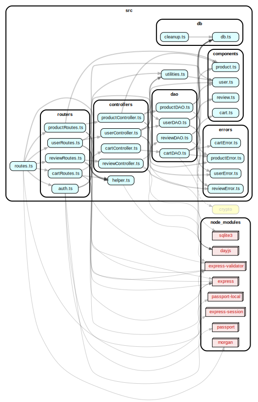
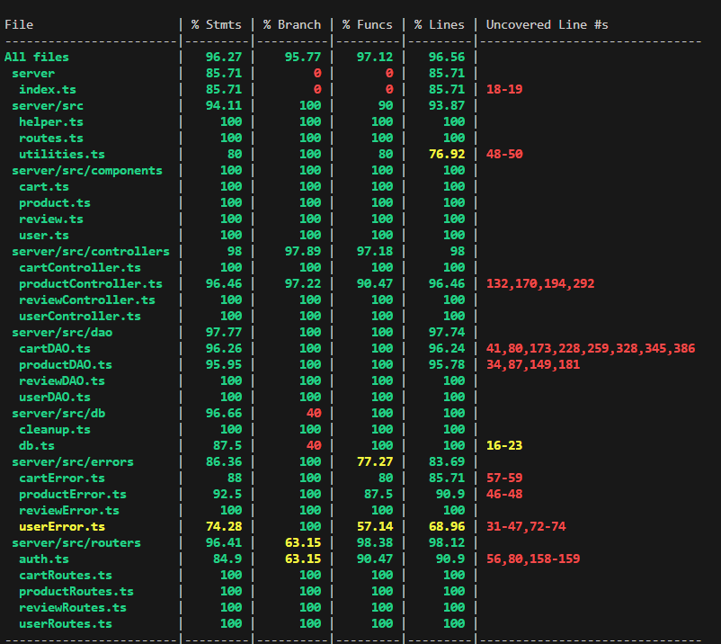

# Test Report

<The goal of this document is to explain how the application was tested, detailing how the test cases were defined and what they cover>

## Contents

- [Test Report](#test-report)
- [Contents](#contents)
- [Dependency graph](#dependency-graph)
- [Integration approach](#integration-approach)
- [Tests](#tests)
- [Coverage](#coverage)
  - [Coverage of FR](#coverage-of-fr)
  - [Coverage white box](#coverage-white-box)

## Dependency graph

## Integration approach

**Integration Approach:**
Per il nostro progetto abbiamo optato per un approccio bottom-up.

**Integration Sequence:**

- Step 1: unit test dei DAO
- Step 2: unit test dei Controller
- Step 3: unit test delle Route
- Step 4: Integration DAO + DB
- Step 5: Integration Controller + DAO + DB
- Step 6: Integration Route + Controller + DAO + DB (API testing)
- Step 7: end-to-end testing con l'uso del client

## Tests

## User 

### UserDAO Unit Tests

#### getIsUserAuthenticated

| Test Case Name                                | Object(s) tested     | Test Level | Technique Used     |
|-----------------------------------------------|----------------------|------------|--------------------|
| UserAuthenticatedSuccessfully                 | getIsUserAuthenticated | Unit       | WB/statement coverage |
| UserNotFound                                  | getIsUserAuthenticated | Unit       | WB/statement coverage |
| UserNotAuthenticatedDueToWrongPassword        | getIsUserAuthenticated | Unit       | WB/statement coverage |
| DatabaseError                                 | getIsUserAuthenticated | Unit       | WB/statement coverage |
| UserNotAuthenticatedDueToMissingSalt          | getIsUserAuthenticated | Unit       | WB/statement coverage |
| returns false when crypto.timingSafeEqual returns false | getIsUserAuthenticated | Unit | WB/statement coverage |
| CatchError                                    | getIsUserAuthenticated | Unit       | WB/statement coverage |

#### createUser

| Test Case Name                                | Object(s) tested     | Test Level | Technique Used     |
|-----------------------------------------------|----------------------|------------|--------------------|
| CorrectUser                                   | createUser           | Unit       | WB/statement coverage |
| errorUserAlreadyExist                         | createUser           | Unit       | WB/statement coverage |
| CatchError                                    | createUser           | Unit       | WB/statement coverage |

#### getUserByUsername

| Test Case Name                                | Object(s) tested     | Test Level | Technique Used     |
|-----------------------------------------------|----------------------|------------|--------------------|
| UserRetrievedSuccessfully                     | getUserByUsername    | Unit       | WB/statement coverage |
| UserNotFound                                  | getUserByUsername    | Unit       | WB/statement coverage |
| DatabaseError                                 | getUserByUsername    | Unit       | WB/statement coverage |
| CatchError                                    | getUserByUsername    | Unit       | WB/statement coverage |

#### getUsers

| Test Case Name                                | Object(s) tested     | Test Level | Technique Used     |
|-----------------------------------------------|----------------------|------------|--------------------|
| UserRetrievedSuccessfully                     | getUsers             | Unit       | WB/statement coverage |
| errorSQL_all                                  | getUsers             | Unit       | WB/statement coverage |
| CatchError                                    | getUsers             | Unit       | WB/statement coverage |

#### getUsersByRole

| Test Case Name                                | Object(s) tested     | Test Level | Technique Used     |
|-----------------------------------------------|----------------------|------------|--------------------|
| UsersRetrievedByRoleSuccessfully              | getUsersByRole       | Unit       | WB/statement coverage |
| errorSQL_all                                  | getUsersByRole       | Unit       | WB/statement coverage |
| CatchError                                    | getUsersByRole       | Unit       | WB/statement coverage |

#### deleteUserAdmin

| Test Case Name                                | Object(s) tested     | Test Level | Technique Used     |
|-----------------------------------------------|----------------------|------------|--------------------|
| UserDeletedSuccessfully                       | deleteUserAdmin      | Unit       | WB/statement coverage |
| errorSQL_get                                  | deleteUserAdmin      | Unit       | WB/statement coverage |
| UserNotFound                                  | deleteUserAdmin      | Unit       | WB/statement coverage |
| UserIsAdminError                              | deleteUserAdmin      | Unit       | WB/statement coverage |
| DatabaseErrorOnSelect                         | deleteUserAdmin      | Unit       | WB/statement coverage |
| DatabaseErrorOnDelete                         | deleteUserAdmin      | Unit       | WB/statement coverage |
| CatchError                                    | deleteUserAdmin      | Unit       | WB/statement coverage |

#### deleteUser

| Test Case Name                                | Object(s) tested     | Test Level | Technique Used     |
|-----------------------------------------------|----------------------|------------|--------------------|
| userDeletedSuccessfully                       | deleteUser           | Unit       | WB/statement coverage |
| errorSQL_get                                  | deleteUser           | Unit       | WB/statement coverage |
| UserNotFound                                  | deleteUser           | Unit       | WB/statement coverage |
| errorSQL_run                                  | deleteUser           | Unit       | WB/statement coverage |
| CatchError                                    | deleteUser           | Unit       | WB/statement coverage |

#### deleteAllUsers

| Test Case Name                                | Object(s) tested     | Test Level | Technique Used     |
|-----------------------------------------------|----------------------|------------|--------------------|
| allUsersDeletedSuccessfully                   | deleteAllUsers       | Unit       | WB/statement coverage |
| errorSQL_run                                  | deleteAllUsers       | Unit       | WB/statement coverage |
| CatchError                                    | deleteAllUsers       | Unit       | WB/statement coverage |

#### updateUserAdmin

| Test Case Name                                | Object(s) tested     | Test Level | Technique Used     |
|-----------------------------------------------|----------------------|------------|--------------------|
| UserUpdatedSuccessfully                       | updateUserAdmin      | Unit       | WB/statement coverage |
| errorSQL_get                                  | updateUserAdmin      | Unit       | WB/statement coverage |
| UserNotFoundError                             | updateUserAdmin      | Unit       | WB/statement coverage |
| UserIsAdminError                              | updateUserAdmin      | Unit       | WB/statement coverage |
| errorSQL_run                                  | updateUserAdmin      | Unit       | WB/statement coverage |
| CatchError                                    | updateUserAdmin      | Unit       | WB/statement coverage |

#### updateUser

| Test Case Name                                | Object(s) tested     | Test Level | Technique Used     |
|-----------------------------------------------|----------------------|------------|--------------------|
| UserUpdatedSuccessfully                       | updateUser           | Unit       | WB/statement coverage |
| errorSQL_get                                  | updateUser           | Unit       | WB/statement coverage |
| UserNotFound                                  | updateUser           | Unit       | WB/statement coverage |
| errorSQL_run                                  | updateUser           | Unit       | WB/statement coverage |
| CatchError                                    | updateUser           | Unit       | WB/statement coverage |

### UserController Unit Tests

#### createUser

| Test Case Name                              | Object(s) tested | Test Level | Technique Used       |
|---------------------------------------------|------------------|------------|----------------------|
| should return true when DAO method returns true | createUser       | Unit       | WB/statement coverage |

#### getUsers

| Test Case Name                              | Object(s) tested | Test Level | Technique Used       |
|---------------------------------------------|------------------|------------|----------------------|
| should return an array of users             | getUsers         | Unit       | WB/statement coverage |

#### getUsersByRole

| Test Case Name                              | Object(s) tested | Test Level | Technique Used       |
|---------------------------------------------|------------------|------------|----------------------|
| should return an array of users with the specified role | getUsersByRole  | Unit       | WB/statement coverage |

#### getUserByUsername

| Test Case Name                              | Object(s) tested | Test Level | Technique Used       |
|---------------------------------------------|------------------|------------|----------------------|
| should return a user with the specified username, by the User himself | getUserByUsername | Unit | WB/statement coverage |
| should return a user with the specified username, by an Admin | getUserByUsername | Unit | WB/statement coverage |
| should return UnauthorizedUserError         | getUserByUsername | Unit       | WB/statement coverage |

#### deleteUser

| Test Case Name                              | Object(s) tested | Test Level | Technique Used       |
|---------------------------------------------|------------------|------------|----------------------|
| should return true when deleting a non-admin user | deleteUser     | Unit       | WB/statement coverage |
| should return true when deleting a non-admin user by an Admin | deleteUser | Unit | WB/statement coverage |
| should return UnauthorizedUserError         | deleteUser       | Unit       | WB/statement coverage |

#### deleteAll

| Test Case Name                              | Object(s) tested | Test Level | Technique Used       |
|---------------------------------------------|------------------|------------|----------------------|
| should return true if all users are deleted | deleteAll        | Unit       | WB/statement coverage |

#### updateUserInfo

| Test Case Name                              | Object(s) tested | Test Level | Technique Used       |
|---------------------------------------------|------------------|------------|----------------------|
| should return a user with the updated info  | updateUserInfo   | Unit       | WB/statement coverage |
| should return a user with the updated info performed by an admin | updateUserInfo | Unit | WB/statement coverage |
| should return a DateError                   | updateUserInfo   | Unit       | WB/statement coverage |
| should return an UnauthorizedUserError      | updateUserInfo   | Unit       | WB/statement coverage |

### UserRoute Unit Tests

#### POST /users

| Test Case Name                     | Object(s) tested | Test Level | Technique Used        |
|------------------------------------|------------------|------------|-----------------------|
| It should return a 200 success code | UserController   | Unit |  WB/statement coverage |
| It should return a 503 error       | UserController   | Unit | WB/statement coverage |

#### GET /users

| Test Case Name                     | Object(s) tested | Test Level | Technique Used        |
|------------------------------------|------------------|------------|-----------------------|
| Correct insertion case (200 status code) | UserController, Authenticator, ErrorHandler | Unit | WB/statement coverage |
| It should return status 401 (Unauthenticated user) | Authenticator       | Unit | WB/statement coverage               |
| It should return status 401 (User is not an admin) | Authenticator       | Unit | WB/statement coverage               |
| It should return status 422 (The parameters are not formatted properly) | ErrorHandler         | Unit | WB/statement coverage               |
| It should return status 503        | UserController   | Unit | WB/statement coverage               |

#### GET /users/roles/:role

| Test Case Name                     | Object(s) tested | Test Level | Technique Used        |
|------------------------------------|------------------|------------|-----------------------|
| It should return status 200 (Users for a valid Role) | UserController, Authenticator, ErrorHandler | Unit | WB/statement coverage |
| It should return status 401 (Unauthenticated user) | Authenticator       | Unit | WB/statement coverage               |
| It should return status 401 (User is not an admin) | Authenticator       | Unit | WB/statement coverage               |
| It should return status 422 (The parameters are not formatted properly) | ErrorHandler         | Unit | WB/statement coverage               |
| It should return status 503        | UserController   | Unit | WB/statement coverage               |

#### GET users/username

| Test Case Name                     | Object(s) tested | Test Level | Technique Used        |
|------------------------------------|------------------|------------|-----------------------|
| Correct function 200 code          | UserController, Authenticator, ErrorHandler | Unit | WB/statement coverage |
| User not logged in (401 code)      | Authenticator    | Unit | WB/statement coverage               |
| Parameters are not formatted properly (422 code) | ErrorHandler         | Unit | WB/statement coverage               |
| Unexpected Error (503 code)        | UserController   | Unit | WB/statement coverage               |

#### DELETE /users

| Test Case Name                     | Object(s) tested | Test Level | Technique Used        |
|------------------------------------|------------------|------------|-----------------------|
| Correct Function (200 code)        | UserController, Authenticator, ErrorHandler | Unit | WB/statement coverage |
| User not logged in (401 code)      | Authenticator    | Unit | WB/statement coverage               |
| User is not an Admin (401 code)    | Authenticator    | Unit | WB/statement coverage               |
| The parameters are not formatted properly (422 code) | ErrorHandler         | Unit | WB/statement coverage               |
| Unexpected Error (503 code)        | UserController   | Unit | WB/statement coverage               |

#### DELETE /users/username
Test Case Name | Object(s) tested | Test Level | Technique Used
--- | --- | --- | ---
Correct function (200 code) | Authenticator.isLoggedIn, ErrorHandler.validateRequest, UserController.deleteUser | Unit | WB/statement coverage
User not logged in (401 code) | Authenticator.isLoggedIn | Unit | WB/statement coverage
The parameters are not formatted properly (422 code) | ErrorHandler.validateRequest | Unit | WB/statement coverage
Unexpected Error (503 code) | UserController.deleteUser | Unit | WB/statement coverage

#### PATCH /users/username
Test Case Name | Object(s) tested | Test Level | Technique Used
--- | --- | --- | ---
Correct Function (200 code) | Authenticator.isLoggedIn, ErrorHandler.validateRequest, UserController.updateUserInfo | Unit | WB/statement coverage
User not logged in (401 code) | Authenticator.isLoggedIn | Unit | WB/statement coverage
Parameters are not formatted properly (422 code) | ErrorHandler.validateRequest | Unit | WB/statement coverage
Unexpected Error (503 code) | UserController.updateUserInfo | Unit | WB/statement coverage

### AuthRoutes

#### POST /sessions
Test Case Name | Object(s) tested | Test Level | Technique Used
--- | --- | --- | ---
Correct Function (200 code) | Authenticator.login, ErrorHandler.validateRequest | Unit | WB/statement coverage
Parameters are not formatted properly (422 code) | ErrorHandler.validateRequest | Unit | WB/statement coverage
Incorrect username or password (401 code) | Authenticator.login | Unit | WB/statement coverage

#### DELETE /sessions/current
Test Case Name | Object(s) tested | Test Level | Technique Used
--- | --- | --- | ---
Correct Function (200 code) | Authenticator.isLoggedIn, ErrorHandler.validateRequest, Authenticator.logout | Unit | WB/statement coverage
User is not logged in (401 code) | Authenticator.isLoggedIn | Unit | WB/statement coverage
Parameters are not formatted properly (422 code) | ErrorHandler.validateRequest | Unit | WB/statement coverage
Unexpected Error (503 code) | Authenticator.logout | Unit | WB/statement coverage

#### GET /sessions/current
Test Case Name | Object(s) tested | Test Level | Technique Used
--- | --- | --- | ---
Correct Function (200 code) | Authenticator.isLoggedIn, ErrorHandler.validateRequest | Unit | WB/statement coverage

### UserDAO Integration Tests

#### getIsUserAuthenticated
Test Case Name | Object(s) tested | Test Level | Technique Used
--- | --- | --- | ---
Correct Function | userDAO.getIsUserAuthenticated | Integration | BB/statement coverage
User not found | userDAO.getIsUserAuthenticated | Integration | BB/statement coverage
errorSQL_get | userDAO.getIsUserAuthenticated | Integration | BB/statement coverage
Different Buffer Length | userDAO.getIsUserAuthenticated | Integration | BB/statement coverage
Incorrect password should return false | userDAO.getIsUserAuthenticated | Integration | BB/statement coverage

#### createUser
Test Case Name | Object(s) tested | Test Level | Technique Used
--- | --- | --- | ---
Correct Function | userDAO.createUser | Integration | BB/statement coverage
UNIQUE constraint failed: users.username | userDAO.createUser | Integration | BB/statement coverage
errorSQL_run | userDAO.createUser | Integration | BB/statement coverage

#### getUserByUsername
Test Case Name | Object(s) tested | Test Level | Technique Used
--- | --- | --- | ---
Correct Function | userDAO.getUserByUsername | Integration | BB/statement coverage
User not Found | userDAO.getUserByUsername | Integration | BB/statement coverage
errorSQL_get | userDAO.getUserByUsername | Integration | BB/statement coverage

#### getUsers
Test Case Name | Object(s) tested | Test Level | Technique Used
--- | --- | --- | ---
Correct Function | userDAO.getUsers | Integration | BB/statement coverage
errorSQL_all | userDAO.getUsers | Integration | BB/statement coverage

#### getUsersByRole
Test Case Name | Object(s) tested | Test Level | Technique Used
--- | --- | --- | ---
Correct Function | userDAO.getUsersByRole | Integration | BB/statement coverage
errorSQL_all | userDAO.getUsersByRole | Integration | BB/statement coverage

#### deleteUserAdmin
Test Case Name | Object(s) tested | Test Level | Technique Used
--- | --- | --- | ---
Correct Function | userDAO.deleteUserAdmin | Integration | BB/statement coverage
User not found | userDAO.deleteUserAdmin | Integration | BB/statement coverage
User is admin | userDAO.deleteUserAdmin | Integration | BB/statement coverage
errorSQL_get | userDAO.deleteUserAdmin | Integration | BB/statement coverage

#### deleteUser
Test Case Name | Object(s) tested | Test Level | Technique Used
--- | --- | --- | ---
Correct Function | userDAO.deleteUser | Integration | BB/statement coverage
User not found | userDAO.deleteUser | Integration | BB/statement coverage
errorSQL_get | userDAO.deleteUser | Integration | BB/statement coverage

#### deleteAllUsers
Test Case Name | Object(s) tested | Test Level | Technique Used
--- | --- | --- | ---
Correct Function | userDAO.deleteAllUsers | Integration | BB/statement coverage
errorSQL_run | userDAO.deleteAllUsers | Integration | BB/statement coverage

#### updateUserAdmin
Test Case Name | Object(s) tested | Test Level | Technique Used
--- | --- | --- | ---
Correct Function | userDAO.updateUserAdmin | Integration | BB/statement coverage
User not found | userDAO.updateUserAdmin | Integration | BB/statement coverage
User is admin | userDAO.updateUserAdmin | Integration | BB/statement coverage
errorSQL_get | userDAO.updateUserAdmin | Integration | BB/statement coverage

#### updateUser
Test Case Name | Object(s) tested | Test Level | Technique Used
--- | --- | --- | ---
Correct Function | userDAO.updateUser | Integration | BB/statement coverage
User not found | userDAO.updateUser | Integration | BB/statement coverage
errorSQL_get | userDAO.updateUser | Integration | BB/statement coverage

### UserController Integration Tests

#### createUser

| Test Case Name           | Object(s) tested                     | Test Level       | Technique Used            |
|--------------------------|--------------------------------------|------------------|---------------------------|
| Correct Function         | userController.createUser             | Integration | BB/statement coverage |
| Database Error           | userController.createUser             | Integration | BB/statement coverage            |
| User already exist       | userController.createUser             | Integration | BB/statement coverage   |

#### getUsers

| Test Case Name           | Object(s) tested                     | Test Level       | Technique Used            |
|--------------------------|--------------------------------------|------------------|---------------------------|
| Correct Function         | userController.getUsers               | Integration | BB/statement coverage |
| Database Error           | userController.getUsers               | Integration | BB/statement coverage            |

#### getUsersByRole

| Test Case Name           | Object(s) tested                     | Test Level       | Technique Used            |
|--------------------------|--------------------------------------|------------------|---------------------------|
| Correct Function         | userController.getUsersByRole         | Integration | BB/statement coverage |
| Database Error           | userController.getUsersByRole         | Integration | BB/statement coverage            |

#### getUserByUsername

| Test Case Name           | Object(s) tested                     | Test Level       | Technique Used            |
|--------------------------|--------------------------------------|------------------|---------------------------|
| Correct Function Admin   | userController.getUserByUsername      | Integration | BB/statement coverage |
| Correct Function non Admin | userController.getUserByUsername    | Integration | BB/statement coverage |
| UnauthorizedUserError    | userController.getUserByUsername      | Integration | BB/statement coverage   |
| Database Error           | userController.getUserByUsername      | Integration | BB/statement coverage            |

#### deleteUser

| Test Case Name           | Object(s) tested                     | Test Level       | Technique Used            |
|--------------------------|--------------------------------------|------------------|---------------------------|
| Correct Function Admin   | userController.deleteUser            | Integration | BB/statement coverage |
| Correct Function non Admin | userController.deleteUser            | Integration | BB/statement coverage |
| UnauthorizedUserError    | userController.deleteUser            | Integration | BB/statement coverage   |
| User not Found Error Admin | userController.deleteUser            | Integration | BB/statement coverage   |
| User not found Error non Admin | userController.deleteUser          | Integration | BB/statement coverage   |
| UserIsAdminError         | userController.deleteUser            | Integration | BB/statement coverage   |
| Database Error Admin     | userController.deleteUser            | Integration | BB/statement coverage            |
| Database Error non Admin | userController.deleteUser            | Integration | BB/statement coverage            |

#### deleteAll

| Test Case Name           | Object(s) tested                     | Test Level       | Technique Used            |
|--------------------------|--------------------------------------|------------------|---------------------------|
| Correct Function         | userController.deleteAll              | Integration | BB/statement coverage |
| Database Error           | userController.deleteAll              | Integration | BB/statement coverage            |

#### updateUserInfo

| Test Case Name           | Object(s) tested                     | Test Level       | Technique Used            |
|--------------------------|--------------------------------------|------------------|---------------------------|
| Correct Function Admin   | userController.updateUserInfo        | Integration | BB/statement coverage |
| Correct Function non Admin | userController.updateUserInfo       | Integration | BB/statement coverage |
| User Not Found Error Admin | userController.updateUserInfo       | Integration | BB/statement coverage   |
| User Not Found Error non Admin | userController.updateUserInfo     | Integration | BB/statement coverage   |
| User Is Admin Error      | userController.updateUserInfo        | Integration | BB/statement coverage   |
| Date Error               | userController.updateUserInfo        | Integration | BB/statement coverage   |
| Database Error Admin     | userController.updateUserInfo        | Integration | BB/statement coverage            |
| Database Error non Admin | userController.updateUserInfo        | Integration | BB/statement coverage            |

### UserRoute Integration Tests

#### POST /

| Test Case Name                     | Object(s) tested          | Test Level       | Technique Used           |
|------------------------------------|---------------------------|------------------|--------------------------|
| Correct Function (200 code)         | userController.createUser | Integration | BB/statement coverage|
| Parameters not formatted Properly (422 code) | userController.createUser | Integration | BB/statement coverage|
| User already Exist (409 code)      | userController.createUser | Integration | BB/statement coverage|

#### GET /

| Test Case Name                     | Object(s) tested          | Test Level       | Technique Used           |
|------------------------------------|---------------------------|------------------|--------------------------|
| correctExecution (200 code)         | userController.getUsers | Integration | BB/statement coverage|
| userNotAllowed (401 code) | userController.getUsers | Integration | BB/statement coverage|

#### GET /roles/role

| Test Case Name                     | Object(s) tested          | Test Level       | Technique Used           |
|------------------------------------|---------------------------|------------------|--------------------------|
| Correct Function (200 code)         | userController.getUsersByRole | Integration | BB/statement coverage|
| User is not an Admin (401 code)    | userController.getUsersByRole | Integration | BB/statement coverage  |
| User is not logged in (401 code)   | userController.getUsersByRole | Integration | BB/statement coverage  |

#### GET /username

| Test Case Name                     | Object(s) tested          | Test Level       | Technique Used           |
|------------------------------------|---------------------------|------------------|--------------------------|
| Correct Function (200 code)         | userController.getUserByUsername | Integration | BB/statement coverage|
| User is not logged in (401 code)   | userController.getUserByUsername | Integration | BB/statement coverage  |
| Unauthorized User (401 code)       | userController.getUserByUsername | Integration | BB/statement coverage|
| User not found (404 code)          | userController.getUserByUsername | Integration | BB/statement coverage  |

#### DELETE /username

| Test Case Name                     | Object(s) tested          | Test Level       | Technique Used           |
|------------------------------------|---------------------------|------------------|--------------------------|
| Correct Function Admin (200 code)   | userController.deleteUser | Integration | BB/statement coverage|
| Correct Function non Admin (200 code) | userController.deleteUser | Integration | BB/statement coverage|
| User Is Not Logged In (401 code)   | userController.deleteUser | Integration | BB/statement coverage  |
| Unauthorized User (401 code)       | userController.deleteUser | Integration | BB/statement coverage|
| userDoesNotExist (404 code)   | userController.deleteUser | Integration | BB/statement coverage  |
| userIsAdmin (401 code)       | userController.deleteUser | Integration | BB/statement coverage|

#### DELETE /

| Test Case Name                     | Object(s) tested          | Test Level       | Technique Used           |
|------------------------------------|---------------------------|------------------|--------------------------|
| Correct Function (200 code)         | userController.deleteAll | Integration | BB/statement coverage|
| User is not logged in (401 code)   | userController.deleteAll | Integration | BB/statement coverage  |
| User is not an Admin (401 code)    | userController.deleteAll | Integration | BB/statement coverage  |

#### PATCH /username

| Test Case Name                     | Object(s) tested          | Test Level       | Technique Used           |
|------------------------------------|---------------------------|------------------|--------------------------|
| Correct Function Admin (200 code)   | userController.updateUserInfo | Integration | BB/statement coverage|
| Correct Function non Admin (200 code) | userController.updateUserInfo | Integration | BB/statement coverage|
| User is not Logged in (401 code)   | userController.updateUserInfo | Integration | BB/statement coverage  |
| Parameters are not formatted properly (422 code) | userController.updateUserInfo | Integration | BB/statement coverage|
| Unauthorized Error (401 code)      | userController.updateUserInfo | Integration | BB/statement coverage  |
| Date Error (400 code)              | userController.updateUserInfo | Integration | BB/statement coverage  |
| userNotExistAdmin (404 code)              | userController.updateUserInfo | Integration | BB/statement coverage  |

#### DELETE sessions/current

| Test Case Name                     | Object(s) tested          | Test Level       | Technique Used           |
|------------------------------------|---------------------------|------------------|--------------------------|
| CorrectExecution (200 code)   | authService.logout | Integration | BB/statement coverage|

#### GET sessions/current

| Test Case Name                     | Object(s) tested          | Test Level       | Technique Used           |
|------------------------------------|---------------------------|------------------|--------------------------|
| CorrectExecution (200 code)   |  | Integration | BB/statement coverage|

## Review

### ReviewRoute Unit Tests

#### POST review/:model test

| Test Case Name                        | Object(s) Tested    | Test Level | Technique Used          |
|---------------------------------------|---------------------|------------|-------------------------|
| Correct insertion case (200 status code) | POST review/:model | Unit       | WB/statement coverage   |
| Not existing product (404 status code) | POST review/:model  | Unit       | WB/statement coverage   |
| Product already reviewed (409 status code) | POST review/:model | Unit    | WB/statement coverage   |
| User not customer (401 status code)    | POST review/:model   | Unit       | WB/statement coverage   |
| Input param not valid (422 status code) | POST review/:model          | Unit       | WB/statement coverage   |

#### GET review/:model test

| Test Case Name                        | Object(s) Tested    | Test Level | Technique Used          |
|---------------------------------------|---------------------|------------|-------------------------|
| Correct resolve test (200 status code) | GET review/:model  | Unit       | WB/statement coverage   |
| No reviews test (200 status code)      | GET review/:model  | Unit       | WB/statement coverage   |
| Internal server error                  | GET review/:model  | Unit       | WB/statement coverage   |
| Input param not valid (422 status code) | GET review/:model          | Unit       | WB/statement coverage   |

#### DELETE review/:model test

| Test Case Name                        | Object(s) Tested    | Test Level | Technique Used          |
|---------------------------------------|---------------------|------------|-------------------------|
| Correct resolve test (200 status code) | DELETE review/:model  | Unit       | WB/statement coverage   |
| No reviews test (404 status code)      | DELETE review/:model  | Unit       | WB/statement coverage   |
| Product not found test (404 status code) | DELETE review/:model | Unit      | WB/statement coverage   |
| User not customer (401 status code)    | DELETE review/:model   | Unit       | WB/statement coverage   |
| Internal server error                  | DELETE review/:model  | Unit       | WB/statement coverage   |
| Input param not valid (422 status code) | DELETE review/:model          | Unit       | WB/statement coverage   |

#### DELETE review/:model/all test

| Test Case Name                        | Object(s) Tested    | Test Level | Technique Used          |
|---------------------------------------|---------------------|------------|-------------------------|
| Correct resolve test (200 status code) | DELETE review/:model/all  | Unit       | WB/statement coverage   |
| User not admin or manager (401 status code) | DELETE review/:model/all | Unit    | WB/statement coverage   |
| Product not found test (404 status code) | DELETE review/:model/all | Unit      | WB/statement coverage   |
| Internal server error                  | DELETE review/:model/all  | Unit       | WB/statement coverage   |
| Input param not valid (422 status code) | DELETE review/:model/all          | Unit       | WB/statement coverage   |

#### DELETE review/

| Test Case Name                        | Object(s) Tested    | Test Level | Technique Used          |
|---------------------------------------|---------------------|------------|-------------------------|
| Correct resolve test (200 status code) | DELETE review/  | Unit       | WB/statement coverage   |
| User not admin or manager (401 status code) | DELETE review/ | Unit    | WB/statement coverage   |
| Internal server error                  | DELETE review/  | Unit       | WB/statement coverage   |

### ReviewController Unit Tests

#### addReview

| Test Case Name                        | Object(s) Tested                      | Test Level | Technique Used          |
|---------------------------------------|--------------------------------------|------------|-------------------------|
| Correct result test                   | addReview                     | Unit       | WB/statement coverage   |
| Existing review error test            | addReview                     | Unit       | WB/statement coverage   |
| Product not exist error test          | addReview                     | Unit       | WB/statement coverage   |
| Internal server error (ReviewDAO)     | addReview                     | Unit       | WB/statement coverage   |
| Internal server error (ProductDAO)    | addReview                     | Unit       | WB/statement coverage   |

#### getProductReviews

| Test Case Name                        | Object(s) Tested                      | Test Level | Technique Used          |
|---------------------------------------|--------------------------------------|------------|-------------------------|
| Correct result test                   | getProductReviews                     | Unit       | WB/statement coverage   |
| No review test                        | getProductReviews                     | Unit       | WB/statement coverage   |
| Internal server error                 | getProductReviews                     | Unit       | WB/statement coverage   |

#### deleteReview

| Test Case Name                        | Object(s) Tested                      | Test Level | Technique Used          |
|---------------------------------------|--------------------------------------|------------|-------------------------|
| Correct result test                   | deleteReview                     | Unit       | WB/statement coverage   |
| Product not found error test           | deleteReview                     | Unit       | WB/statement coverage   |
| No Existing review error test         | deleteReview                     | Unit       | WB/statement coverage   |
| Internal server error of exist        | deleteReview                     | Unit       | WB/statement coverage   |
| Internal server error of deleteReview | deleteReview                     | Unit       | WB/statement coverage   |
| Internal server error of getProductReviews | deleteReview                | Unit       | WB/statement coverage   |

#### deleteReviewsOfProduct

| Test Case Name                        | Object(s) Tested                      | Test Level | Technique Used          |
|---------------------------------------|--------------------------------------|------------|-------------------------|
| Correct result test                   | deleteReviewsOfProduct                     | Unit       | WB/statement coverage   |
| Product not found test                | deleteReviewsOfProduct                     | Unit       | WB/statement coverage   |
| Internal server error of exist        | deleteReviewsOfProduct                     | Unit       | WB/statement coverage   |
| Internal server error of deleteReviewsOfProduct | deleteReviewsOfProduct          | Unit       | WB/statement coverage   |

#### deleteAllReviews

| Test Case Name                        | Object(s) Tested                      | Test Level | Technique Used          |
|---------------------------------------|--------------------------------------|------------|-------------------------|
| Correct result test                   | deleteAllReviews                     | Unit       | WB/statement coverage   |
| Internal server error                 | deleteAllReviews                     | Unit       | WB/statement coverage   |

### ReviewDAO Unit Tests

#### AddReview method WhiteBox tests

| Test Case Name          | Object(s) tested                    | Test Level | Technique Used          |
|-------------------------|-------------------------------------|------------|-------------------------|
| Correct test            | addReview                     | Unit       | WB/statement coverage   |
| Null elements test      | addReview                     | Unit       | WB/statement coverage   |
| Not unique test         | addReview                     | Unit       | WB/statement coverage   |
| Internal server error test | addReview                   | Unit       | WB/statement coverage   |
| Db throw exception (dbRun) | addReview                   | Unit       | WB/statement coverage   |
| Db throw exception (dbGet User) | addReview               | Unit       | WB/statement coverage   |
| Db throw exception (dbGet Product) | addReview            | Unit       | WB/statement coverage   |
| Product not found test  | addReview                     | Unit       | WB/statement coverage   |

#### getProductReviews method WhiteBox tests

| Test Case Name          | Object(s) tested                    | Test Level | Technique Used          |
|-------------------------|-------------------------------------|------------|-------------------------|
| Correct test            | getProductReviews             | Unit       | WB/statement coverage   |
| Product not reviewed test | getProductReviews           | Unit       | WB/statement coverage   |
| Internal server error test (DBrun) | getProductReviews      | Unit       | WB/statement coverage   |
| Db throw exception      | getProductReviews             | Unit       | WB/statement coverage   |

#### deleteReview method WhiteBox tests

| Test Case Name          | Object(s) tested                    | Test Level | Technique Used          |
|-------------------------|-------------------------------------|------------|-------------------------|
| Correct test            | deleteReview                 | Unit       | WB/statement coverage   |
| Internal server error test (DBrun) | deleteReview           | Unit       | WB/statement coverage   |
| Internal server error test (DBget User) | deleteReview       | Unit       | WB/statement coverage   |
| Internal server error test (DBget Product) | deleteReview     | Unit       | WB/statement coverage   |
| Product not found error test (DBget Product) | deleteReview   | Unit       | WB/statement coverage   |
| Db throw exception      | deleteReview                 | Unit       | WB/statement coverage   |

#### deleteReviewsOfProduct method WhiteBox tests

| Test Case Name          | Object(s) tested                    | Test Level | Technique Used          |
|-------------------------|-------------------------------------|------------|-------------------------|
| Correct test            | deleteReviewsOfProduct       | Unit       | WB/statement coverage   |
| Product not found error test (DBget) | deleteReviewsOfProduct | Unit       | WB/statement coverage   |
| Internal server error test (DBget) | deleteReviewsOfProduct   | Unit       | WB/statement coverage   |
| Internal server error test (DBrun) | deleteReviewsOfProduct   | Unit       | WB/statement coverage   |
| Db throw exception      | deleteReviewsOfProduct       | Unit       | WB/statement coverage   |

#### deleteAllReviews method WhiteBox tests

| Test Case Name          | Object(s) tested                    | Test Level | Technique Used          |
|-------------------------|-------------------------------------|------------|-------------------------|
| Correct test            | deleteAllReviews             | Unit       | WB/statement coverage   |
| Internal server error test | deleteAllReviews            | Unit       | WB/statement coverage   |
| Db throw exception      | deleteAllReviews             | Unit       | WB/statement coverage   |

### ReviewDAO Integration Tests

#### AddReview

| Test Case Name                    | Object(s) tested         | Test Level | Technique Used          |
|-----------------------------------|--------------------------|------------|-------------------------|
| Correct test                      | addReview         | Integration| WB/statement coverage   |
| Null elements test                | addReview         | Integration| WB/statement coverage   |
| Not unique test                   | addReview         | Integration| WB/statement coverage   |
| Internal server error (db_get user)| addReview         | Integration| WB/statement coverage   |
| Internal server error (db_get products)| addReview      | Integration| WB/statement coverage   |
| Internal server error (db_run)    | addReview         | Integration| WB/statement coverage   |
| Product not found test            | addReview         | Integration| WB/statement coverage   |

#### getProductReviews

| Test Case Name                    | Object(s) tested         | Test Level | Technique Used          |
|-----------------------------------|--------------------------|------------|-------------------------|
| Correct test (loop_N)             | getProductReviews | Integration| WB/statement coverage   |
| Correct test (loop_1)             | getProductReviews | Integration| WB/statement coverage   |
| Product not reviewed test          | getProductReviews| Integration| WB/statement coverage   |
| Internal server error (db_all)    | getProductReviews | Integration| WB/statement coverage   |

#### deleteReview 

| Test Case Name                    | Object(s) tested         | Test Level | Technique Used          |
|-----------------------------------|--------------------------|------------|-------------------------|
| Correct test                      | deleteReview      | Integration| WB/statement coverage   |
| No reviews test                   | deleteReview      | Integration| WB/statement coverage   |
| Internal server error (db_run)    | deleteReview      | Integration| WB/statement coverage   |
| Internal server error (db_get User)| deleteReview     | Integration| WB/statement coverage   |
| Internal server error (db_get Product)| deleteReview   | Integration| WB/statement coverage   |
| Product not found error (DBget Product)| deleteReview  | Integration| WB/statement coverage   |

#### deleteReviewsOfProduct

| Test Case Name                    | Object(s) tested         | Test Level | Technique Used          |
|-----------------------------------|--------------------------|------------|-------------------------|
| Correct test                      | deleteReviewsOfProduct | Integration | WB/statement coverage  |
| Product not found error (db_get)   | deleteReviewsOfProduct | Integration | WB/statement coverage  |
| Internal server error (db_get)     | deleteReviewsOfProduct | Integration | WB/statement coverage  |
| Internal server error (db_run)     | deleteReviewsOfProduct | Integration | WB/statement coverage  |

#### deleteAllReviews

| Test Case Name                    | Object(s) tested         | Test Level | Technique Used          |
|-----------------------------------|--------------------------|------------|-------------------------|
| Correct test                      | deleteAllReviews  | Integration| WB/statement coverage   |
| Internal server error             | deleteAllReviews  | Integration| WB/statement coverage   |

### ReviewController Integration Tests

#### addReview

| Test Case Name                     | Object(s) tested       | Test Level | Technique Used          |
|------------------------------------|------------------------|------------|-------------------------|
| Correct result test                | addReview       | Integration| WB/statement coverage  |
| Existing review error test         | addReview       | Integration| WB/statement coverage  |
| Product not exist error test       | addReview       | Integration| WB/statement coverage  |
| Internal server error (AddReviewDAO)| addReview       | Integration| WB/statement coverage  |
| Internal server error (ProductDAO)  | addReview       | Integration| WB/statement coverage  |

#### getProductReviews

| Test Case Name                     | Object(s) tested       | Test Level | Technique Used          |
|------------------------------------|------------------------|------------|-------------------------|
| Correct result test                | getProductReviews       | Integration| WB/statement coverage  |
| No review test                      | getProductReviews       | Integration| WB/statement coverage  |
| Internal server error test          | getProductReviews       | Integration| WB/statement coverage  |

#### deleteReview

| Test Case Name                     | Object(s) tested       | Test Level | Technique Used          |
|------------------------------------|------------------------|------------|-------------------------|
| Correct result test                | deleteReview       | Integration| WB/statement coverage  |
| Product not found error test       | deleteReview       | Integration| WB/statement coverage  |
| No Existing review error test      | deleteReview       | Integration| WB/statement coverage  |
| Internal server error of exist     | deleteReview       | Integration| WB/statement coverage  |
| Internal server error of getProductReviews | deleteReview | Integration| WB/statement coverage  |

#### deleteReviewsOfProduct

| Test Case Name                     | Object(s) tested       | Test Level | Technique Used          |
|------------------------------------|------------------------|------------|-------------------------|
| Correct result test                | deleteReviewsOfProduct       | Integration| WB/statement coverage  |
| Product not found test             | deleteReviewsOfProduct       | Integration| WB/statement coverage  |
| Internal server error of exist     | deleteReviewsOfProduct       | Integration| WB/statement coverage  |
| Internal server error of deleteReviewsOfProduct | deleteReviewsOfProduct | Integration| WB/statement coverage  |

#### deleteAllReviews

| Test Case Name                     | Object(s) tested       | Test Level | Technique Used          |
|------------------------------------|------------------------|------------|-------------------------|
| Correct result test                | deleteAllReviews       | Integration| WB/statement coverage  |

### ReviewRoute Integration Test

#### POST review/:model test

| Test Case Name                           | Object(s) tested            | Test Level | Technique Used          |
|------------------------------------------|-----------------------------|------------|-------------------------|
| Correct insertion case (200 status code)  | POST review/:model          | API        | WB/statement coverage  |
| Not existing product (404 status code)    | POST review/:model          | API        | WB/statement coverage  |
| Product already reviewed (409 status code)| POST review/:model          | API        | WB/statement coverage  |
| User not logged in (401 status code)      | POST review/:model          | API        | WB/statement coverage  |
| User not customer (401 status code)       | POST review/:model          | API        | WB/statement coverage  |
| Input body score valid == 5 (200 status code) | POST review/:model       | API        | WB/statement coverage  |
| Input body score valid == 1 (200 status code) | POST review/:model       | API        | WB/statement coverage  |
| Input body score not valid > 5 (422 status code) | POST review/:model    | API        | WB/statement coverage  |
| Input body score not valid < 1 (422 status code) | POST review/:model    | API        | WB/statement coverage  |
| Input body comment null not valid (422 status code) | POST review/:model  | API        | WB/statement coverage  |
| Internal server error (503 status code)   | POST review/:model          | API        | WB/statement coverage  |

#### GET review/:model test

| Test Case Name                           | Object(s) tested            | Test Level | Technique Used          |
|------------------------------------------|-----------------------------|------------|-------------------------|
| Correct resolve test (single reviews) (200 status code) | GET review/:model       | API        | WB/statement coverage  |
| Correct resolve test (multiple reviews) (200 status code) | GET review/:model      | API        | WB/statement coverage  |
| No reviews test (200 status code)         | GET review/:model           | API        | WB/statement coverage  |
| User not logged in (401 status code)      | GET review/:model           | API        | WB/statement coverage  |
| Internal server error (503 status code)   | GET review/:model           | API        | WB/statement coverage  |

#### DELETE review/:model test

| Test Case Name                           | Object(s) tested            | Test Level | Technique Used          |
|------------------------------------------|-----------------------------|------------|-------------------------|
| Correct resolve test (200 status code)    | DELETE review/:model        | API        | WB/statement coverage  |
| No reviews test (404 status code)         | DELETE review/:model        | API        | WB/statement coverage  |
| Product not found test (404 status code)  | DELETE review/:model        | API        | WB/statement coverage  |
| User not logged in (401 status code)      | DELETE review/:model        | API        | WB/statement coverage  |
| User not customer (401 status code)       | DELETE review/:model        | API        | WB/statement coverage  |
| Internal server error (503 status code)   | DELETE review/:model        | API        | WB/statement coverage  |

#### DELETE review/:model/all test

| Test Case Name                           | Object(s) tested            | Test Level | Technique Used          |
|------------------------------------------|-----------------------------|------------|-------------------------|
| Correct resolve test (Manager) (200 status code) | DELETE review/:model/all  | API        | WB/statement coverage  |
| Correct resolve test (Admin) (200 status code) | DELETE review/:model/all  | API        | WB/statement coverage  |
| User not logged in (401 status code)      | DELETE review/:model/all    | API        | WB/statement coverage  |
| User not admin or manager (401 status code) | DELETE review/:model/all  | API        | WB/statement coverage  |
| Product not found test (404 status code)  | DELETE review/:model/all    | API        | WB/statement coverage  |
| Internal server error (503 status code)   | DELETE review/:model/all    | API        | WB/statement coverage  |

#### DELETE review/ test

| Test Case Name                           | Object(s) tested            | Test Level | Technique Used          |
|------------------------------------------|-----------------------------|------------|-------------------------|
| Correct resolve test (200 status code)    | DELETE review/              | API        | WB/statement coverage  |
| User not logged in (401 status code)      | DELETE review/              | API        | WB/statement coverage  |
| User not admin or manager (401 status code) | DELETE review/            | API        | WB/statement coverage  |
| Internal server error (503 status code)   | DELETE review/              | API        | WB/statement coverage  |

## Cart

### CartDAO Unit Test

#### getCartById

| Test Case Name   | Object(s) Tested | Test Level | Technique Used       |
|------------------|------------------|------------|----------------------|
| correctExecution  | cartDAO          | Unit       | WB/statement coverage |
| cartNotFound     | cartDAO          | Unit       | WB/statement coverage |
| errorSQL_get     | cartDAO          | Unit       | WB/statement coverage |
| errorSQL_all     | cartDAO          | Unit       | WB/statement coverage |

#### getCartByUser

| Test Case Name          | Object(s) Tested | Test Level | Technique Used       |
|-------------------------|------------------|------------|----------------------|
| currentCartWithProducts | cartDAO          | Unit       | WB/statement coverage |
| noCurrentCart           | cartDAO          | Unit       | WB/statement coverage |
| noProductInCurrentCart  | cartDAO          | Unit       | WB/statement coverage |
| errorSQL_get            | cartDAO          | Unit       | WB/statement coverage |
| errorSQL_all            | cartDAO          | Unit       | WB/statement coverage |

#### addToCartDAO

| Test Case Name                         | Object(s) Tested | Test Level | Technique Used |
|----------------------------------------|------------------|------------|----------------|
| noCurrentCart                          | cartDAO          | Unit       | WB/statement coverage |
| currentCart_productNotPresent           | cartDAO          | Unit       | WB/statement coverage |
| currentCart_productPresent_errorSQL_run | cartDAO          | Unit       | WB/statement coverage |
| productNotFound                        | cartDAO          | Unit       | WB/statement coverage |
| productNotAvailable                    | cartDAO          | Unit       | WB/statement coverage |
| errorSQL_first_get                     | cartDAO          | Unit       | WB/statement coverage |
| errorSQL_second_get                    | cartDAO          | Unit       | WB/statement coverage |
| noCurrentCart_errorSQL_first_get       | cartDAO          | Unit       | WB/statement coverage |
| noCurrentCart_errorSQL_first_run       | cartDAO          | Unit       | WB/statement coverage |
| noCurrentCart_errorSQL_second_get      | cartDAO          | Unit       | WB/statement coverage |
| noCurrentCart_errorSQL_second_run      | cartDAO          | Unit       | WB/statement coverage |
| currentCart_errorSQL_get               | cartDAO          | Unit       | WB/statement coverage |
| currentCart_productNotPresent_errorSQL_run | cartDAO       | Unit       | WB/statement coverage |
| currentCart_productPresent_errorSQL_run | cartDAO          | Unit       | WB/statement coverage |

#### doCheckoutByUsername

| Test Case Name               | Object(s) Tested | Test Level | Technique Used |
|------------------------------|------------------|------------|----------------|
| emptyCart                    | cartDAO          | Unit       | WB/statement coverage |
| loop1_time                   | cartDAO          | Unit       | WB/statement coverage |
| loopN_times                  | cartDAO          | Unit       | WB/statement coverage |
| cartNotFound                 | cartDAO          | Unit       | WB/statement coverage |
| productNotAvailable          | cartDAO          | Unit       | WB/statement coverage |
| productQuantityNotEnough     | cartDAO          | Unit       | WB/statement coverage |
| errorSQL_first_get           | cartDAO          | Unit       | WB/statement coverage |
| errorSQL_all                 | cartDAO          | Unit       | WB/statement coverage |
| errorSQL_get_loop            | cartDAO          | Unit       | WB/statement coverage |
| errorSQL_run                 | cartDAO          | Unit       | WB/statement coverage |

#### getHistoryByUsername

| Test Case Name         | Object(s) tested          | Test Level | Technique Used        |
|------------------------|---------------------------|------------|-----------------------|
| loop0_Times             | cartDAO                   | Unit       | WB/statement coverage |
| loop1_Time              | cartDAO                   | Unit       | WB/statement coverage |
| loopN_Times             | cartDAO                   | Unit       | WB/statement coverage |
| errorSQL_all            | cartDAO                   | Unit       | WB/statement coverage |
| errorSQL_getCartById    | cartDAO                   | Unit       | WB/statement coverage |
| errorCartNotFound_getCartById | cartDAO                   | Unit       | WB/statement coverage |

#### removeProductFromCartDAO

| Test Case Name                    | Object(s) tested | Test Level | Technique Used        |
|-----------------------------------|------------------|------------|-----------------------|
| productQuantityGreater1            | cartDAO          | Unit       | WB/statement coverage |
| productQuantity1                   | cartDAO          | Unit       | WB/statement coverage |
| cartNotFoundOrEmptyCart            | cartDAO          | Unit       | WB/statement coverage |
| productNotInCart                   | cartDAO          | Unit       | WB/statement coverage |
| errorSQL_first_get                 | cartDAO          | Unit       | WB/statement coverage |
| errorSQL_second_get                | cartDAO          | Unit       | WB/statement coverage |
| errorSQL_run_update                | cartDAO          | Unit       | WB/statement coverage |
| errorSQL_run_delete                | cartDAO          | Unit       | WB/statement coverage |

#### clearCartDAO

| Test Case Name         | Object(s) tested | Test Level | Technique Used        |
|------------------------|------------------|------------|-----------------------|
| correctExecution       | cartDAO          | Unit       | WB/statement coverage |
| errorSQL_get           | cartDAO          | Unit       | WB/statement coverage |
| errorSQL_run           | cartDAO          | Unit       | WB/statement coverage |
| errorCartNotFound      | cartDAO          | Unit       | WB/statement coverage |

#### deleteAllCartsDAO

| Test Case Name         | Object(s) tested | Test Level | Technique Used        |
|------------------------|------------------|------------|-----------------------|
| correctExecution       | cartDAO          | Unit       | WB/statement coverage |
| errorSQL_run           | cartDAO          | Unit       | WB/statement coverage |

#### getAllCartsDAO

| Test Case Name         | Object(s) tested | Test Level | Technique Used        |
|------------------------|------------------|------------|-----------------------|
| loop0_Times             | cartDAO          | Unit       | WB/statement coverage |
| loop1_Time              | cartDAO          | Unit       | WB/statement coverage |
| loopN_Times             | cartDAO          | Unit       | WB/statement coverage |
| errorSQL_firts_all      | cartDAO          | Unit       | WB/statement coverage |
| errorSQL_second_all     | cartDAO          | Unit       | WB/statement coverage |

### CartController Unit Test

#### addToCart

| Test Case Name         | Object(s) tested | Test Level | Technique Used        |
|------------------------|------------------|------------|-----------------------|
| correctExecution       | cartController   | Unit       | WB/statement coverage |
| databaseError          | cartController   | Unit       | WB/statement coverage |
| ProductNotFound        | cartController   | Unit       | WB/statement coverage |
| emptyStock             | cartController   | Unit       | WB/statement coverage |

#### getCart

| Test Case Name         | Object(s) tested | Test Level | Technique Used        |
|------------------------|------------------|------------|-----------------------|
| currentCartWithProducts| cartController   | Unit       | WB/statement coverage |
| emptyOrAbsentCurrentCart| cartController  | Unit       | WB/statement coverage |
| databaseError          | cartController   | Unit       | WB/statement coverage |

#### checkoutCart

| Test Case Name         | Object(s) tested | Test Level | Technique Used        |
|------------------------|------------------|------------|-----------------------|
| correctExecution       | cartController   | Unit       | WB/statement coverage |
| databaseError          | cartController   | Unit       | WB/statement coverage |
| cartNotFound           | cartController   | Unit       | WB/statement coverage |
| emptyCart              | cartController   | Unit       | WB/statement coverage |
| productNotAvailable    | cartController   | Unit       | WB/statement coverage |

#### getCustomerCarts

| Test Case Name         | Object(s) tested | Test Level | Technique Used        |
|------------------------|------------------|------------|-----------------------|
| correctExecution       | cartController   | Unit       | WB/statement coverage |
| databaseError          | cartController   | Unit       | WB/statement coverage |

#### removeProductFromCart

| Test Case Name         | Object(s) tested | Test Level | Technique Used        |
|------------------------|------------------|------------|-----------------------|
| correctExecution       | cartController   | Unit       | WB/statement coverage |
| databaseError          | cartController   | Unit       | WB/statement coverage |
| noCurrentCart          | cartController   | Unit       | WB/statement coverage |
| productNotInCart       | cartController   | Unit       | WB/statement coverage |

#### clearCart

| Test Case Name         | Object(s) tested | Test Level | Technique Used        |
|------------------------|------------------|------------|-----------------------|
| correctExecution       | cartController   | Unit       | WB/statement coverage |
| databaseError          | cartController   | Unit       | WB/statement coverage |
| cartNotFound           | cartController   | Unit       | WB/statement coverage |

#### deleteAllCarts

| Test Case Name         | Object(s) tested | Test Level | Technique Used        |
|------------------------|------------------|------------|-----------------------|
| correctExecution       | cartController   | Unit       | WB/statement coverage |
| databaseError          | cartController   | Unit       | WB/statement coverage |

#### getAllCarts

| Test Case Name         | Object(s) tested | Test Level | Technique Used        |
|------------------------|------------------|------------|-----------------------|
| correctExecution       | cartController   | Unit       | WB/statement coverage |
| databaseError          | cartController   | Unit       | WB/statement coverage |

### CartRoute Unit Test

#### GET /carts

| Test Case Name       | Object(s) tested       | Test Level | Technique Used        |
|----------------------|------------------------|------------|-----------------------|
| correctExecution  - return status 200   | CartRoute             | Unit       | WB/statement coverage |
| genericError - return status 503        | CartRoute             | Unit       | WB/statement coverage |
| userNotAllowed - return status 401      | CartRoute | Unit     | WB/statement coverage |

#### POST /carts

| Test Case Name       | Object(s) tested       | Test Level | Technique Used        |
|----------------------|------------------------|------------|-----------------------|
| correctExecution - return status 200    | CartRoute             | Unit       | WB/statement coverage |
| genericError - return status 503         | CartRoute             | Unit       | WB/statement coverage |
| userNotAllowed  - return status 401     | CartRoute | Unit     | WB/statement coverage |
| requestError - return status 422        | ErrorHandler           | Unit       | WB/statement coverage |
| productNotFound - return status 404     | CartRoute             | Unit       | WB/statement coverage |
| productNotAvailable - return status 409  | CartRoute             | Unit       | WB/statement coverage |

#### PATCH /carts

| Test Case Name       | Object(s) tested       | Test Level | Technique Used        |
|----------------------|------------------------|------------|-----------------------|
| correctExecution - return status 200    | CartRoute             | Unit       | WB/statement coverage |
| genericError- return status 503        | CartRoute             | Unit       | WB/statement coverage |
| userNotAllowed - return status 401      | CartRoute | Unit     | WB/statement coverage |
| noCurrentCart - return status 404       | CartRoute             | Unit       | WB/statement coverage |
| currentCartEmpty - return status 400     | CartRoute             | Unit       | WB/statement coverage |
| productNotAvailable - return status 409 | CartRoute             | Unit       | WB/statement coverage |

#### GET /carts/history

| Test Case Name       | Object(s) tested       | Test Level | Technique Used        |
|----------------------|------------------------|------------|-----------------------|
| correctExecution - return status 200    | CartRoute             | Unit       | WB/statement coverage |
| genericError - return status 503        | CartRoute             | Unit       | WB/statement coverage |
| userNotAllowed - return status 401      | CartRoute | Unit     | WB/statement coverage |

#### DELETE /carts/products/:model

| Test Case Name       | Object(s) tested       | Test Level | Technique Used        |
|----------------------|------------------------|------------|-----------------------|
| correctExecution - return status 200     | CartRoute             | Unit       | WB/statement coverage |
| genericError - return status 503         | CartRoute             | Unit       | WB/statement coverage |
| requestError - return status 422        | ErrorHandler           | Unit       | WB/statement coverage |
| userNotAllowed - return status 401      | CartRoute | Unit     | WB/statement coverage |
| productNotInCart - return status 404    | CartRoute             | Unit       | WB/statement coverage |
| noCurrentOrEmptyCart - return status 404| CartRoute             | Unit       | WB/statement coverage |

#### DELETE /carts/current

| Test Case Name       | Object(s) tested       | Test Level | Technique Used        |
|----------------------|------------------------|------------|-----------------------|
| correctExecution - return status 200    | CartRoute             | Unit       | WB/statement coverage |
| genericError  - return status 503       | CartRoute             | Unit       | WB/statement coverage |
| userNotAllowed  - return status 401     | CartRoute | Unit     | WB/statement coverage |
| noCurrentCart - return status 404       | CartRoute             | Unit       | WB/statement coverage |

#### DELETE /carts

| Test Case Name       | Object(s) tested       | Test Level | Technique Used        |
|----------------------|------------------------|------------|-----------------------|
| correctExecution - return status 200    | CartRoute             | Unit       | WB/statement coverage |
| genericError - return status 503        | CartRoute             | Unit       | WB/statement coverage |
| userNotAllowed - return status 401      | CartRoute | Unit     | WB/statement coverage |

#### GET /carts/all

| Test Case Name       | Object(s) tested       | Test Level | Technique Used        |
|----------------------|------------------------|------------|-----------------------|
| correctExecution - return status 200     | CartRoute             | Unit       | WB/statement coverage |
| genericError  - return status 503       | CartRoute             | Unit       | WB/statement coverage |
| userNotAllowed - return status 401      | CartRoute | Unit     | WB/statement coverage |

### CartDAO Integration Test

#### getCartById

| Test Case Name       | Object(s) tested | Test Level   | Technique Used        |
|----------------------|------------------|--------------|-----------------------|
| emptyCart            | CartDAO          | Integration  | WB/statement coverage |
| oneProductCart       | CartDAO          | Integration  | WB/statement coverage |
| cartWithProducts     | CartDAO          | Integration  | WB/statement coverage |
| cartNotPaid          | CartDAO          | Integration  | WB/statement coverage |
| cartNotExists        | CartDAO          | Integration  | WB/statement coverage |
| errorSQL_get         | CartDAO          | Integration  | WB/statement coverage |
| errorSQL_all         | CartDAO          | Integration  | WB/statement coverage |

#### getCartByUser

| Test Case Name            | Object(s) tested | Test Level   | Technique Used        |
|---------------------------|------------------|--------------|-----------------------|
| currentCartWithProducts   | CartDAO          | Integration  | WB/statement coverage |
| noCurrentCart             | CartDAO          | Integration  | WB/statement coverage |
| noProductInCurrentCart    | CartDAO          | Integration  | WB/statement coverage |
| errorSQL_get              | CartDAO          | Integration  | WB/statement coverage |
| errorSQL_all              | CartDAO          | Integration  | WB/statement coverage |

#### addToCartDAO

| Test Case Name                    | Object(s) tested | Test Level   | Technique Used        |
|-----------------------------------|------------------|--------------|-----------------------|
| noCurrentCart                     | CartDAO          | Integration  | WB/statement coverage |
| currentCart_productNotPresent     | CartDAO          | Integration  | WB/statement coverage |
| currentCart_productPresent        | CartDAO          | Integration  | WB/statement coverage |
| productNotFound                   | CartDAO          | Integration  | WB/statement coverage |
| productNotAvailable               | CartDAO          | Integration  | WB/statement coverage |
| errorSQL_first_get                | CartDAO          | Integration  | WB/statement coverage |
| errorSQL_second_get               | CartDAO          | Integration  | WB/statement coverage |
| noCurrentCart_errorSQL_second_run | CartDAO          | Integration  | WB/statement coverage |
| currentCart_errorSQL_get          | CartDAO          | Integration  | WB/statement coverage |

#### doCheckoutByUsername

| Test Case Name           | Object(s) tested | Test Level   | Technique Used        |
|--------------------------|------------------|--------------|-----------------------|
| emptyCart                | CartDAO          | Integration  | WB/statement coverage |
| loop1_time               | CartDAO          | Integration  | WB/statement coverage |
| loopN_times              | CartDAO          | Integration  | WB/statement coverage |
| cartNotFound             | CartDAO          | Integration  | WB/statement coverage |
| productNotAvailable      | CartDAO          | Integration  | WB/statement coverage |
| productQuantityNotEnough | CartDAO          | Integration  | WB/statement coverage |
| errorSQL_first_get       | CartDAO          | Integration  | WB/statement coverage |
| errorSQL_all             | CartDAO          | Integration  | WB/statement coverage |

#### getHistoryByUsername

| Test Case Name        | Object(s) tested | Test Level   | Technique Used        |
|-----------------------|------------------|--------------|-----------------------|
| loop0_Times           | CartDAO          | Integration  | WB/statement coverage |
| errorSQL_all          | CartDAO          | Integration  | WB/statement coverage |

#### removeProductFromCartDAO

| Test Case Name           | Object(s) tested | Test Level   | Technique Used        |
|--------------------------|------------------|--------------|-----------------------|
| productQuantityGreater1  | CartDAO          | Integration  | WB/statement coverage |
| productQuantity1         | CartDAO          | Integration  | WB/statement coverage |
| cartNotFound             | CartDAO          | Integration  | WB/statement coverage |
| emptyCart                | CartDAO          | Integration  | WB/statement coverage |
| productNotInCart         | CartDAO          | Integration  | WB/statement coverage |
| errorSQL_first_get       | CartDAO          | Integration  | WB/statement coverage |

#### clearCartDAO

| Test Case Name      | Object(s) tested | Test Level   | Technique Used        |
|---------------------|------------------|--------------|-----------------------|
| correctExecution    | CartDAO          | Integration  | WB/statement coverage |
| errorSQL_get        | CartDAO          | Integration  | WB/statement coverage |
| errorSQL_run        | CartDAO          | Integration  | WB/statement coverage |
| errorCartNotFound   | CartDAO          | Integration  | WB/statement coverage |

#### deleteAllCartsDAO

| Test Case Name      | Object(s) tested | Test Level   | Technique Used        |
|---------------------|------------------|--------------|-----------------------|
| correctExecution    | CartDAO          | Integration  | WB/statement coverage |
| errorSQL_run        | CartDAO          | Integration  | WB/statement coverage |

#### getAllCartsDAO

| Test Case Name           | Object(s) tested | Test Level   | Technique Used        |
|--------------------------|------------------|--------------|-----------------------|
| errorSQL_first_all       | CartDAO          | Integration  | WB/statement coverage |
| errorSQL_second_all      | CartDAO          | Integration  | WB/statement coverage |

### CartController Integration Test

#### addToCart

| Test Case Name       | Object(s) tested   | Test Level  | Technique Used        |
|----------------------|--------------------|-------------|-----------------------|
| correctExecution     | cartController     | Integration | WB/statement coverage |
| databaseError        | cartController     | Integration | WB/statement coverage |
| ProductNotFound      | cartController     | Integration | WB/statement coverage |
| emptyStock           | cartController     | Integration | WB/statement coverage |

#### getCart

| Test Case Name             | Object(s) tested   | Test Level  | Technique Used        |
|----------------------------|--------------------|-------------|-----------------------|
| currentCartWithProducts    | cartController     | Integration | WB/statement coverage |
| emptyOrAbsentCurrentCart   | cartController     | Integration | WB/statement coverage |
| databaseError              | cartController     | Integration | WB/statement coverage |

#### checkoutCart

| Test Case Name       | Object(s) tested   | Test Level  | Technique Used        |
|----------------------|--------------------|-------------|-----------------------|
| correctExecution     | cartController     | Integration | WB/statement coverage |
| databaseError        | cartController     | Integration | WB/statement coverage |
| cartNotFound         | cartController     | Integration | WB/statement coverage |
| emptyCart            | cartController     | Integration | WB/statement coverage |
| productNotAvailable  | cartController     | Integration | WB/statement coverage |

#### getCustomerCarts

| Test Case Name       | Object(s) tested   | Test Level  | Technique Used        |
|----------------------|--------------------|-------------|-----------------------|
| correctExecution     | cartController     | Integration | WB/statement coverage |
| databaseError        | cartController     | Integration | WB/statement coverage |

#### removeProductFromCart

| Test Case Name            | Object(s) tested   | Test Level  | Technique Used        |
|---------------------------|--------------------|-------------|-----------------------|
| correctExecution          | cartController     | Integration | WB/statement coverage |
| databaseError             | cartController     | Integration | WB/statement coverage |
| noCurrentCartOrEmptyCart  | cartController     | Integration | WB/statement coverage |
| productNotInCart          | cartController     | Integration | WB/statement coverage |

#### clearCart

| Test Case Name       | Object(s) tested   | Test Level  | Technique Used        |
|----------------------|--------------------|-------------|-----------------------|
| correctExecution     | cartController     | Integration | WB/statement coverage |
| databaseError        | cartController     | Integration | WB/statement coverage |
| cartNotFound         | cartController     | Integration | WB/statement coverage |

#### deleteAllCarts

| Test Case Name    | Object(s) tested  | Test Level  | Technique Used        |
|-------------------|-------------------|-------------|-----------------------|
| correctExecution  | cartController    | Integration | WB/statement coverage |
| databaseError     | cartController    | Integration | WB/statement coverage |

#### getAllCarts

| Test Case Name    | Object(s) tested  | Test Level  | Technique Used        |
|-------------------|-------------------|-------------|-----------------------|
| correctExecution  | cartController    | Integration | WB/statement coverage |
| databaseError     | cartController    | Integration | WB/statement coverage |

### CartRoute Integration Test

#### GET /carts

| Test Case Name                | Object(s) tested | Test Level   | Technique Used        |
|-------------------------------|------------------|--------------|-----------------------|
| currentCartWithProducts - return status 200      | cartRoute        | API          | WB/statement coverage |
| noCurrentCart return status 200                | cartRoute        | API          | WB/statement coverage |
| currentCartEmpty return status 200             | cartRoute        | API          | WB/statement coverage |
| genericError  -  return status 503              | cartRoute        | API          | WB/statement coverage |
| genericErrorBis   return status 503                | cartRoute        | API          | WB/statement coverage |
| userNotAllowed  - return status 401              | cartRoute        | API          | WB/statement coverage |

#### POST /carts

| Test Case Name                | Object(s) tested | Test Level   | Technique Used        |
|-------------------------------|------------------|--------------|-----------------------|
| productNotAlreadyPresent - return status 200    | cartRoute        | API          | WB/statement coverage |
| productAlreadyPresent - return status 200       | cartRoute        | API          | WB/statement coverage |
| noCurrenctCart   - return status 200               | cartRoute        | API          | WB/statement coverage |
| userNotAllowed - return status 401               | cartRoute        | API          | WB/statement coverage |
| requestError - return status 422                 | cartRoute        | API          | WB/statement coverage |
| productNotFound  - return status 404             | cartRoute        | API          | WB/statement coverage |
| productNotAvailable - return status 409          | cartRoute        | API          | WB/statement coverage |
| genericError - return status 503                  | cartRoute        | API          | WB/statement coverage |
| genericErrorBis  - return status 503                | cartRoute        | API          | WB/statement coverage |

#### PATCH /carts

| Test Case Name                | Object(s) tested | Test Level   | Technique Used        |
|-------------------------------|------------------|--------------|-----------------------|
| correctExecution - return status 200             | cartRoute        | API          | WB/statement coverage |
| genericError - return status 503                 | cartRoute        | API          | WB/statement coverage |
| userNotAllowed - return status 401               | cartRoute        | API          | WB/statement coverage |
| noCurrentCart - return status 404                | cartRoute        | API          | WB/statement coverage |
| currentCartEmpty   - return status 400            | cartRoute        | API          | WB/statement coverage |
| productNotAvailable  - return status 409         | cartRoute        | API          | WB/statement coverage |
| productRequestToHigh    return status 409       | cartRoute        | API          | WB/statement coverage |

#### GET /carts/history

| Test Case Name                | Object(s) tested | Test Level   | Technique Used        |
|-------------------------------|------------------|--------------|-----------------------|
| correctExecution - return status 200             | cartRoute        | API          | WB/statement coverage |
| genericError - return status 503                | cartRoute        | API          | WB/statement coverage |
| userNotAllowed   - return status 401             | cartRoute        | API          | WB/statement coverage |

#### DELETE /carts/products/:model

| Test Case Name                | Object(s) tested | Test Level   | Technique Used        |
|-------------------------------|------------------|--------------|-----------------------|
| correctExecutionRemoveProduct  - return status 200            | cartRoute        | API          | WB/statement coverage |
| correctExecutionUpdateProduct  - return status 200"            | cartRoute        | API          | WB/statement coverage |
| genericError   - return status 503               | cartRoute        | API          | WB/statement coverage |
| genericErrorBis   - return status 503               | cartRoute        | API          | WB/statement coverage |
| userNotAllowed  - return status 401              | cartRoute        | API          | WB/statement coverage |
| noCurrentCart   - return status 404             | cartRoute        | API          | WB/statement coverage |
| emptyCurrentCart    - return status 404            | cartRoute        | API          | WB/statement coverage |
| productNotInCart - return status 404              | cartRoute        | API          | WB/statement coverage |

#### DELETE /carts/current

| Test Case Name                | Object(s) tested | Test Level   | Technique Used        |
|-------------------------------|------------------|--------------|-----------------------|
| correctExecution - return status 200             | cartRoute        | API          | WB/statement coverage |
| genericError   - return status 503               | cartRoute        | API          | WB/statement coverage |
| genericErrorBis   - return status 503               | cartRoute        | API          | WB/statement coverage |
| userNotAllowed - return status 401               | cartRoute        | API          | WB/statement coverage |
| noCurrentCart - return status 404                | cartRoute        | API          | WB/statement coverage |

#### DELETE /carts

| Test Case Name                | Object(s) tested | Test Level   | Technique Used        |
|-------------------------------|------------------|--------------|-----------------------|
| correctExecutionAdmin - return status 200             | cartRoute        | API          | WB/statement coverage |
| correctExecutionManager return status 200             | cartRoute        | API          | WB/statement coverage |
| genericError - return status 503                 | cartRoute        | API          | WB/statement coverage |
| userNotAllowed  - return status 401              | cartRoute        | API          | WB/statement coverage |

#### GET /carts/all

| Test Case Name                | Object(s) tested | Test Level   | Technique Used        |
|-------------------------------|------------------|--------------|-----------------------|
| correctExecution   - return status 200           | cartRoute        | API          | WB/statement coverage |
| genericError    - return status 503"              | cartRoute        | API          | WB/statement coverage |
| genericErrorBis   - return status 503               | cartRoute        | API          | WB/statement coverage |
| userNotAllowed   - return status 401             | cartRoute        | API          | WB/statement coverage |

### ProductRoute unit Test

#### Get/products

| Test Case Name                           | Object(s) tested            | Test Level | Technique Used          |
|------------------------------------------|-----------------------------|------------|-------------------------|
| It should return a 200 success code  | ProductRoute       | unit| WB/statement coverage  |
|Modello non fornito|ProductRoute       | unit| WB/statement coverage  |
|Modello ripetuto |ProductRoute       | unit| WB/statement coverage  |
|Quantità insufficiente| ProductRoute| unit| WB/statement coverage  |
|Prezzo di vendita insufficiente| ProductRoute| unit| WB/statement coverage  |
|Categoria errata|ProductRoute| unit| WB/statement coverage  |
|Data di arrivo dopo la data odierna |ProductRoute| unit| WB/statement coverage  |

#### Patch/:model
| Test Case Name                           | Object(s) tested            | Test Level | Technique Used          |
|------------------------------------------|-----------------------------|------------|-------------------------|
|Corretto Funzionamento| ProductRoute       | unit| WB/statement coverage  |
|Modello non fornito| ProductRoute       | unit| WB/statement coverage  |
|Modello non esistente| ProductRoute       | unit| WB/statement coverage  |
|Quantità insufficiente| ProductRoute       | unit| WB/statement coverage  |
|Data non valida| ProductRoute       | unit| WB/statement coverage  |

#### Patch/:model/sell
| Test Case Name                           | Object(s) tested            | Test Level | Technique Used          |
|------------------------------------------|-----------------------------|------------|-------------------------|
|Corretto Funzionamento| ProductRoute       | unit| WB/statement coverage  |
|Modello non fornito| ProductRoute       | unit| WB/statement coverage  |
|La quantità venduta è maggiore della quantità disponibile| ProductRoute       | unit| WB/statement coverage  |
|Quantità insufficiente| ProductRoute       | unit| WB/statement coverage  |
|Data non valida| ProductRoute       | unit| WB/statement coverage  |
|Data dopo la data attuale| ProductRoute       | unit| WB/statement coverage  |
|La data di vendita è prima della data di arrivo| ProductRoute       | unit| WB/statement coverage  |
|Grouping non valido|ProductRoute       | unit| WB/statement coverage  |
|Categoria non valida (deve essere una stringa)|ProductRoute       | unit| WB/statement coverage  |
|Grouping su categoria, ma categoria nulla|ProductRoute       | unit| WB/statement coverage  |
|Grouping su modello, ma modello vuoto|ProductRoute       | unit| WB/statement coverage  |
|Grouping su modello, ma modello nullo|ProductRoute       | unit| WB/statement coverage  |
|Grouping su modello, ma modello non esistente|ProductRoute       | unit| WB/statement coverage  |
|Grouping nullo, ma categoria o modello non nulli|ProductRoute       | unit| WB/statement coverage  |
|Errore sellProduct|ProductRoute       | unit| WB/statement coverage  | 

#### GET/products
| Test Case Name                           | Object(s) tested            | Test Level | Technique Used          |
|------------------------------------------|-----------------------------|------------|-------------------------|
|Corretto Funzionamento| ProductRoute       | unit| WB/statement coverage  |
|Error getProducts| ProductRoute       | unit| WB/statement coverage  |
|Wrong user| ProductRoute       | unit| WB/statement coverage  |

#### GET/available
| Test Case Name                           | Object(s) tested            | Test Level | Technique Used          |
|------------------------------------------|-----------------------------|------------|-------------------------|
|Corretto Funzionamento category| ProductRoute       | unit| WB/statement coverage  |
|Corretto funzionamento model| ProductRoute       | unit| WB/statement coverage  |
|Corretto funzionamento senza parametri| ProductRoute       | unit| WB/statement coverage  |
|Grouping nullo, ma categoria o modello non nulli| ProductRoute       | unit| WB/statement coverage  |
|Grouping non valido|ProductRoute       | unit| WB/statement coverage  |
|Categoria non valida (deve essere una stringa)|ProductRoute       | unit| WB/statement coverage  |
|Grouping su categoria, ma categoria nulla|ProductRoute       | unit| WB/statement coverage  |
|Grouping su categoria, ma modello not null e categoria null|ProductRoute       | unit| WB/statement coverage  |
|Grouping su modello, ma modello vuoto|ProductRoute       | unit| WB/statement coverage  |

#### DELETE/
| Test Case Name                           | Object(s) tested            | Test Level | Technique Used          |
|------------------------------------------|-----------------------------|------------|-------------------------|
|Corretto funzionamento| ProductRoute       | unit| WB/statement coverage  |
|Errore deleteAllProducts| ProductRoute       | unit| WB/statement coverage  |
|nessun prodotto da eliminare| ProductRoute       | unit| WB/statement coverage  |

#### DELETE/:model
| Test Case Name                           | Object(s) tested            | Test Level | Technique Used          |
|------------------------------------------|-----------------------------|------------|-------------------------|
|Corretto funzionamento| ProductRoute       | unit| WB/statement coverage  |
|Errore deleteProducts| ProductRoute       | unit| WB/statement coverage  |
|Modello non fornito| ProductRoute       | unit| WB/statement coverage  |

### ProductController unit Test
#### registerProducts
| Test Case Name                           | Object(s) tested            | Test Level | Technique Used          |
|------------------------------------------|-----------------------------|------------|-------------------------|
|TEST 1.1a registerProduct(): I should resolve the promise and add a set of product| ProductController      | unit| WB/statement coverage  |
TEST 1.1b registerProduct(): I should resolve the promise and add a set of product	|ProductController|	unit|	WB/statement coverage
TEST 1.2 registerProduct(): already existing set of products (already existing model)|	ProductController	|unit	|WB/statement coverage
TEST 1.3 registerProduct(): arrivalDate after the current Date	|ProductController	|unit|	WB/statement coverage
TEST 1.4 registerProduct(): arrivalDate not present	|ProductController	|unit|	WB/statement coverage

#### changeProductQuantity()
| Test Case Name                           | Object(s) tested            | Test Level | Technique Used          |
|------------------------------------------|-----------------------------|------------|-------------------------|
|TEST 2.1 changeProductQuantity(): I should change the quantity of a product	|ProductController	|unit|	WB/statement coverage
|TEST 2.2 changeProductQuantity(): ProductNotFoundError	|ProductController|	unit	|WB/statement coverage|
|TEST 2.3 changeProductQuantity(): DateError|	ProductController	|unit|	WB/statement coverage|
|TEST 2.4 changeProductQuantity(): DateError	|ProductController	|unit	|WB/statement coverage|
|TEST 2.5 changeProductQuantity(): noDate	|ProductController|	unit|	WB/statement coverage|

#### sellProduct()
| Test Case Name                           | Object(s) tested            | Test Level | Technique Used          |
|------------------------------------------|-----------------------------|------------|-------------------------|
|TEST 3.1 sellProduct(): sellProduct should resolve with new quantity	|ProductController|	unit|	WB/statement coverage
|TEST 3.2 sellProduct(): ProductNotFoundError|	ProductController|	unit	|WB/statement coverage|
|TEST 3.3 sellProduct(): LowProductStockError|	ProductController	|unit	|WB/statement coverage
|TEST 3.4 sellProduct(): LowProductStockError	|ProductController	|unit	|WB/statement coverage|
|TEST 3.5 sellProduct(): DateError (before ArrivalDate)	|ProductController|	unit|	WB/statement coverage|
|TEST 3.6 sellProduct(): noSellingDate	|ProductController	|unit	|WB/statement coverage|
|TEST 3.7 sellProduct(): DateError (after current date)|ProductController	|unit	|WB/statement coverage|

#### getProducts()
| Test Case Name                           | Object(s) tested            | Test Level | Technique Used          |
|------------------------------------------|-----------------------------|------------|-------------------------|
|TEST 4.1 getProducts(): getProducts should resolve with an array of products, category|	ProductController	|unit	|WB/statement coverage
|TEST 4.2 getProducts(): getProducts should resolve with an array of products, model	|ProductController	|unit|	WB/statement coverage
|TEST 4.3 getProducts(): getProducts should resolve with an array of products, no grouping	|ProductController	|unit|	WB/statement coverage
|TEST 4.4 getProducts(): InvalidCategoryError|	ProductController	|unit	|WB/statement coverage|
|TEST 4.5 getProducts(): InvalidModelError	|ProductController|	unit	|WB/statement coverage|
|TEST 4.6 getProducts():InvalidGroupingError	|ProductController|	unit|	WB/statement coverage

#### getAvailableProducts()
| Test Case Name                           | Object(s) tested            | Test Level | Technique Used          |
|------------------------------------------|-----------------------------|------------|-------------------------|
|TEST 5.1 getAvailableProducts() - category: getAvailableProducts should resolve with all available products when no grouping is provided	|ProductController|	unit|	WB/statement coverage
|TEST 5.2 getAvailableProducts()- model: getAvailableProducts should resolve with all available Android products	|ProductController	|unit	|WB/statement coverage
|TEST 5.3 getAvailableProducts(): getAvailableProducts should resolve with all available products when grouping is category	|ProductController|	unit|	WB/statement coverage
|TEST 5.4 getAvailableProducts(): InvalidCategoryGroupingError		|ProductController|	unit|	WB/statement coverage

#### deleteAllProducts()
| Test Case Name                           | Object(s) tested            | Test Level | Technique Used          |
|------------------------------------------|-----------------------------|------------|-------------------------|
|TEST 7.1  deleteAllProducts(): I should resolve the promise and delete a product | ProductController|	unit|	WB/statement coverage
|TEST 7.2 deleteAllProducts (): ProductNotFoundError| ProductController|	unit|	WB/statement coverage

#### deleteProduct()
| Test Case Name                           | Object(s) tested            | Test Level | Technique Used          |
|------------------------------------------|-----------------------------|------------|-------------------------|
|TEST 6.1 deleteProduct (): I should resolve the promise and delete a product| ProductController|	unit|	WB/statement coverage
|TEST 6.2 deleteProduct (): ProductNotFoundError| ProductController|	unit|	WB/statement coverage

### ProductDAO unit Test

### exist (model: string)
| Test Case Name                           | Object(s) tested            | Test Level | Technique Used          |
|------------------------------------------|-----------------------------|------------|-------------------------|
|TEST 1.1 exist(): It should resolve true if product exists|	productDAO	|unit|	WB/statement coverage
|TEST 1.2 exist(): It should return false if product does not exist	|productDAO	|unit|	WB/statement coverage
|TEST 1.3 exist(): It should throw an error if db.get fails|	productDAO|	unit|	WB/statement coverage

### add (product: Product)
| Test Case Name                           | Object(s) tested            | Test Level | Technique Used          |
|------------------------------------------|-----------------------------|------------|-------------------------|
|TEST 2.1 add(): It should resolve without errors if product is added successfully	|productDAO	|unit|	WB/statement coverage
|TEST 2.2 add(): It should throw an error if db.run fails|	productDAO	|unit	|WB/statement coverage
|TEST 2.4 add(): It should throw an error if an error occurs outside of db.run|	productDAO	|unit	|WB/statement coverage

### get (model: string)
| Test Case Name                           | Object(s) tested            | Test Level | Technique Used          |
|------------------------------------------|-----------------------------|------------|-------------------------|
|TEST 3.1 get(): It should resolve with product if product exists	|productDAO|	unit	|WB/statement coverage
|TEST 3.2 get(): It should throw ProductNotFoundError if product does not exist|	productDAO|	unit	|WB/statement coverage
|TEST 3.3 get(): It should throw an error if db.get fails	|productDAO	|unit|	WB/statement coverage
|TEST 3.4 get(): It should throw an error if an error occurs outside of db.get|	productDAO	|unit|	WB/statement coverage|

### getAllProducts()
| Test Case Name                           | Object(s) tested            | Test Level | Technique Used          |
|------------------------------------------|-----------------------------|------------|-------------------------|
|TEST 4.1 getAllProducts(): It should resolve with all products	|productDAO	|unit	|WB/statement coverage
|TEST 4.2 getAllProducts(): It should throw an error if db.all fails	|productDAO|	unit	|WB/statement coverage
|TEST 4.3 getAllProducts(): It should throw an error if an error occurs outside of db.all	|productDAO	|unit	|WB/statement coverage

### changeQuantity(model: string, newQuantity: number)
| Test Case Name                           | Object(s) tested            | Test Level | Technique Used          |
|------------------------------------------|-----------------------------|------------|-------------------------|
|TEST 5.1 changeQuantity(): It should resolve without errors if product exists and quantity is updated|	productDAO|	unit	|WB/statement coverage
|TEST 5.3 changeQuantity(): It should throw an error if db.run fails	|productDAO	|unit|	WB/statement coverage|

### deleteOne(model: string)
| Test Case Name                           | Object(s) tested            | Test Level | Technique Used          |
|------------------------------------------|-----------------------------|------------|-------------------------|
|TEST 6.1 deleteOne(): It should resolve without errors if product exists and is deleted	|productDAO|	unit|	WB/statement coverage
|TEST 6.2 deleteOne(): It should throw ProductNotFoundError if product does not exist|	productDAO	|unit	|WB/statement coverage
|TEST 6.3 deleteOne(): It should throw an error if db.run fails	|productDAO	|unit	|WB/statement coverage|

### deleteAll()
| Test Case Name                           | Object(s) tested            | Test Level | Technique Used          |
|------------------------------------------|-----------------------------|------------|-------------------------|
|TEST 7.1 deleteAll(): It should resolve without errors if all products are deleted	|productDAO|	unit|	WB/statement coverage
|TEST 7.2 deleteAll(): It should throw an error if db.run fails	|productDAO|	unit	|WB/statement coverage|
|TEST 7.3 deleteAll(): It should throw an error if an error occurs outside of db.run|	productDAO	|unit	|WB/statement coverage

## Coverage

### Coverage of FR

| Functional Requirement or scenario | Test(s) |
| :--------------------------------: | :-----: |
| FR1.1   Scenario 1.1   Scenario 1.2   Scenario 1.3 |    POST /sessions     |
| FR1.2   Scenario 2.1   Scenario 2.3 |    DELETE /sessions     |
| FR1.3   Scenario 3.1   Scenario 3.2   Scenario 3.3 |    createUser (DAO), createUser (Controller), POST /users     |
| FR2.1   Scenario 4.3 |    getUsers (DAO), getUsers (Controller), GET /users     |
| FR2.2   Scenario 4.4   Scenario 4.5 |    GetUsersByRole (DAO), GetUsersByRole (Controller), GET /users/roles/role     |
| FR2.3   Scenario 4.1   Scenario 4.2 |    GetUserByUsername (DAO), GetUserByRole (Controller), GET users/username    |
| FR2.4   Scenario 12.1 |    udpateUser (DAO), UpdateUserAdmin, UpdateUser (Controller), PATCH /users/username     |
| FR2.5   Scenario 5.1   Scenario 5.2 |    deleteUser (DAO), deleteUserAdmin, deleteUser (Controller), DELETE /users/username     |
| FR2.6   Scenario 13.1 |    deleteAll (DAO), DeleteAll (Controller), DELETE /users     |
|               FR3.1   Scenario 6.1   Scenario 6.2   Scenario 6.3               |     POST /products/, registerProducts (ProductController), exist (ProductDAO), add(ProductDAO)     |
|               FR3.2   Scenario 6.4   Scenario 6.5               |     PATCH /products/:model, changeProductQuantity (ProductController), get (ProductDAO), changeQuantity (ProductDAO)    |
|               FR3.3    Scenario 7.1   Scenario 7.2   Scenario 7.3              |     PATCH /products/:model/sell, sellProduct (ProductController), get (ProductDAO), changeQuantity (ProductDAO)    |
|               FR3.4    Scenario 8.1   Scenario 8.2   Scenario 8.3                  |    GET /products/, getProducts (ProductController), getAllProducts (ProductDAO)     |
|               FR3.4.1    Scenario 8.7              |    GET /products/available, getAvailableProducts (ProductController), getAvailableProducts (ProductDAO)      |
|               FR3.5     Scenario 8.4   Scenario 8.5             |     GET /products/, getProducts (ProductController), getAllProducts (ProductDAO)     |
|               FR3.5.1     Scenario 8.8           |     GET /products/available, getAvailableProducts (ProductController), getAvailableProducts (ProductDAO)    |
|               FR3.6     Scenario 8.6             |    GET /products/, getProducts (ProductController), getAllProducts (ProductDAO)     |
|               FR3.6.1    Scenario 8.9            |    GET /products/available, getAvailableProducts (ProductController), getAvailableProducts (ProductDAO)     |
|               FR3.7    Scenario 9.1   Scenario 9.2  |   DELETE /products/:model, deleteProduct (ProductController), deleteOne (ProductDAO)      |
|               FR3.8     Scenario 14.1             |   DELETE /products/, deleteAllProducts (ProductController), deleteAll (ProductDAO)      |
|               FR4.1   Scenario 17.1                | POST /reviews/:model, addReview, exist        |
|               FR4.2   Scenario 18.1               |   GET /reviews/:model, getProductReviews     |
|               FR4.3   Scenario 17.2              |    DELETE /reviews/:model, deleteReviews, getProductReviews, exist  |
|               FR4.4   Scenario 19.1            |  DELETE /reviews/:model/all, deleteReviewsOfProduct, exist  |
|               FR4.5   Scenario 19.2             |   DELETE /reviews/, deleteAllReviews      |
|               FR4.1   Scenario 17.1                | POST /reviews/:model, addReviews, exist        |
|               FR4.2   Scenario 18.1               |   GET reviews/:model, exist, getProductReview     |
|               FR4.3   Scenario 17.2              |    DELETE /reviews/:model, deleteReviews, getProductReview  |
|               FR4.4      Scenario 19.1            |  DELETE /reviews/:model/all, deleteReviewsOfProduct   |
|               FR4.5     Scenario 19.2             |   DELETE /reviews/      |
| FR5.1   Scenario 10.1           | GET /carts, getCart, getCartByUser |
| FR5.2   Scenario 10.3   Scenario 10.4    Scenario 10.5      | POST /carts, addToCart, addToCartDao |
| FR5.3   Scenario 10.6    Scenario 10.7    Scenario 10.8          | PATCH /carts, checkoutCart, doCheckoutByUsername |
| FR5.4   Scenario 10.2           | GET /carts/history, getCustomerCarts, getHistoryByUsername, getCartById |
| FR5.5   Scenario 10.9   Scenario 10.10   Scenario 10.11   Scenario 10.12 | DELETE /carts/products/:model, removeProductFromCart, removeProductFromCartDAO |
|  FR5.6   Scenario 11.1   Scenario 11.2      |   DELETE /carts/current, clearCart, clearCartDAO |
|  FR5.7   Scenario 15.1              | GET /carts/all, getAllCarts, getAllCartsDAO |
| FR5.8     Scenario 16.1                          | DELETE /carts, deleteAllCarts, deleteAllCartsDAO |

### Coverage white box

