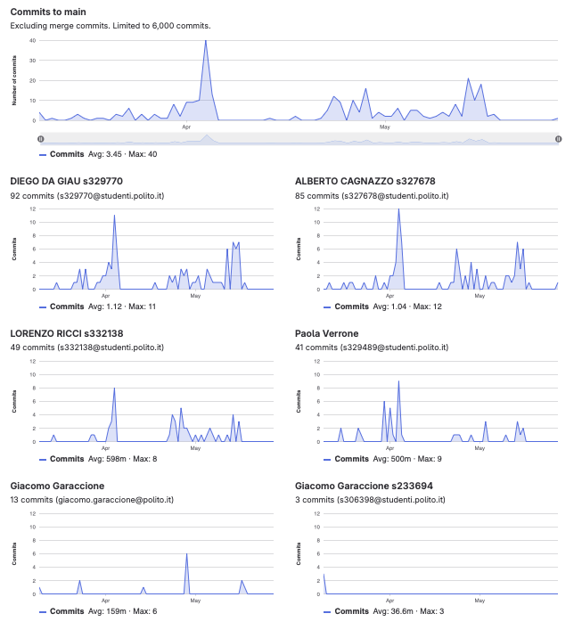

# Gruppo 10

## Valutazione deliverable V1

| gruppo | context diagram | business model | stakeholder | stories | interface | FR | NFR | use cases diagram | use cases | scenario | Glossary | DeploymentDiagram | functionality | estimation doc | precisione valori estimation | valutazione |
| --- | --- | --- | --- | --- | --- | --- | --- | --- | --- | --- | --- | --- | --- | --- | --- | --- |
| - | 1 | 0.5 | 0.5 | 1 | 1 | 3 | 3 | 1 | 5 | 5 | 5 | 2 | 1 | 2 | 2 | 33 |
| 10 | 85 | 100 | 95 | 90 | 95 | 95 | 100 | 100 | 100 | 100 | 85 | 100 | 100 | 90 | 85.34 | 96.32 |

## Valutazione deliverable V2

| gruppo | context diagram | business model | stakeholder | stories | interface | FR | NFR | ACCESS RIGHTS | use cases diagram | use cases | scenario | Glossary | DeploymentDiagram | functionality | estimation | precisione valori estimation | valutazione |
| --- | --- | --- | --- | --- | --- | --- | --- | --- | --- | --- | --- | --- | --- | --- | --- | --- | --- |
| - | 1 | 0.5 | 0.5 | 1 | 1 | 3 | 2 | 1 | 1 | 5 | 5 | 5 | 2 | 1 | 2 | 2 | 33 |
| 10 | 100 | 100 | 100 | 100 | 100 | 100 | 100 | 100 | 100 | 100 | 100 | 100 | 100 | 100 | 95 | 58.36 | 98.7 |

Le percentuali di v2 sono state riscalate in quanto la media pesata delle percentuali portava alcuni gruppi oltre al 100%.

## Valutazione codice e test (V2 + V3)

| Test Unit Totali | Test Unit Passati | Statement Coverage Unit | Branch Coverage Unit | Function Coverage Unit | Line Coverage Unit | Test Integration Totali | Test Integration Falliti | Statement Coverage Integration | Branch Coverage Integration | Function Coverage Integration | Line Coverage Integration | Correttezza V2 | Correttezza V3 | valutazione |
| --- | --- | --- | --- | --- | --- | --- | --- | --- | --- | --- | --- | --- | --- | --- |
| 1 | 0.5 | 2 | 2 | 1 | 1 | 1 | 0.5 | 2 | 2 | 1 | 1 | 16 | 2 | 33 |
| 100 | 100 | 100 | 100 | 100 | 100 | 100 | 100 | 100 | 100 | 100 | 100 | 96.6386554621849 | 100 | 98.37 |

 Unit e integration test prodotti dai gruppi sono stati eseguiti con la versione V2 del codice.

## Risultati Progetto

| Deliverable | Punteggio | Peso |
| --- | --- | --- |
| **Documenti V1** | 96.32% | 6 |
| **Documenti V2** | 97.38% | 2 |
| **Codice e Test** | 98.37% | 22 |
| **Timesheet** | 66.66% | 3 |
| **Valutazione** | 31.37 | 33 |
| **Valutazione** | 12.55 | 13.2 |

## Calcolo pesi progetto per singolo studente

| cognome | nome | email | gruppo | commit studente | commit totali | commit sul totale | coefficiente catme | coefficiente pesato | coefficiente progetto |
| --- | --- | --- | --- | --- | --- | --- | --- | --- | --- |
| CAGNAZZO | ALBERTO | s327678@studenti.polito.it | 10 | 85 | 267 | 0.32 | 1.05 | 0.90 | 0.99 |
| DA GIAU | DIEGO | s329770@studenti.polito.it | 10 | 92 | 267 | 0.34 | 1.05 | 0.91 | 1.00 |
| RICCI | LORENZO | s332138@studenti.polito.it | 10 | 49 | 267 | 0.18 | 1.00 | 0.84 | 0.92 |
| VERRONE | PAOLA | s329489@studenti.polito.it | 10 | 41 | 267 | 0.15 | 0.77 | 0.65 | 0.71 |

 I pesi del progetto sono ottenuti per l'80% dal valore calcolato da CATME e per il 20% dalla percentuale dei commit del singolo studente sul totale dei commit effettuati dagli studenti dello stesso gruppo. Il risultato è stato poi riscalato in modo che il punteggio più alto del gruppo ottenesse 1.

## Studenti

| Nome | Matricola | Email | Bonus | Voto Primo Appello | Voto Progetto | Voto Finale |
| --- | --- | --- | --- | --- | --- | --- |
| DIEGO DA GIAU | 329770 | s329770@studenti.polito.it | 1 | 16.28 | 12.55 | 30 |
| ALBERTO CAGNAZZO | 327678 | s327678@studenti.polito.it | 0 | 15.5 | 12.48 | 28 |
| LORENZO RICCI | 332138 | s332138@studenti.polito.it | 0 | 13.73 | 11.55 | 25 |
| PAOLA VERRONE | 329489 | s329489@studenti.polito.it | 1 | 12.9 | 8.93 | 23 |
